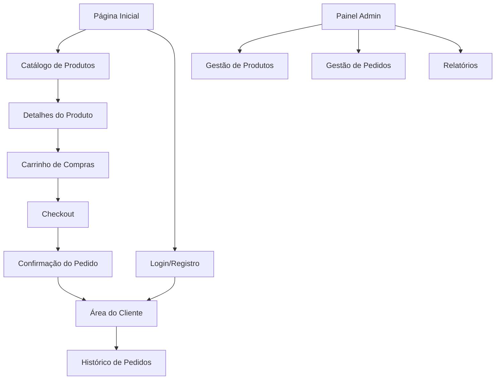

# B-Commerce: Plataforma de E-commerce com Arquitetura de Microsserviços

## 1. Visão Geral do Produto

O B-Commerce é uma plataforma de e-commerce moderna e escalável desenvolvida com arquitetura de microsserviços usando .NET 8. O sistema resolve os desafios de escalabilidade, manutenibilidade e performance de plataformas monolíticas tradicionais através de 8 microsserviços especializados que se comunicam via eventos de domínio.

O produto atende empresas que precisam de uma solução robusta de e-commerce com capacidade de crescimento orgânico, compliance LGPD nativo e metodologia de desenvolvimento educativo incremental.

## 2. Funcionalidades Principais

### 2.1 Papéis de Usuário

| Papel | Método de Registro | Permissões Principais |
|-------|-------------------|----------------------|
| Cliente Anônimo | Navegação livre | Visualizar produtos, adicionar ao carrinho, realizar compras |
| Cliente Registrado | Email + validação CPF | Todas as funcionalidades + histórico, endereços salvos, cartões |
| Administrador | Convite interno | Gestão completa de produtos, pedidos, usuários e relatórios |

### 2.2 Módulos Funcionais

Nossa plataforma B-Commerce consiste nas seguintes páginas principais:

1. **Página Inicial**: vitrine de produtos, navegação por categorias, busca avançada, promoções em destaque
2. **Catálogo de Produtos**: listagem com filtros, detalhes do produto, variações (cor/tamanho), imagens, avaliações
3. **Carrinho de Compras**: gestão de itens, cálculo de totais, aplicação de cupons, estimativa de frete
4. **Checkout**: dados de entrega, métodos de pagamento, confirmação do pedido
5. **Área do Cliente**: perfil, endereços, cartões salvos, histórico de pedidos, avaliações
6. **Painel Administrativo**: gestão de produtos, categorias, pedidos, usuários, relatórios
7. **Sistema de Avaliações**: comentários de produtos, moderação, estatísticas
8. **Autenticação**: login, registro, recuperação de senha via Keycloak

### 2.3 Detalhes das Páginas

| Nome da Página | Nome do Módulo | Descrição da Funcionalidade |
|----------------|----------------|-----------------------------|
| Página Inicial | Vitrine Principal | Exibir produtos em destaque, categorias populares, promoções ativas com navegação intuitiva |
| Página Inicial | Sistema de Busca | Implementar busca full-text com filtros por categoria, preço, marca e disponibilidade |
| Catálogo | Listagem de Produtos | Apresentar produtos com paginação, ordenação por relevância/preço, filtros avançados |
| Catálogo | Detalhes do Produto | Mostrar informações completas, imagens, variações, estoque, avaliações e produtos relacionados |
| Carrinho | Gestão de Itens | Adicionar, remover, alterar quantidades, calcular totais, aplicar cupons de desconto |
| Carrinho | Persistência | Manter carrinho para usuários anônimos (sessão) e registrados (banco de dados) |
| Checkout | Dados de Entrega | Coletar/selecionar endereço, calcular frete, definir prazo de entrega |
| Checkout | Processamento de Pagamento | Integrar múltiplos gateways, validar dados, processar transações seguras |
| Área do Cliente | Gestão de Perfil | Editar dados pessoais, gerenciar endereços e cartões salvos, consentimentos LGPD |
| Área do Cliente | Histórico de Pedidos | Visualizar pedidos, status de entrega, notas fiscais, solicitar trocas/devoluções |
| Painel Admin | Gestão de Produtos | CRUD completo de produtos, categorias, marcas, controle de estoque, upload de imagens |
| Painel Admin | Gestão de Pedidos | Visualizar, processar, atualizar status, gerar relatórios, controle de estoque |
| Sistema de Avaliações | Comentários | Permitir avaliações de produtos com compra verificada, sistema de moderação |
| Autenticação | Login/Registro | Integração com Keycloak, validação CPF, recuperação de senha, SSO |

## 3. Processo Principal

### Fluxo do Cliente:
1. **Descoberta**: Cliente acessa a página inicial e navega pelo catálogo
2. **Seleção**: Visualiza detalhes do produto, escolhe variações e adiciona ao carrinho
3. **Carrinho**: Revisa itens, aplica cupons e procede para checkout
4. **Checkout**: Informa dados de entrega e pagamento
5. **Confirmação**: Recebe confirmação do pedido e acompanha status
6. **Pós-venda**: Avalia produtos e gerencia conta na área do cliente

### Fluxo do Administrador:
1. **Gestão de Catálogo**: Cadastra produtos, categorias e gerencia estoque
2. **Processamento de Pedidos**: Monitora pedidos e atualiza status
3. **Análise**: Acessa relatórios e métricas de performance
4. **Moderação**: Gerencia avaliações e conteúdo do usuário

## 4. Design da Interface do Usuário

### 4.1 Estilo de Design

- **Cores Primárias**: Azul corporativo (#2563EB), Verde sucesso (#10B981)
- **Cores Secundárias**: Cinza neutro (#6B7280), Branco (#FFFFFF)
- **Estilo de Botões**: Arredondados com sombra sutil, estados hover/active bem definidos
- **Tipografia**: Inter ou system fonts, tamanhos 14px (corpo), 18px (títulos), 24px (cabeçalhos)
- **Layout**: Design responsivo mobile-first, grid system, cards para produtos
- **Ícones**: Heroicons ou Lucide, estilo outline, tamanho 20px/24px

### 4.2 Visão Geral do Design das Páginas

| Nome da Página | Nome do Módulo | Elementos da UI |
|----------------|----------------|----------------|
| Página Inicial | Header Principal | Logo, menu de navegação, busca, carrinho, login - fundo branco, sombra sutil |
| Página Inicial | Vitrine de Produtos | Grid responsivo 4x3x2x1, cards com imagem, título, preço, botão CTA |
| Catálogo | Filtros Laterais | Sidebar colapsível, checkboxes, sliders de preço, tags de categoria |
| Catálogo | Grid de Produtos | Layout flexível, paginação, ordenação dropdown, indicadores de estoque |
| Detalhes do Produto | Galeria de Imagens | Carousel principal, thumbnails, zoom on hover, indicadores de variação |
| Detalhes do Produto | Informações | Título, preço, descrição, seletor de variações, botões de ação destacados |
| Carrinho | Lista de Itens | Tabela responsiva, controles de quantidade, botões de remoção, resumo lateral |
| Checkout | Formulário Multi-step | Steps indicator, validação em tempo real, campos agrupados logicamente |
| Área do Cliente | Menu Lateral | Navegação vertical, ícones, indicadores de status, perfil do usuário |
| Painel Admin | Dashboard | Cards de métricas, gráficos, tabelas de dados, filtros avançados |

### 4.3 Responsividade

A plataforma é desenvolvida com abordagem mobile-first, garantindo experiência otimizada em dispositivos móveis, tablets e desktops. Utiliza breakpoints do TailwindCSS (sm: 640px, md: 768px, lg: 1024px, xl: 1280px) com navegação touch-friendly e gestos intuitivos para dispositivos móveis.
