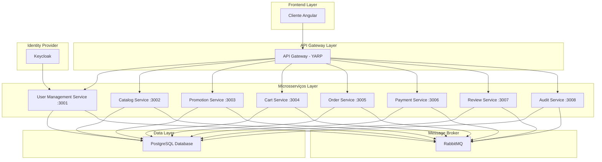
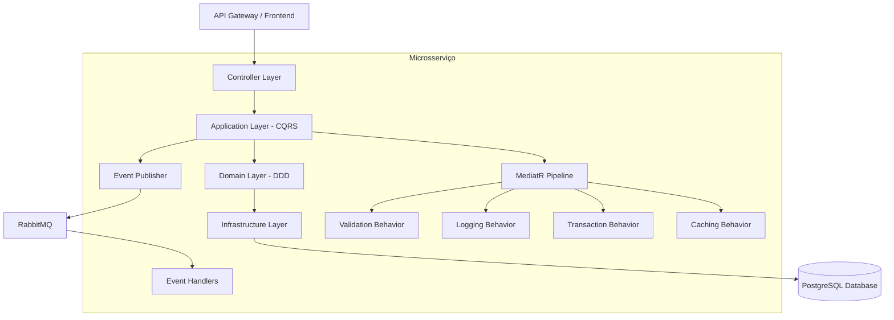
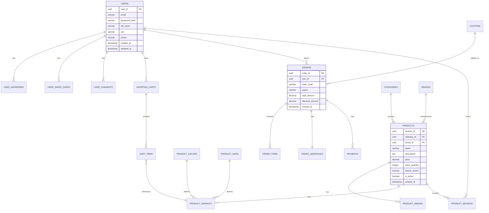

# B-Commerce: Arquitetura Técnica de Microsserviços

## 1. Design da Arquitetura



## 2. Descrição das Tecnologias

- **Frontend**: Angular@20 + TailwindCSS@4 + Standalone Components
- **API Gateway**: ASP.NET Core + YARP (Yet Another Reverse Proxy)
- **Microsserviços**: ASP.NET Core@8 + Minimal APIs + Entity Framework Core
- **Mensageria**: MassTransit + RabbitMQ
- **Banco de Dados**: PostgreSQL (compartilhado inicialmente)
- **Autenticação**: Keycloak + OIDC/JWT
- **Logging**: Serilog
- **Validação**: FluentValidation
- **Testes**: xUnit + Testcontainers
- **Containerização**: Docker + Docker Compose

## 3. Definições de Rotas

| Rota | Propósito |
|------|----------|
| / | Página inicial com vitrine de produtos e navegação principal |
| /products | Catálogo de produtos com busca e filtros avançados |
| /products/:id | Detalhes do produto com variações e avaliações |
| /cart | Carrinho de compras com gestão de itens e cupons |
| /checkout | Processo de finalização de compra multi-step |
| /login | Autenticação via Keycloak com redirecionamento OIDC |
| /register | Registro de novo usuário com validação CPF |
| /profile | Área do cliente com dados pessoais e preferências |
| /orders | Histórico de pedidos e acompanhamento de status |
| /admin | Painel administrativo para gestão da plataforma |
| /admin/products | Gestão de produtos, categorias e estoque |
| /admin/orders | Processamento e acompanhamento de pedidos |

## 4. Definições de API

### 4.1 APIs Principais

**Autenticação de Usuários**
```
POST /api/auth/login
```

Request:
| Nome do Parâmetro | Tipo do Parâmetro | Obrigatório | Descrição |
|-------------------|-------------------|-------------|----------|
| email | string | true | Email do usuário para autenticação |
| password | string | true | Senha do usuário (será validada via Keycloak) |

Response:
| Nome do Parâmetro | Tipo do Parâmetro | Descrição |
|-------------------|-------------------|----------|
| access_token | string | Token JWT para autenticação |
| refresh_token | string | Token para renovação da sessão |
| expires_in | number | Tempo de expiração em segundos |

Exemplo:
```json
{
  "email": "usuario@exemplo.com",
  "password": "senha123"
}
```

**Gestão de Produtos**
```
GET /api/products
POST /api/products
PUT /api/products/{id}
DELETE /api/products/{id}
```

**Gestão de Carrinho**
```
GET /api/cart
POST /api/cart/items
PUT /api/cart/items/{id}
DELETE /api/cart/items/{id}
```

**Processamento de Pedidos**
```
POST /api/orders
GET /api/orders/{id}
PUT /api/orders/{id}/status
```

**Processamento de Pagamentos**
```
POST /api/payments
GET /api/payments/{id}/status
```

## 5. Arquitetura do Servidor



## 6. Modelo de Dados

### 6.1 Definição do Modelo de Dados



### 6.2 Linguagem de Definição de Dados

**Tabela de Usuários (users)**
```sql
-- Criar tabela
CREATE TABLE users (
    user_id UUID PRIMARY KEY DEFAULT gen_random_uuid(),
    email VARCHAR(255) UNIQUE NOT NULL,
    password_hash VARCHAR(255) NOT NULL,
    full_name VARCHAR(255) NOT NULL,
    cpf VARCHAR(14) UNIQUE,
    phone VARCHAR(20),
    is_active BOOLEAN DEFAULT TRUE,
    created_at TIMESTAMPTZ DEFAULT CURRENT_TIMESTAMP,
    updated_at TIMESTAMPTZ DEFAULT CURRENT_TIMESTAMP
);

-- Criar índices
CREATE INDEX idx_users_email ON users(email);
CREATE INDEX idx_users_cpf ON users(cpf);
CREATE INDEX idx_users_created_at ON users(created_at DESC);

-- Trigger para eventos de domínio
CREATE TRIGGER trigger_user_domain_events
    AFTER INSERT OR UPDATE ON users
    FOR EACH ROW
    EXECUTE FUNCTION publish_domain_event();
```

**Tabela de Produtos (products)**
```sql
-- Criar tabela
CREATE TABLE products (
    product_id UUID PRIMARY KEY DEFAULT gen_random_uuid(),
    category_id UUID REFERENCES categories(category_id),
    brand_id UUID REFERENCES brands(brand_id),
    name VARCHAR(255) NOT NULL,
    description TEXT,
    price DECIMAL(10,2) NOT NULL,
    stock_quantity INTEGER DEFAULT 0,
    search_vector TSVECTOR,
    is_active BOOLEAN DEFAULT TRUE,
    created_at TIMESTAMPTZ DEFAULT CURRENT_TIMESTAMP,
    updated_at TIMESTAMPTZ DEFAULT CURRENT_TIMESTAMP
);

-- Criar índices
CREATE INDEX idx_products_category ON products(category_id);
CREATE INDEX idx_products_brand ON products(brand_id);
CREATE INDEX idx_products_search ON products USING GIN(search_vector);
CREATE INDEX idx_products_price ON products(price);
CREATE INDEX idx_products_stock ON products(stock_quantity);

-- Trigger para busca full-text
CREATE TRIGGER trigger_product_search_vector
    BEFORE INSERT OR UPDATE ON products
    FOR EACH ROW
    EXECUTE FUNCTION update_search_vector();
```

**Tabela de Eventos de Domínio (domain_events)**
```sql
-- Criar tabela
CREATE TABLE domain_events (
    event_id UUID PRIMARY KEY DEFAULT gen_random_uuid(),
    event_type VARCHAR(100) NOT NULL,
    aggregate_type VARCHAR(100) NOT NULL,
    aggregate_id UUID NOT NULL,
    event_data JSONB NOT NULL,
    occurred_at TIMESTAMPTZ DEFAULT CURRENT_TIMESTAMP,
    processed_at TIMESTAMPTZ
);

-- Criar índices
CREATE INDEX idx_domain_events_type ON domain_events(event_type);
CREATE INDEX idx_domain_events_aggregate ON domain_events(aggregate_type, aggregate_id);
CREATE INDEX idx_domain_events_occurred ON domain_events(occurred_at DESC);
CREATE INDEX idx_domain_events_processed ON domain_events(processed_at) WHERE processed_at IS NULL;

-- Dados iniciais
INSERT INTO service_registry (service_name, service_url, health_check_endpoint, is_active)
VALUES 
    ('user-management', 'http://localhost:3001', '/health', true),
    ('catalog', 'http://localhost:3002', '/health', true),
    ('promotion', 'http://localhost:3003', '/health', true),
    ('cart', 'http://localhost:3004', '/health', true),
    ('order', 'http://localhost:3005', '/health', true),
    ('payment', 'http://localhost:3006', '/health', true),
    ('review', 'http://localhost:3007', '/health', true),
    ('audit', 'http://localhost:3008', '/health', true);
```
