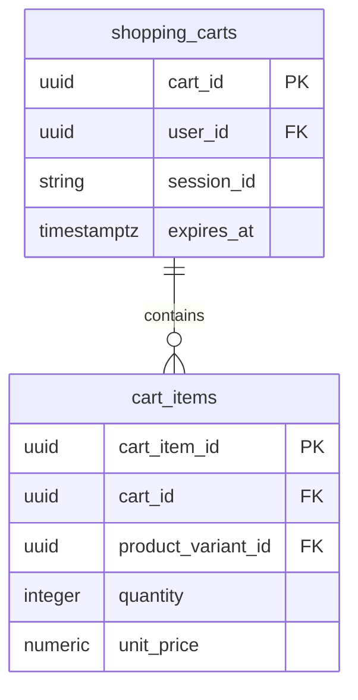

# Cart Service - Documentação Técnica

## 1. Visão Geral do Microsserviço

O **Cart Service** é responsável por toda a gestão de carrinhos de compras, tanto para usuários autenticados quanto para sessões anônimas. Este microsserviço centraliza as operações relacionadas ao carrinho de compras e preparação para checkout.

### Responsabilidades Principais

- Gestão de carrinhos para usuários autenticados
- Suporte a carrinhos para sessões anônimas
- Adição, remoção e atualização de itens
- Cálculo de totais e subtotais
- Persistência de carrinho entre sessões
- Migração de carrinho anônimo para usuário
- Limpeza automática de carrinhos expirados
- Validação de disponibilidade de produtos

## 2. Estrutura de Tabelas

### 2.1 Tabela Principal: `shopping_carts`

**Descrição**: Carrinhos de compras do sistema

| Campo      | Tipo         | Descrição                              |
| ---------- | ------------ | -------------------------------------- |
| cart_id    | UUID         | Identificador único do carrinho        |
| user_id    | UUID         | ID do usuário (nullable para anônimos) |
| session_id | VARCHAR(128) | ID da sessão (para usuários anônimos)  |
| created_at | TIMESTAMPTZ  | Data de criação do carrinho            |
| updated_at | TIMESTAMPTZ  | Última atualização                     |
| expires_at | TIMESTAMPTZ  | Data de expiração (opcional)           |

### 2.2 Tabela: `cart_items`

**Descrição**: Itens individuais dentro dos carrinhos

| Campo              | Tipo          | Descrição                           |
| ------------------ | ------------- | ----------------------------------- |
| cart_item_id       | UUID          | Identificador único do item         |
| cart_id            | UUID          | Referência ao carrinho              |
| product_variant_id | UUID          | Referência à variação do produto    |
| quantity           | INTEGER       | Quantidade do item                  |
| unit_price         | NUMERIC(10,2) | Preço unitário no momento da adição |
| currency           | CHAR(3)       | Moeda (padrão BRL)                  |
| created_at         | TIMESTAMPTZ   | Data de adição ao carrinho          |
| updated_at         | TIMESTAMPTZ   | Última atualização do item          |

## 3. Relacionamentos Entre Entidades



**Relacionamentos Externos:**

- `user_id` → User Management Service (users.user_id)
- `product_variant_id` → Catalog Service (product_variants.product_variant_id)

## 4. Regras de Negócio e Constraints

### 4.1 Constraints de Integridade

#### Proprietário do Carrinho

```sql
CONSTRAINT chk_cart_owner CHECK (
    user_id IS NOT NULL OR session_id IS NOT NULL
)
```

**Descrição**: Garante que todo carrinho tenha um proprietário (usuário ou sessão)

#### Quantidade Positiva

```sql
CONSTRAINT quantity_positive CHECK (quantity > 0)
```

**Descrição**: Garante que a quantidade de itens seja sempre positiva

#### Unicidade de Item por Carrinho

```sql
CONSTRAINT uq_cart_item_variant UNIQUE (cart_id, product_variant_id)
```

**Descrição**: Previne duplicação de itens no mesmo carrinho

### 4.2 Regras de Negócio

#### Carrinhos de Usuários Autenticados

- Um carrinho único por usuário
- Persistência indefinida (até conversão ou limpeza manual)
- Migração automática de carrinho anônimo

#### Carrinhos Anônimos

- Identificados por session_id
- Expiração automática configurável
- Conversão para usuário autenticado

## 5. Considerações de Segurança

### 5.1 Proteção de Dados

- Isolamento de carrinhos por usuário/sessão
- Validação de propriedade antes de operações
- Sanitização de session_id
- Controle de acesso baseado em propriedade

### 5.2 Prevenção de Fraudes

- Validação de preços no momento da adição
- Verificação de disponibilidade de produtos
- Limite de quantidade por item
- Auditoria de alterações de carrinho

### 5.3 Gestão de Sessões

- Session_id seguro e único
- Expiração automática de sessões
- Limpeza de dados sensíveis
- Migração segura entre sessões

## 6. Considerações de Performance

### 6.1 Índices Estratégicos

#### Índice de Usuário

```sql
CREATE INDEX idx_shopping_carts_user_id ON shopping_carts (user_id);
```

**Descrição**: Busca rápida de carrinho por usuário

#### Índice de Sessão

```sql
CREATE INDEX idx_shopping_carts_session_id ON shopping_carts (session_id);
```

**Descrição**: Busca rápida de carrinho por sessão anônima

#### Índice de Itens por Carrinho

```sql
CREate INDEX idx_cart_items_cart_id ON cart_items (cart_id);
```

**Descrição**: Listagem eficiente de itens do carrinho

#### Índice de Produto

```sql
CREATE INDEX idx_cart_items_product_variant_id ON cart_items (product_variant_id);
```

**Descrição**: Consultas por produto específico

### 6.2 Otimizações

- Triggers automáticos para updated_at
- Consultas otimizadas com JOINs eficientes
- Cache de totais calculados
- Limpeza automática de carrinhos expirados

## 7. Funcionalidades do Sistema

### 7.1 Operações de Carrinho

#### Criação de Carrinho

- Automática na primeira adição de item
- Associação por user_id ou session_id
- Definição de expiração (se aplicável)

#### Adição de Itens

1. Validar disponibilidade do produto
2. Verificar se item já existe no carrinho
3. Atualizar quantidade ou criar novo item
4. Capturar preço atual do produto
5. Atualizar timestamp do carrinho

#### Atualização de Quantidade

1. Validar nova quantidade
2. Verificar disponibilidade em estoque
3. Atualizar registro existente
4. Remover item se quantidade = 0

#### Remoção de Itens

1. Validar propriedade do carrinho
2. Remover item específico
3. Atualizar timestamp do carrinho
4. Limpar carrinho vazio (opcional)

### 7.2 Cálculos de Totais

#### Subtotal por Item

```sql
SELECT quantity * unit_price as line_total
FROM cart_items
```

#### Total do Carrinho

```sql
SELECT SUM(quantity * unit_price) as cart_total
FROM cart_items
WHERE cart_id = ?
```

### 7.3 Migração de Carrinho

#### Cenário: Usuário Anônimo Faz Login

1. Identificar carrinho anônimo por session_id
2. Verificar se usuário já possui carrinho
3. Mesclar itens (somar quantidades de itens iguais)
4. Atualizar propriedade do carrinho
5. Limpar session_id
6. Remover carrinho anônimo vazio

### 7.4 Limpeza Automática

#### Carrinhos Expirados

```sql
CREATE OR REPLACE FUNCTION cleanup_expired_carts()
RETURNS INTEGER AS $
DECLARE
    deleted_count INTEGER;
BEGIN
    DELETE FROM shopping_carts
    WHERE expires_at IS NOT NULL
    AND expires_at < CURRENT_TIMESTAMP;

    GET DIAGNOSTICS deleted_count = ROW_COUNT;
    RETURN deleted_count;
END;
$ LANGUAGE plpgsql;
```

## 8. Integração com Outros Serviços

### 8.1 Catalog Service

- Validação de produtos e variações
- Verificação de disponibilidade
- Obtenção de preços atuais
- Validação de produtos ativos

### 8.2 User Management Service

- Identificação de usuários autenticados
- Migração de carrinhos anônimos
- Validação de sessões

### 8.3 Order Service

- Conversão de carrinho em pedido
- Transferência de itens
- Limpeza pós-checkout

### 8.4 Promotion Service

- Aplicação de cupons de desconto
- Cálculo de totais com promoções
- Validação de elegibilidade

## 9. Monitoramento e Métricas

### 9.1 Métricas de Negócio

- Taxa de abandono de carrinho
- Valor médio do carrinho
- Itens mais adicionados
- Tempo médio no carrinho
- Taxa de conversão carrinho → pedido

### 9.2 Métricas Técnicas

- Performance de consultas
- Uso de índices
- Taxa de carrinhos expirados
- Frequência de limpeza automática

### 9.3 Alertas

- Carrinhos com alta quantidade de itens
- Sessões com tempo excessivo
- Falhas de migração de carrinho
- Produtos indisponíveis em carrinhos

## 10. Padrões de Nomenclatura

### 10.1 Convenções de Tabelas

- Prefixo `cart_` para tabelas relacionadas
- Nome descritivo: `shopping_carts`, `cart_items`
- Relacionamentos claros via foreign keys

### 10.2 Convenções de Campos

- Snake_case consistente
- Sufixo `_id` para identificadores
- Sufixo `_at` para timestamps
- Prefixos descritivos (`unit_price`, `line_total`)

### 10.3 Convenções de Índices

- Prefixo `idx_` para índices regulares
- Prefixo `uq_` para constraints únicos
- Nomes incluindo tabela e campos indexados

## 11. Estratégias de Cache

### 11.1 Cache de Carrinho

- Cache em memória para carrinhos ativos
- TTL baseado na última atualização
- Invalidação em operações de modificação

### 11.2 Cache de Totais

- Cálculos pré-computados
- Atualização incremental
- Sincronização com banco de dados

### 11.3 Cache de Produtos

- Informações básicas de produtos em carrinho
- Preços e disponibilidade
- Sincronização com Catalog Service

## 12. Commands e Queries (CQRS)

### 12.1 Commands (Operações de Escrita)

#### 12.1.1 Cart Management Commands

**CreateCartCommand**

```csharp
public record CreateCartCommand(
    Guid? UserId,
    string? SessionId,
    DateTime? ExpiresAt = null
) : ICommand<CreateCartResult>;

public record CreateCartResult(Guid CartId, DateTime CreatedAt);
```

**Validações**: UserId ou SessionId obrigatório, ExpiresAt válida
**Eventos**: CartCreatedEvent
**Handler**: CreateCartCommandHandler
**Segurança**: Validação de sessão/usuário

**MergeCartsCommand**

```csharp
public record MergeCartsCommand(
    Guid SourceCartId,
    Guid TargetCartId,
    MergeStrategy Strategy = MergeStrategy.SumQuantities
) : ICommand;

public enum MergeStrategy { SumQuantities, KeepTarget, KeepSource }
```

**Validações**: Carrinhos existem, propriedade válida
**Eventos**: CartsMergedEvent, CartItemsUpdatedEvent
**Handler**: MergeCartsCommandHandler
**Segurança**: Validação de propriedade dos carrinhos

**ClearCartCommand**

```csharp
public record ClearCartCommand(
    Guid CartId,
    Guid? UserId,
    string? SessionId,
    string Reason
) : ICommand;
```

**Validações**: Carrinho existe, propriedade válida
**Eventos**: CartClearedEvent
**Handler**: ClearCartCommandHandler
**Segurança**: Validação de propriedade

**ExpireCartCommand**

```csharp
public record ExpireCartCommand(
    Guid CartId,
    DateTime ExpiredAt
) : ICommand;
```

**Validações**: Carrinho existe, data válida
**Eventos**: CartExpiredEvent
**Handler**: ExpireCartCommandHandler
**Segurança**: Sistema interno apenas

**MigrateAnonymousCartCommand**

```csharp
public record MigrateAnonymousCartCommand(
    string SessionId,
    Guid UserId
) : ICommand<MigrateCartResult>;

public record MigrateCartResult(
    Guid CartId,
    int ItemsMigrated,
    bool MergeOccurred
);
```

**Validações**: Sessão válida, usuário existe
**Eventos**: CartMigratedEvent, UserCartMergedEvent
**Handler**: MigrateAnonymousCartCommandHandler
**Segurança**: Validação de usuário autenticado

#### 12.1.2 Cart Item Commands

**AddItemToCartCommand**

```csharp
public record AddItemToCartCommand(
    Guid? CartId,
    Guid? UserId,
    string? SessionId,
    Guid ProductVariantId,
    int Quantity,
    decimal? UnitPrice = null
) : ICommand<AddItemResult>;

public record AddItemResult(
    Guid CartId,
    Guid CartItemId,
    int TotalQuantity,
    decimal LineTotal
);
```

**Validações**: Produto existe, quantidade > 0, estoque disponível
**Eventos**: ItemAddedToCartEvent, CartUpdatedEvent
**Handler**: AddItemToCartCommandHandler
**Integração**: Catalog Service (validação produto/preço)
**Segurança**: Validação de propriedade do carrinho

**UpdateCartItemQuantityCommand**

```csharp
public record UpdateCartItemQuantityCommand(
    Guid CartItemId,
    Guid CartId,
    Guid? UserId,
    string? SessionId,
    int NewQuantity
) : ICommand;
```

**Validações**: Item existe, quantidade >= 0, estoque disponível
**Eventos**: CartItemQuantityUpdatedEvent, CartItemRemovedEvent (se qty=0)
**Handler**: UpdateCartItemQuantityCommandHandler
**Segurança**: Validação de propriedade

**RemoveItemFromCartCommand**

```csharp
public record RemoveItemFromCartCommand(
    Guid CartItemId,
    Guid CartId,
    Guid? UserId,
    string? SessionId
) : ICommand;
```

**Validações**: Item existe, propriedade válida
**Eventos**: CartItemRemovedEvent, CartUpdatedEvent
**Handler**: RemoveItemFromCartCommandHandler
**Segurança**: Validação de propriedade

**UpdateItemPriceCommand**

```csharp
public record UpdateItemPriceCommand(
    Guid CartItemId,
    decimal NewUnitPrice,
    string Reason
) : ICommand;
```

**Validações**: Item existe, preço > 0
**Eventos**: CartItemPriceUpdatedEvent
**Handler**: UpdateItemPriceCommandHandler
**Segurança**: Sistema interno ou admin apenas

#### 12.1.3 Cart Operations Commands

**ApplyCouponCommand**

```csharp
public record ApplyCouponCommand(
    Guid CartId,
    Guid? UserId,
    string? SessionId,
    string CouponCode
) : ICommand<ApplyCouponResult>;

public record ApplyCouponResult(
    bool Applied,
    decimal DiscountAmount,
    string? ErrorMessage
);
```

**Validações**: Carrinho existe, cupom válido
**Eventos**: CouponAppliedEvent
**Handler**: ApplyCouponCommandHandler
**Integração**: Promotion Service
**Segurança**: Validação de propriedade

**RemoveCouponCommand**

```csharp
public record RemoveCouponCommand(
    Guid CartId,
    Guid? UserId,
    string? SessionId,
    string CouponCode
) : ICommand;
```

**Validações**: Carrinho existe, cupom aplicado
**Eventos**: CouponRemovedEvent
**Handler**: RemoveCouponCommandHandler
**Segurança**: Validação de propriedade

**ValidateCartCommand**

```csharp
public record ValidateCartCommand(
    Guid CartId,
    bool CheckStock = true,
    bool CheckPrices = true
) : ICommand<CartValidationResult>;

public record CartValidationResult(
    bool IsValid,
    List<ValidationError> Errors,
    List<PriceChange> PriceChanges
);
```

**Validações**: Carrinho existe
**Eventos**: CartValidatedEvent, CartValidationFailedEvent
**Handler**: ValidateCartCommandHandler
**Integração**: Catalog Service

**PrepareCheckoutCommand**

```csharp
public record PrepareCheckoutCommand(
    Guid CartId,
    Guid UserId,
    Guid? ShippingAddressId,
    string? CouponCode
) : ICommand<CheckoutPreparationResult>;

public record CheckoutPreparationResult(
    Guid CheckoutSessionId,
    decimal SubTotal,
    decimal ShippingCost,
    decimal DiscountAmount,
    decimal TotalAmount,
    List<CartItemDto> Items
);
```

**Validações**: Carrinho válido, usuário autenticado, endereço válido
**Eventos**: CheckoutPreparedEvent
**Handler**: PrepareCheckoutCommandHandler
**Integração**: Shipping Service, Promotion Service
**Segurança**: Usuário autenticado obrigatório

### 12.2 Queries (Operações de Leitura)

#### 12.2.1 Cart Queries

**GetCartByUserIdQuery**

```csharp
public record GetCartByUserIdQuery(
    Guid UserId,
    bool IncludeItems = true
) : IQuery<CartDto?>;
```

**Handler**: GetCartByUserIdQueryHandler
**Cache**: 2 minutos
**Segurança**: Dados próprios ou admin
**Integração**: Catalog Service (detalhes dos produtos)

**GetCartBySessionIdQuery**

```csharp
public record GetCartBySessionIdQuery(
    string SessionId,
    bool IncludeItems = true
) : IQuery<CartDto?>;
```

**Handler**: GetCartBySessionIdQueryHandler
**Cache**: 1 minuto
**Segurança**: Validação de sessão

**GetCartByIdQuery**

```csharp
public record GetCartByIdQuery(
    Guid CartId,
    Guid? UserId,
    string? SessionId,
    bool IncludeItems = true
) : IQuery<CartDto?>;
```

**Handler**: GetCartByIdQueryHandler
**Cache**: 2 minutos
**Segurança**: Validação de propriedade

**GetActiveCartsQuery**

```csharp
public record GetActiveCartsQuery(
    DateTime? CreatedAfter,
    DateTime? UpdatedAfter,
    int Page = 1,
    int PageSize = 50
) : IQuery<PagedResult<CartSummaryDto>>;
```

**Handler**: GetActiveCartsQueryHandler
**Cache**: 30 segundos
**Segurança**: Admin apenas

#### 12.2.2 Cart Item Queries

**GetCartItemsQuery**

```csharp
public record GetCartItemsQuery(
    Guid CartId,
    Guid? UserId,
    string? SessionId
) : IQuery<List<CartItemDto>>;
```

**Handler**: GetCartItemsQueryHandler
**Cache**: 2 minutos
**Segurança**: Validação de propriedade
**Integração**: Catalog Service (detalhes dos produtos)

**GetCartItemByIdQuery**

```csharp
public record GetCartItemByIdQuery(
    Guid CartItemId,
    Guid? UserId,
    string? SessionId
) : IQuery<CartItemDto?>;
```

**Handler**: GetCartItemByIdQueryHandler
**Cache**: 5 minutos
**Segurança**: Validação de propriedade

**GetCartTotalQuery**

```csharp
public record GetCartTotalQuery(
    Guid CartId,
    Guid? UserId,
    string? SessionId,
    string? CouponCode = null
) : IQuery<CartTotalDto>;

public record CartTotalDto(
    decimal SubTotal,
    decimal DiscountAmount,
    decimal ShippingEstimate,
    decimal TotalAmount,
    int ItemCount,
    string Currency
);
```

**Handler**: GetCartTotalQueryHandler
**Cache**: 1 minuto
**Segurança**: Validação de propriedade
**Integração**: Promotion Service, Shipping Service

**GetCartSummaryQuery**

```csharp
public record GetCartSummaryQuery(
    Guid CartId,
    Guid? UserId,
    string? SessionId
) : IQuery<CartSummaryDto>;

public record CartSummaryDto(
    Guid CartId,
    int ItemCount,
    decimal TotalAmount,
    DateTime LastUpdated,
    bool HasExpired
);
```

**Handler**: GetCartSummaryQueryHandler
**Cache**: 30 segundos
**Segurança**: Validação de propriedade

#### 12.2.3 Analytics Queries

**GetAbandonedCartsQuery**

```csharp
public record GetAbandonedCartsQuery(
    DateTime AbandonedSince,
    decimal? MinValue,
    int Page = 1,
    int PageSize = 50
) : IQuery<PagedResult<AbandonedCartDto>>;

public record AbandonedCartDto(
    Guid CartId,
    Guid? UserId,
    decimal TotalValue,
    int ItemCount,
    DateTime LastActivity,
    TimeSpan AbandonedFor
);
```

**Handler**: GetAbandonedCartsQueryHandler
**Cache**: 10 minutos
**Segurança**: Admin apenas

**GetCartMetricsQuery**

```csharp
public record GetCartMetricsQuery(
    DateTime StartDate,
    DateTime EndDate,
    MetricType Type = MetricType.All
) : IQuery<CartMetricsDto>;

public record CartMetricsDto(
    int TotalCarts,
    int ActiveCarts,
    int AbandonedCarts,
    decimal AverageCartValue,
    decimal ConversionRate,
    Dictionary<string, int> TopProducts
);
```

**Handler**: GetCartMetricsQueryHandler
**Cache**: 15 minutos
**Segurança**: Admin apenas

**GetPopularItemsInCartsQuery**

```csharp
public record GetPopularItemsInCartsQuery(
    DateTime StartDate,
    DateTime EndDate,
    int TopCount = 20
) : IQuery<List<PopularCartItemDto>>;

public record PopularCartItemDto(
    Guid ProductVariantId,
    string ProductName,
    int TimesAdded,
    int TotalQuantity,
    decimal AveragePrice
);
```

**Handler**: GetPopularItemsInCartsQueryHandler
**Cache**: 30 minutos
**Segurança**: Admin apenas
**Integração**: Catalog Service

#### 12.2.4 Admin Queries

**GetExpiredCartsQuery**

```csharp
public record GetExpiredCartsQuery(
    DateTime? ExpiredBefore,
    bool IncludeProcessed = false,
    int Page = 1,
    int PageSize = 100
) : IQuery<PagedResult<ExpiredCartDto>>;
```

**Handler**: GetExpiredCartsQueryHandler
**Cache**: 5 minutos
**Segurança**: Admin apenas

**GetCartsReportQuery**

```csharp
public record GetCartsReportQuery(
    DateTime StartDate,
    DateTime EndDate,
    ReportType Type,
    string? GroupBy = null
) : IQuery<CartReportDto>;

public enum ReportType { Daily, Weekly, Monthly, Custom }
```

**Handler**: GetCartsReportQueryHandler
**Cache**: 1 hora
**Segurança**: Admin apenas

**GetCartsByProductQuery**

```csharp
public record GetCartsByProductQuery(
    Guid ProductVariantId,
    DateTime? StartDate,
    DateTime? EndDate,
    int Page = 1,
    int PageSize = 50
) : IQuery<PagedResult<CartWithProductDto>>;
```

**Handler**: GetCartsByProductQueryHandler
**Cache**: 10 minutos
**Segurança**: Admin apenas

### 12.3 Considerações de Implementação

#### 12.3.1 Tratamento de Erros

- **ValidationException**: Dados inválidos ou regras de negócio
- **UnauthorizedException**: Acesso negado ou propriedade inválida
- **NotFoundException**: Carrinho ou item não encontrado
- **ConflictException**: Conflitos de concorrência
- **BusinessRuleException**: Estoque insuficiente, produto inativo
- **IntegrationException**: Falhas em serviços externos

#### 12.3.2 Segurança

- Validação rigorosa de propriedade de carrinho
- Sanitização de session_id
- Rate limiting para operações de carrinho
- Auditoria de operações sensíveis
- Validação de integridade de preços

#### 12.3.3 Performance

- Cache agressivo para queries frequentes
- Invalidação inteligente de cache
- Otimização de consultas com índices
- Paginação obrigatória para listas
- Projeções específicas para DTOs

#### 12.3.4 Integração com Serviços

- **Catalog Service**: Validação de produtos, preços e estoque
- **User Management Service**: Autenticação e migração de carrinhos
- **Promotion Service**: Aplicação de cupons e descontos
- **Shipping Service**: Cálculo de frete
- **Order Service**: Conversão de carrinho em pedido

#### 12.3.5 Observabilidade

- Logs estruturados para todas as operações
- Métricas de performance e conversão
- Tracing distribuído para integrações
- Health checks específicos
- Alertas para carrinhos abandonados e erros críticos

# Cart Service - Tasks

## Setup de Infraestrutura

[ ] Configurar banco de dados PostgreSQL para Cart
[ ] Configurar Redis para cache de carrinho
[ ] Configurar RabbitMQ para eventos de carrinho
[ ] Configurar variáveis de ambiente no .env
[ ] Criar .env.example com todas as variáveis necessárias

## Desenvolvimento de APIs

[ ] Implementar endpoint POST /cart (criar carrinho)
[ ] Implementar endpoint GET /cart/{user_id} (buscar carrinho do usuário)
[ ] Implementar endpoint POST /cart/{cart_id}/items (adicionar item)
[ ] Implementar endpoint PUT /cart/{cart_id}/items/{item_id} (atualizar quantidade)
[ ] Implementar endpoint DELETE /cart/{cart_id}/items/{item_id} (remover item)
[ ] Implementar endpoint DELETE /cart/{cart_id} (limpar carrinho)
[ ] Implementar endpoint GET /cart/{cart_id}/total (calcular total)
[ ] Implementar endpoint POST /cart/{cart_id}/merge (mesclar carrinhos)
[ ] Implementar endpoint PUT /cart/{cart_id}/apply-coupon (aplicar cupom)
[ ] Implementar endpoint DELETE /cart/{cart_id}/coupon (remover cupom)
[ ] Implementar validação de dados de entrada
[ ] Implementar middleware de autenticação

## Modelo de Dados

[ ] Criar tabela carts com campos obrigatórios
[ ] Criar tabela cart_items para itens do carrinho
[ ] Criar tabela cart_sessions para carrinho de visitantes
[ ] Implementar triggers para auditoria
[ ] Implementar índices para performance
[ ] Configurar constraints e relacionamentos
[ ] Implementar soft delete para histórico

## Gestão de Sessão

[ ] Implementar carrinho para usuários logados
[ ] Implementar carrinho para visitantes (sessão)
[ ] Implementar migração de carrinho na autenticação
[ ] Configurar expiração automática de carrinhos
[ ] Implementar limpeza de carrinhos abandonados
[ ] Configurar persistência de carrinho

## Validações de Negócio

[ ] Validar disponibilidade de produtos
[ ] Validar quantidade máxima por item
[ ] Validar estoque disponível
[ ] Implementar regras de quantidade mínima
[ ] Validar produtos ativos/inativos
[ ] Implementar validação de preços
[ ] Configurar limites de carrinho

## Integração com Outros Serviços

[ ] Integrar com Catalog Service para validar produtos
[ ] Integrar com Promotion Service para cupons
[ ] Integrar com User Management para autenticação
[ ] Configurar eventos para Order Service
[ ] Implementar sincronização de preços
[ ] Configurar webhooks para atualizações

## Cache e Performance

[ ] Implementar cache de carrinho no Redis
[ ] Configurar TTL para cache de carrinho
[ ] Implementar invalidação inteligente de cache
[ ] Otimizar queries de carrinho
[ ] Implementar compressão de dados
[ ] Configurar connection pooling

## Cálculos e Totais

[ ] Implementar cálculo de subtotal
[ ] Implementar cálculo de descontos
[ ] Implementar cálculo de impostos
[ ] Implementar cálculo de frete estimado
[ ] Implementar total final
[ ] Configurar arredondamento de valores
[ ] Implementar histórico de cálculos

## Segurança

[ ] Implementar autenticação para operações de carrinho
[ ] Configurar rate limiting para APIs
[ ] Implementar validação de propriedade do carrinho
[ ] Configurar CORS adequadamente
[ ] Implementar logs de auditoria
[ ] Configurar sanitização de dados
[ ] Implementar proteção contra SQL injection
[ ] Configurar headers de segurança

## Testes

[ ] Criar testes unitários para controllers
[ ] Criar testes unitários para services
[ ] Criar testes de integração para APIs
[ ] Criar testes para validações de negócio
[ ] Criar testes de performance
[ ] Configurar coverage de testes
[ ] Implementar testes de carga
[ ] Criar testes para migração de carrinho

## Monitoramento e Logs

[ ] Configurar logs estruturados
[ ] Implementar métricas de abandono de carrinho
[ ] Configurar alertas para falhas
[ ] Implementar health check endpoint
[ ] Configurar monitoramento de cache
[ ] Implementar métricas de conversão

## Deploy e DevOps

[ ] Configurar Dockerfile
[ ] Configurar docker-compose para desenvolvimento
[ ] Configurar pipeline CI/CD
[ ] Configurar ambiente de staging
[ ] Configurar ambiente de produção
[ ] Implementar rollback strategy
[ ] Configurar backup automático do banco

## Documentação

[ ] Documentar APIs com Swagger/OpenAPI
[ ] Criar documentação de setup
[ ] Documentar fluxos de carrinho
[ ] Documentar regras de negócio
[ ] Criar guia de troubleshooting
[ ] Documentar variáveis de ambiente

## Otimização de Conversão

[ ] Implementar recuperação de carrinho abandonado
[ ] Configurar notificações de carrinho
[ ] Implementar sugestões de produtos
[ ] Configurar lembretes automáticos
[ ] Implementar análise de abandono

## Gestão de Estoque

[ ] Implementar reserva temporária de produtos
[ ] Configurar liberação automática de reservas
[ ] Implementar validação de estoque em tempo real
[ ] Configurar notificações de indisponibilidade
[ ] Implementar fila de espera para produtos

## Analytics e Relatórios

[ ] Implementar tracking de eventos de carrinho
[ ] Configurar métricas de abandono
[ ] Implementar análise de produtos populares
[ ] Configurar relatórios de conversão
[ ] Implementar dashboards de performance

## Backup e Recuperação

[ ] Configurar backup automático de carrinhos
[ ] Implementar recuperação de dados
[ ] Configurar replicação de dados
[ ] Implementar disaster recovery

## Compliance

[ ] Implementar LGPD compliance
[ ] Configurar anonização de dados
[ ] Implementar políticas de retenção
[ ] Configurar auditoria de acesso
[ ] Implementar controle de consentimento
