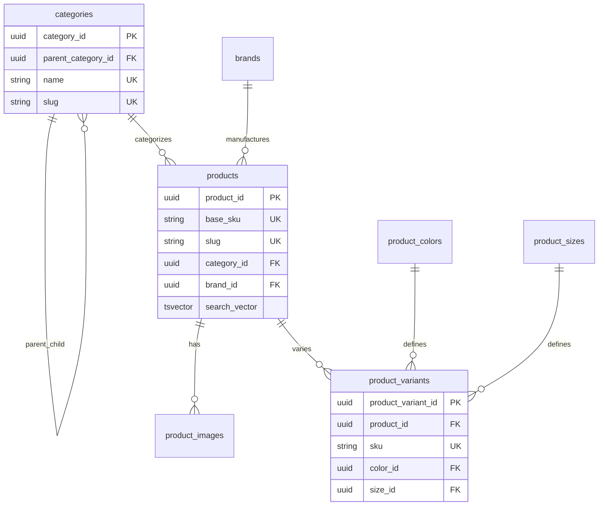

# Catalog Service - Documentação Técnica

## 1. Visão Geral do Microsserviço

O **Catalog Service** é responsável por toda a gestão do catálogo de produtos, incluindo categorias, marcas, variações e inventário. Este microsserviço centraliza as operações relacionadas ao catálogo de produtos e suas características.

### Responsabilidades Principais
- Gestão de categorias hierárquicas
- Administração de marcas e produtos
- Controle de variações (cores, tamanhos)
- Gerenciamento de inventário e estoque
- Indexação e busca de produtos
- Gestão de imagens de produtos
- Controle de preços e promoções

## 2. Estrutura de Tabelas

### 2.1 Tabela: `categories`
**Descrição**: Estrutura hierárquica de categorias de produtos

| Campo | Tipo | Descrição |
|-------|------|----------|
| category_id | UUID | Identificador único da categoria |
| name | VARCHAR(100) | Nome único da categoria |
| slug | VARCHAR(150) | Slug único para URLs |
| description | TEXT | Descrição da categoria |
| parent_category_id | UUID | Referência à categoria pai |
| is_active | BOOLEAN | Status ativo da categoria |
| sort_order | INTEGER | Ordem de exibição |

### 2.2 Tabela: `brands`
**Descrição**: Marcas dos produtos

| Campo | Tipo | Descrição |
|-------|------|----------|
| brand_id | UUID | Identificador único da marca |
| name | VARCHAR(100) | Nome único da marca |
| slug | VARCHAR(150) | Slug único para URLs |
| description | TEXT | Descrição da marca |
| logo_url | VARCHAR(255) | URL do logotipo |
| is_active | BOOLEAN | Status ativo da marca |

### 2.3 Tabela Principal: `products`
**Descrição**: Produtos base do catálogo

| Campo | Tipo | Descrição |
|-------|------|----------|
| product_id | UUID | Identificador único do produto |
| base_sku | VARCHAR(50) | SKU base único |
| name | VARCHAR(150) | Nome do produto |
| slug | VARCHAR(200) | Slug único para URLs |
| description | TEXT | Descrição detalhada |
| category_id | UUID | Referência à categoria |
| brand_id | UUID | Referência à marca |
| base_price | NUMERIC(10,2) | Preço base |
| sale_price | NUMERIC(10,2) | Preço promocional |
| sale_price_start_date | TIMESTAMPTZ | Início da promoção |
| sale_price_end_date | TIMESTAMPTZ | Fim da promoção |
| stock_quantity | INTEGER | Quantidade em estoque |
| is_active | BOOLEAN | Status ativo do produto |
| weight_kg | NUMERIC(6,3) | Peso em quilogramas |
| height_cm | INTEGER | Altura em centímetros |
| width_cm | INTEGER | Largura em centímetros |
| depth_cm | INTEGER | Profundidade em centímetros |
| search_vector | TSVECTOR | Vetor de busca textual |

### 2.4 Tabela: `product_images`
**Descrição**: Imagens dos produtos

| Campo | Tipo | Descrição |
|-------|------|----------|
| product_image_id | UUID | Identificador único da imagem |
| product_id | UUID | Referência ao produto |
| image_url | VARCHAR(255) | URL da imagem |
| alt_text | VARCHAR(255) | Texto alternativo |
| is_cover | BOOLEAN | Imagem de capa |
| sort_order | INTEGER | Ordem de exibição |

### 2.5 Tabela: `product_colors`
**Descrição**: Cores disponíveis para variações

| Campo | Tipo | Descrição |
|-------|------|----------|
| color_id | UUID | Identificador único da cor |
| name | VARCHAR(50) | Nome único da cor |
| hex_code | CHAR(7) | Código hexadecimal |
| is_active | BOOLEAN | Status ativo da cor |

### 2.6 Tabela: `product_sizes`
**Descrição**: Tamanhos disponíveis para variações

| Campo | Tipo | Descrição |
|-------|------|----------|
| size_id | UUID | Identificador único do tamanho |
| name | VARCHAR(50) | Nome único do tamanho |
| size_code | VARCHAR(20) | Código do tamanho |
| sort_order | INTEGER | Ordem de exibição |
| is_active | BOOLEAN | Status ativo do tamanho |

### 2.7 Tabela: `product_variants`
**Descrição**: Variações específicas dos produtos

| Campo | Tipo | Descrição |
|-------|------|----------|
| product_variant_id | UUID | Identificador único da variação |
| product_id | UUID | Referência ao produto base |
| sku | VARCHAR(50) | SKU único da variação |
| color_id | UUID | Referência à cor |
| size_id | UUID | Referência ao tamanho |
| stock_quantity | INTEGER | Estoque específico da variação |
| additional_price | NUMERIC(10,2) | Preço adicional da variação |
| image_url | VARCHAR(255) | Imagem específica da variação |
| is_active | BOOLEAN | Status ativo da variação |

## 3. Relacionamentos Entre Entidades



## 4. Funções e Triggers Específicos

### 4.1 Função de Busca Textual
```sql
CREATE OR REPLACE FUNCTION trigger_update_products_search_vector()
RETURNS TRIGGER
```
**Descrição**: Atualiza automaticamente o vetor de busca com pesos diferenciados:
- Peso 'A': Nome do produto e SKU base
- Peso 'B': Descrição do produto
- Utiliza dicionário português para stemming

### 4.2 Trigger de Timestamp
**Aplicado em todas as tabelas**: Atualiza automaticamente `updated_at`

### 4.3 Constraints de Integridade
- Validação de preço promocional menor que preço base
- Validação de datas de promoção consistentes
- Validação de código hexadecimal para cores
- Unicidade de variações por produto

## 5. Considerações de Segurança

### 5.1 Integridade de Dados
- Constraints rigorosas para preços e datas
- Validação de códigos hexadecimais
- Prevenção de exclusão em cascata para categorias com produtos
- Soft delete para preservar histórico

### 5.2 Controle de Acesso
- Separação clara entre dados públicos e administrativos
- Índices otimizados para consultas públicas
- Controle de versioning para auditoria

## 6. Considerações de Performance

### 6.1 Índices de Busca
- `idx_products_search_vector`: Índice GIN para busca textual
- `idx_products_category_id`: Filtros por categoria
- `idx_products_brand_id`: Filtros por marca
- `idx_products_is_active`: Produtos ativos apenas

### 6.2 Índices de Relacionamento
- `idx_product_variants_product_id`: Variações por produto
- `idx_product_images_product_id`: Imagens por produto
- `uq_product_images_cover_per_product`: Uma capa por produto
- `uq_product_variant_attributes`: Unicidade de variações

### 6.3 Otimizações de Consulta
- Índices parciais para dados ativos
- Busca textual otimizada com pesos
- Índices compostos para queries comuns
- Estrutura hierárquica eficiente para categorias

## 7. Funcionalidades Avançadas

### 7.1 Busca Textual
- Suporte completo ao português brasileiro
- Busca por nome, SKU e descrição
- Ranking por relevância com pesos
- Índice GIN para performance

### 7.2 Gestão de Inventário
- Controle de estoque por produto base
- Controle granular por variação
- Validações de quantidade não negativa
- Histórico de alterações via auditoria

### 7.3 Sistema de Variações
- Combinações flexíveis de cor e tamanho
- Preços adicionais por variação
- Imagens específicas por variação
- Controle independente de estoque

### 7.4 Gestão de Promoções
- Preços promocionais com período definido
- Validação automática de datas
- Constraints para garantir desconto real

## 8. Padrões de Nomenclatura

### 8.1 Convenções de Tabelas
- Prefixo `product_` para tabelas relacionadas a produtos
- Nomes no plural para entidades principais
- Sufixos descritivos (`_images`, `_variants`, `_colors`)

### 8.2 Convenções de Campos
- Snake_case consistente
- Sufixo `_id` para identificadores UUID
- Sufixo `_url` para URLs
- Sufixo `_code` para códigos
- Prefixo `is_` para booleanos de status

### 8.3 Convenções de Índices
- Prefixo `idx_` para índices regulares
- Prefixo `uq_` para constraints únicos
- Nomes descritivos incluindo tabela e propósito
- Índices parciais com sufixo indicativo

## 9. Commands e Queries (CQRS)

### 9.1 Commands (Operações de Escrita)

#### 9.1.1 Product Management Commands

**CreateProductCommand**
```csharp
public class CreateProductCommand : IRequest<Guid>
{
    public string BaseSku { get; set; }
    public string Name { get; set; }
    public string Slug { get; set; }
    public string Description { get; set; }
    public Guid CategoryId { get; set; }
    public Guid BrandId { get; set; }
    public decimal BasePrice { get; set; }
    public decimal? SalePrice { get; set; }
    public DateTime? SalePriceStartDate { get; set; }
    public DateTime? SalePriceEndDate { get; set; }
    public int StockQuantity { get; set; }
    public decimal? WeightKg { get; set; }
    public int? HeightCm { get; set; }
    public int? WidthCm { get; set; }
    public int? DepthCm { get; set; }
}
```
- **Validações**: SKU único, preço > 0, categoria e marca existentes
- **Eventos**: ProductCreatedEvent
- **Segurança**: Requer permissão de administrador

**UpdateProductCommand**
```csharp
public class UpdateProductCommand : IRequest<Unit>
{
    public Guid ProductId { get; set; }
    public string Name { get; set; }
    public string Description { get; set; }
    public Guid CategoryId { get; set; }
    public Guid BrandId { get; set; }
    public decimal? WeightKg { get; set; }
    public int? HeightCm { get; set; }
    public int? WidthCm { get; set; }
    public int? DepthCm { get; set; }
}
```
- **Validações**: Produto existente, categoria e marca válidas
- **Eventos**: ProductUpdatedEvent
- **Cache**: Invalidar cache do produto

**UpdateProductPriceCommand**
```csharp
public class UpdateProductPriceCommand : IRequest<Unit>
{
    public Guid ProductId { get; set; }
    public decimal BasePrice { get; set; }
    public decimal? SalePrice { get; set; }
    public DateTime? SalePriceStartDate { get; set; }
    public DateTime? SalePriceEndDate { get; set; }
}
```
- **Validações**: Preços > 0, sale_price < base_price, datas consistentes
- **Eventos**: ProductPriceUpdatedEvent

**UpdateProductStockCommand**
```csharp
public class UpdateProductStockCommand : IRequest<Unit>
{
    public Guid ProductId { get; set; }
    public int StockQuantity { get; set; }
    public string Reason { get; set; }
}
```
- **Validações**: Quantidade >= 0
- **Eventos**: ProductStockUpdatedEvent
- **Auditoria**: Log de alteração de estoque

#### 9.1.2 Category Management Commands

**CreateCategoryCommand**
```csharp
public class CreateCategoryCommand : IRequest<Guid>
{
    public string Name { get; set; }
    public string Slug { get; set; }
    public string Description { get; set; }
    public Guid? ParentCategoryId { get; set; }
    public int SortOrder { get; set; }
}
```
- **Validações**: Nome único, slug único, categoria pai existente
- **Eventos**: CategoryCreatedEvent

**MoveCategoryCommand**
```csharp
public class MoveCategoryCommand : IRequest<Unit>
{
    public Guid CategoryId { get; set; }
    public Guid? NewParentCategoryId { get; set; }
}
```
- **Validações**: Prevenir referência circular
- **Eventos**: CategoryMovedEvent

#### 9.1.3 Brand Management Commands

**CreateBrandCommand**
```csharp
public class CreateBrandCommand : IRequest<Guid>
{
    public string Name { get; set; }
    public string Slug { get; set; }
    public string Description { get; set; }
    public string LogoUrl { get; set; }
}
```
- **Validações**: Nome único, slug único, URL válida
- **Eventos**: BrandCreatedEvent

#### 9.1.4 Product Variant Commands

**CreateProductVariantCommand**
```csharp
public class CreateProductVariantCommand : IRequest<Guid>
{
    public Guid ProductId { get; set; }
    public string Sku { get; set; }
    public Guid ColorId { get; set; }
    public Guid SizeId { get; set; }
    public int StockQuantity { get; set; }
    public decimal? AdditionalPrice { get; set; }
    public string ImageUrl { get; set; }
}
```
- **Validações**: SKU único, combinação cor/tamanho única por produto
- **Eventos**: ProductVariantCreatedEvent

#### 9.1.5 Product Image Commands

**AddProductImageCommand**
```csharp
public class AddProductImageCommand : IRequest<Guid>
{
    public Guid ProductId { get; set; }
    public string ImageUrl { get; set; }
    public string AltText { get; set; }
    public bool IsCover { get; set; }
    public int SortOrder { get; set; }
}
```
- **Validações**: URL válida, apenas uma imagem de capa por produto
- **Eventos**: ProductImageAddedEvent

### 9.2 Queries (Operações de Leitura)

#### 9.2.1 Product Queries

**GetProductByIdQuery**
```csharp
public class GetProductByIdQuery : IRequest<ProductDto>
{
    public Guid ProductId { get; set; }
    public bool IncludeVariants { get; set; } = false
    public bool IncludeImages { get; set; } = false
}
```
- **Cache**: Redis, TTL 30 minutos
- **Performance**: Índice por product_id

**SearchProductsQuery**
```csharp
public class SearchProductsQuery : IRequest<PagedResult<ProductSummaryDto>>
{
    public string SearchTerm { get; set; }
    public Guid? CategoryId { get; set; }
    public Guid? BrandId { get; set; }
    public decimal? MinPrice { get; set; }
    public decimal? MaxPrice { get; set; }
    public List<Guid> ColorIds { get; set; }
    public List<Guid> SizeIds { get; set; }
    public bool OnlyInStock { get; set; } = true
    public ProductSortBy SortBy { get; set; } = ProductSortBy.Relevance
    public int Page { get; set; } = 1
    public int PageSize { get; set; } = 20
}
```
- **Performance**: Índice GIN para busca textual
- **Cache**: Redis com chave baseada em filtros

**GetProductsByCategoryQuery**
```csharp
public class GetProductsByCategoryQuery : IRequest<PagedResult<ProductSummaryDto>>
{
    public Guid CategoryId { get; set; }
    public bool IncludeSubcategories { get; set; } = true
    public ProductSortBy SortBy { get; set; } = ProductSortBy.Name
    public int Page { get; set; } = 1
    public int PageSize { get; set; } = 20
}
```
- **Cache**: Redis, TTL 15 minutos
- **Performance**: Índice composto category_id + is_active

#### 9.2.2 Category Queries

**GetCategoriesHierarchyQuery**
```csharp
public class GetCategoriesHierarchyQuery : IRequest<List<CategoryHierarchyDto>>
{
    public bool OnlyActive { get; set; } = true
    public int? MaxDepth { get; set; }
}
```
- **Cache**: Redis, TTL 60 minutos
- **Performance**: CTE recursiva otimizada

**GetCategoryBySlugQuery**
```csharp
public class GetCategoryBySlugQuery : IRequest<CategoryDto>
{
    public string Slug { get; set; }
}
```
- **Cache**: Redis, TTL 30 minutos
- **Performance**: Índice único por slug

#### 9.2.3 Brand Queries

**GetActiveBrandsQuery**
```csharp
public class GetActiveBrandsQuery : IRequest<List<BrandDto>>
{
    public bool IncludeProductCount { get; set; } = false
}
```
- **Cache**: Redis, TTL 30 minutos

#### 9.2.4 Product Variant Queries

**GetProductVariantsQuery**
```csharp
public class GetProductVariantsQuery : IRequest<List<ProductVariantDto>>
{
    public Guid ProductId { get; set; }
    public bool OnlyInStock { get; set; } = false
}
```
- **Cache**: Redis, TTL 10 minutos
- **Performance**: Índice por product_id

#### 9.2.5 Inventory Queries

**GetLowStockProductsQuery**
```csharp
public class GetLowStockProductsQuery : IRequest<List<LowStockProductDto>>
{
    public int Threshold { get; set; } = 10
    public Guid? CategoryId { get; set; }
}
```
- **Performance**: Índice por stock_quantity
- **Segurança**: Apenas administradores

#### 9.2.6 Search & Filter Queries

**FullTextSearchQuery**
```csharp
public class FullTextSearchQuery : IRequest<PagedResult<ProductSearchResultDto>>
{
    public string Query { get; set; }
    public int Page { get; set; } = 1
    public int PageSize { get; set; } = 20
}
```
- **Performance**: Índice GIN no search_vector
- **Cache**: Redis com TTL baseado na popularidade da busca

**GetProductFiltersQuery**
```csharp
public class GetProductFiltersQuery : IRequest<ProductFiltersDto>
{
    public Guid? CategoryId { get; set; }
    public string SearchTerm { get; set; }
}
```
- **Cache**: Redis, TTL 20 minutos

### 9.3 Handlers e Eventos

#### 9.3.1 Command Handlers
- Implementam `IRequestHandler<TCommand, TResponse>`
- Validação via FluentValidation
- Transações para operações complexas
- Publicação de eventos de domínio

#### 9.3.2 Query Handlers
- Implementam `IRequestHandler<TQuery, TResponse>`
- Estratégias de cache diferenciadas
- Projeções otimizadas
- Paginação consistente

#### 9.3.3 Domain Events
- `ProductCreatedEvent`
- `ProductUpdatedEvent`
- `ProductPriceUpdatedEvent`
- `ProductStockUpdatedEvent`
- `CategoryCreatedEvent`
- `BrandCreatedEvent`
- `ProductVariantCreatedEvent`

### 9.4 Considerações Técnicas

#### 9.4.1 Segurança
- Autorização baseada em roles
- Validação de entrada rigorosa
- Rate limiting para APIs públicas
- Auditoria de operações sensíveis

#### 9.4.2 Performance
- Cache distribuído com Redis
- Índices otimizados para queries frequentes
- Paginação eficiente
- Projeções read-only para consultas

#### 9.4.3 Tratamento de Erros
- Exceptions específicas por domínio
- Logging estruturado
- Retry policies para operações críticas
- Circuit breaker para dependências externas

#### 9.4.4 Observabilidade
- Métricas de performance por command/query
- Tracing distribuído
- Health checks específicos
- Alertas para operações críticas


# Catalog Service - Tasks

## Setup de Infraestrutura
[ ] Configurar banco de dados PostgreSQL para Catalog
[ ] Configurar Redis para cache de produtos
[ ] Configurar RabbitMQ para eventos de catálogo
[ ] Configurar Elasticsearch para busca de produtos
[ ] Configurar variáveis de ambiente no .env
[ ] Criar .env.example com todas as variáveis necessárias

## Desenvolvimento de APIs
[ ] Implementar endpoint POST /products (criar produto)
[ ] Implementar endpoint GET /products/{id} (buscar produto)
[ ] Implementar endpoint PUT /products/{id} (atualizar produto)
[ ] Implementar endpoint DELETE /products/{id} (deletar produto)
[ ] Implementar endpoint GET /products (listar produtos com filtros)
[ ] Implementar endpoint GET /products/search (busca textual)
[ ] Implementar endpoint POST /categories (criar categoria)
[ ] Implementar endpoint GET /categories (listar categorias)
[ ] Implementar endpoint PUT /categories/{id} (atualizar categoria)
[ ] Implementar endpoint DELETE /categories/{id} (deletar categoria)
[ ] Implementar endpoint GET /products/category/{id} (produtos por categoria)
[ ] Implementar endpoint PUT /products/{id}/inventory (atualizar estoque)
[ ] Implementar validação de dados de entrada
[ ] Implementar middleware de autenticação para operações admin

## Modelo de Dados
[ ] Criar tabela products com campos obrigatórios
[ ] Criar tabela categories para organização
[ ] Criar tabela product_categories para relacionamento N:N
[ ] Criar tabela product_attributes para características
[ ] Criar tabela product_images para imagens
[ ] Criar tabela inventory para controle de estoque
[ ] Implementar triggers para auditoria de estoque
[ ] Implementar índices para performance de busca
[ ] Configurar constraints e relacionamentos

## Sistema de Busca
[ ] Configurar indexação no Elasticsearch
[ ] Implementar sincronização PostgreSQL -> Elasticsearch
[ ] Implementar busca por texto completo
[ ] Implementar filtros por categoria, preço, marca
[ ] Implementar ordenação por relevância, preço, data
[ ] Implementar sugestões de busca (autocomplete)
[ ] Implementar busca por similaridade
[ ] Configurar análise de texto em português

## Gestão de Estoque
[ ] Implementar controle de quantidade disponível
[ ] Implementar reserva temporária de produtos
[ ] Implementar notificações de estoque baixo
[ ] Implementar histórico de movimentações
[ ] Configurar alertas automáticos
[ ] Implementar previsão de demanda

## Cache e Performance
[ ] Implementar cache de produtos populares
[ ] Implementar cache de categorias
[ ] Implementar cache de resultados de busca
[ ] Configurar invalidação inteligente de cache
[ ] Implementar compressão de imagens
[ ] Otimizar queries de listagem
[ ] Implementar paginação eficiente

## Segurança
[ ] Implementar autenticação para operações admin
[ ] Configurar rate limiting para APIs públicas
[ ] Implementar validação de dados de produto
[ ] Configurar CORS adequadamente
[ ] Implementar logs de auditoria
[ ] Configurar sanitização de dados
[ ] Implementar proteção contra SQL injection
[ ] Configurar headers de segurança

## Testes
[ ] Criar testes unitários para controllers
[ ] Criar testes unitários para services
[ ] Criar testes de integração para APIs
[ ] Criar testes para sistema de busca
[ ] Criar testes de performance para listagens
[ ] Configurar coverage de testes
[ ] Implementar testes de carga
[ ] Criar testes para sincronização de dados

## Monitoramento e Logs
[ ] Configurar logs estruturados
[ ] Implementar métricas de performance de busca
[ ] Configurar alertas para falhas de sincronização
[ ] Implementar health check endpoint
[ ] Configurar monitoramento de Elasticsearch
[ ] Implementar métricas de uso de cache

## Deploy e DevOps
[ ] Configurar Dockerfile
[ ] Configurar docker-compose para desenvolvimento
[ ] Configurar pipeline CI/CD
[ ] Configurar ambiente de staging
[ ] Configurar ambiente de produção
[ ] Implementar rollback strategy
[ ] Configurar backup automático do banco
[ ] Configurar backup de índices Elasticsearch

## Documentação
[ ] Documentar APIs com Swagger/OpenAPI
[ ] Criar documentação de setup
[ ] Documentar sistema de busca
[ ] Documentar estrutura de dados
[ ] Criar guia de troubleshooting
[ ] Documentar variáveis de ambiente

## Integração
[ ] Integrar com Order Service para reserva de produtos
[ ] Integrar com Promotion Service para preços
[ ] Configurar eventos para mudanças de estoque
[ ] Implementar webhooks para atualizações
[ ] Integrar com CDN para imagens

## Gestão de Imagens
[ ] Implementar upload de imagens de produtos
[ ] Configurar redimensionamento automático
[ ] Implementar compressão de imagens
[ ] Configurar CDN para delivery
[ ] Implementar watermark automático
[ ] Configurar backup de imagens

## Analytics e Relatórios
[ ] Implementar tracking de visualizações
[ ] Implementar métricas de busca
[ ] Configurar relatórios de produtos populares
[ ] Implementar análise de conversão
[ ] Configurar dashboards de performance

## Compliance
[ ] Implementar LGPD compliance para dados de produto
[ ] Configurar políticas de retenção de dados
[ ] Implementar auditoria de mudanças
[ ] Configurar controle de acesso a dados sensíveis