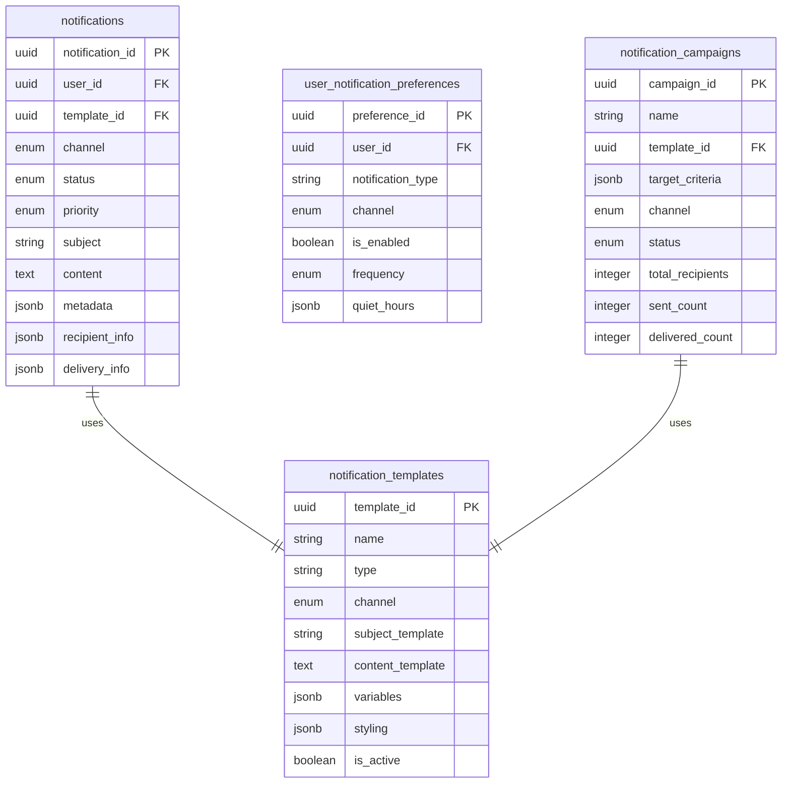
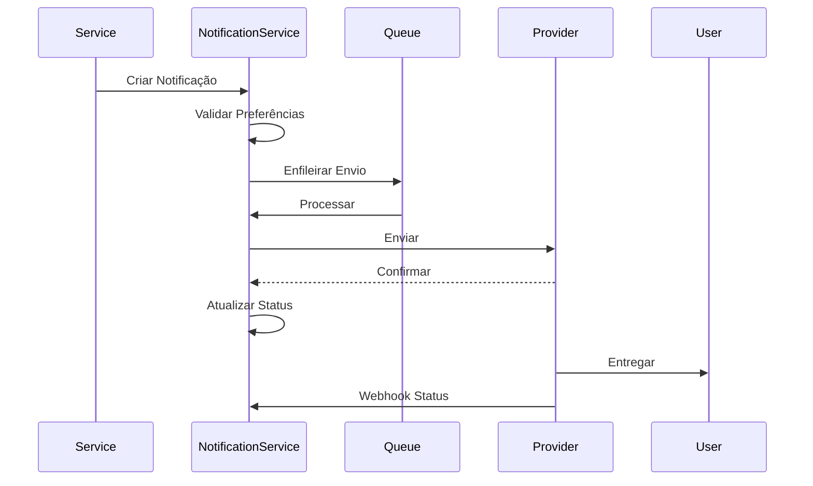

# Notification Service - Documentação Técnica

## 1. Visão Geral do Microsserviço

O **Notification Service** é responsável por todo o sistema de notificações e comunicações do e-commerce. Este microsserviço centraliza o envio de mensagens através de múltiplos canais, gestão de templates, preferências de usuário e controle de entrega de notificações.

### Responsabilidades Principais
- Envio de notificações multi-canal (email, SMS, push, in-app)
- Gestão de templates de mensagens
- Controle de preferências de notificação
- Agendamento e programação de envios
- Rastreamento de entrega e engajamento
- Gestão de listas de contatos
- Prevenção de spam e controle de frequência
- Integração com provedores de comunicação
- Personalização de conteúdo
- Analytics de comunicação

## 2. Estrutura de Tabelas

### 2.1 Tabela Principal: `notifications`
**Descrição**: Notificações enviadas pelo sistema

| Campo | Tipo | Descrição |
|-------|------|----------|
| notification_id | UUID | Identificador único da notificação |
| user_id | UUID | Referência ao usuário destinatário |
| template_id | UUID | Referência ao template utilizado |
| channel | notification_channel_enum | Canal de envio |
| status | notification_status_enum | Status da notificação |
| priority | notification_priority_enum | Prioridade de envio |
| subject | VARCHAR(200) | Assunto da notificação |
| content | TEXT | Conteúdo da mensagem |
| metadata | JSONB | Dados adicionais e contexto |
| recipient_info | JSONB | Informações do destinatário |
| delivery_info | JSONB | Informações de entrega |
| scheduled_at | TIMESTAMPTZ | Data agendada para envio |
| sent_at | TIMESTAMPTZ | Data de envio |
| delivered_at | TIMESTAMPTZ | Data de entrega |
| read_at | TIMESTAMPTZ | Data de leitura |
| created_at | TIMESTAMPTZ | Data de criação |
| updated_at | TIMESTAMPTZ | Última atualização |
| version | INTEGER | Controle de versão |

### 2.2 Tabela: `notification_templates`
**Descrição**: Templates de notificações

| Campo | Tipo | Descrição |
|-------|------|----------|
| template_id | UUID | Identificador único do template |
| name | VARCHAR(100) | Nome do template |
| type | VARCHAR(50) | Tipo de notificação |
| channel | notification_channel_enum | Canal suportado |
| subject_template | VARCHAR(200) | Template do assunto |
| content_template | TEXT | Template do conteúdo |
| variables | JSONB | Variáveis disponíveis |
| styling | JSONB | Configurações de estilo |
| is_active | BOOLEAN | Status ativo/inativo |
| version | INTEGER | Versão do template |
| created_at | TIMESTAMPTZ | Data de criação |
| updated_at | TIMESTAMPTZ | Última atualização |

### 2.3 Tabela: `user_notification_preferences`
**Descrição**: Preferências de notificação dos usuários

| Campo | Tipo | Descrição |
|-------|------|----------|
| preference_id | UUID | Identificador único da preferência |
| user_id | UUID | Referência ao usuário |
| notification_type | VARCHAR(50) | Tipo de notificação |
| channel | notification_channel_enum | Canal de comunicação |
| is_enabled | BOOLEAN | Preferência habilitada |
| frequency | frequency_enum | Frequência de envio |
| quiet_hours | JSONB | Horários de silêncio |
| created_at | TIMESTAMPTZ | Data de criação |
| updated_at | TIMESTAMPTZ | Última atualização |

### 2.4 Tabela: `notification_campaigns`
**Descrição**: Campanhas de notificação em massa

| Campo | Tipo | Descrição |
|-------|------|----------|
| campaign_id | UUID | Identificador único da campanha |
| name | VARCHAR(100) | Nome da campanha |
| template_id | UUID | Referência ao template |
| target_criteria | JSONB | Critérios de segmentação |
| channel | notification_channel_enum | Canal de envio |
| status | campaign_status_enum | Status da campanha |
| scheduled_at | TIMESTAMPTZ | Data agendada |
| started_at | TIMESTAMPTZ | Data de início |
| completed_at | TIMESTAMPTZ | Data de conclusão |
| total_recipients | INTEGER | Total de destinatários |
| sent_count | INTEGER | Quantidade enviada |
| delivered_count | INTEGER | Quantidade entregue |
| opened_count | INTEGER | Quantidade aberta |
| clicked_count | INTEGER | Quantidade clicada |
| created_at | TIMESTAMPTZ | Data de criação |
| updated_at | TIMESTAMPTZ | Última atualização |

## 3. Tipos Enumerados

### 3.1 `notification_channel_enum`
**Descrição**: Canais de notificação disponíveis

| Valor | Descrição |
|-------|----------|
| email | Notificação por email |
| sms | Mensagem de texto SMS |
| push | Notificação push mobile |
| in_app | Notificação dentro do app |
| whatsapp | Mensagem via WhatsApp |

### 3.2 `notification_status_enum`
**Descrição**: Status de uma notificação

| Valor | Descrição |
|-------|----------|
| pending | Aguardando processamento |
| scheduled | Agendada para envio futuro |
| sending | Em processo de envio |
| sent | Enviada com sucesso |
| delivered | Entregue ao destinatário |
| read | Lida pelo usuário |
| failed | Falha no envio |
| cancelled | Cancelada antes do envio |

### 3.3 `notification_priority_enum`
**Descrição**: Prioridade de envio

| Valor | Descrição |
|-------|----------|
| low | Prioridade baixa |
| normal | Prioridade normal |
| high | Prioridade alta |
| urgent | Urgente (imediato) |

### 3.4 `frequency_enum`
**Descrição**: Frequência de notificações

| Valor | Descrição |
|-------|----------|
| immediate | Imediata |
| daily | Diária |
| weekly | Semanal |
| monthly | Mensal |
| never | Nunca |

### 3.5 `campaign_status_enum`
**Descrição**: Status de campanhas

| Valor | Descrição |
|-------|----------|
| draft | Rascunho |
| scheduled | Agendada |
| running | Em execução |
| paused | Pausada |
| completed | Concluída |
| cancelled | Cancelada |

## 4. Relacionamentos Entre Entidades



**Relacionamentos Externos:**
- `user_id` → User Management Service (users.user_id)

## 5. Estrutura de Dados JSONB

### 5.1 `metadata` (Notifications)
**Descrição**: Dados contextuais da notificação

```json
{
  "source_service": "order_service",
  "source_event": "order_confirmed",
  "order_id": "123e4567-e89b-12d3-a456-426614174000",
  "correlation_id": "corr_123456",
  "retry_count": 0,
  "max_retries": 3,
  "tags": ["transactional", "order"],
  "custom_data": {
    "order_total": 150.00,
    "delivery_date": "2024-01-20"
  }
}
```

### 5.2 `recipient_info`
**Descrição**: Informações do destinatário

```json
{
  "email": "user@example.com",
  "phone": "+5511999999999",
  "name": "João Silva",
  "language": "pt-BR",
  "timezone": "America/Sao_Paulo",
  "device_tokens": [
    "fcm_token_123",
    "apns_token_456"
  ],
  "preferences": {
    "html_email": true,
    "marketing_consent": false
  }
}
```

### 5.3 `delivery_info`
**Descrição**: Informações de entrega

```json
{
  "provider": "sendgrid",
  "provider_message_id": "msg_123456789",
  "attempts": 1,
  "last_attempt_at": "2024-01-15T10:30:00Z",
  "delivery_status": "delivered",
  "bounce_reason": null,
  "open_tracking": {
    "opened": true,
    "open_count": 2,
    "first_opened_at": "2024-01-15T11:00:00Z",
    "last_opened_at": "2024-01-15T15:30:00Z"
  },
  "click_tracking": {
    "clicked": true,
    "click_count": 1,
    "clicked_links": [
      {
        "url": "https://example.com/order/123",
        "clicked_at": "2024-01-15T11:05:00Z"
      }
    ]
  }
}
```

### 5.4 `variables` (Templates)
**Descrição**: Variáveis disponíveis no template

```json
{
  "required": [
    {
      "name": "user_name",
      "type": "string",
      "description": "Nome do usuário"
    },
    {
      "name": "order_id",
      "type": "string",
      "description": "ID do pedido"
    }
  ],
  "optional": [
    {
      "name": "order_total",
      "type": "number",
      "description": "Valor total do pedido",
      "default": 0
    },
    {
      "name": "delivery_date",
      "type": "date",
      "description": "Data de entrega",
      "format": "YYYY-MM-DD"
    }
  ]
}
```

### 5.5 `styling` (Templates)
**Descrição**: Configurações de estilo para emails

```json
{
  "theme": "modern",
  "colors": {
    "primary": "#007bff",
    "secondary": "#6c757d",
    "success": "#28a745",
    "background": "#ffffff",
    "text": "#333333"
  },
  "fonts": {
    "primary": "Arial, sans-serif",
    "heading": "Georgia, serif"
  },
  "layout": {
    "width": "600px",
    "padding": "20px",
    "border_radius": "8px"
  },
  "branding": {
    "logo_url": "https://example.com/logo.png",
    "company_name": "E-commerce Store",
    "footer_text": "© 2024 E-commerce Store. Todos os direitos reservados."
  }
}
```

### 5.6 `quiet_hours` (User Preferences)
**Descrição**: Horários de silêncio do usuário

```json
{
  "enabled": true,
  "timezone": "America/Sao_Paulo",
  "daily": {
    "start_time": "22:00",
    "end_time": "08:00"
  },
  "weekends": {
    "enabled": true,
    "start_time": "20:00",
    "end_time": "10:00"
  },
  "exceptions": [
    {
      "type": "urgent",
      "allowed": true
    },
    {
      "type": "security",
      "allowed": true
    }
  ]
}
```

### 5.7 `target_criteria` (Campaigns)
**Descrição**: Critérios de segmentação para campanhas

```json
{
  "user_segments": [
    "premium_customers",
    "active_last_30_days"
  ],
  "filters": {
    "registration_date": {
      "after": "2023-01-01"
    },
    "total_orders": {
      "greater_than": 5
    },
    "location": {
      "countries": ["BR"],
      "states": ["SP", "RJ", "MG"]
    }
  },
  "exclusions": {
    "unsubscribed": true,
    "bounced_emails": true,
    "inactive_devices": true
  },
  "estimated_reach": 15000
}
```

## 6. Considerações de Segurança

### 6.1 Proteção de Dados Pessoais
- Criptografia de informações de contato
- Anonimização de dados em logs
- Controle de acesso a dados sensíveis
- Conformidade com LGPD e GDPR

### 6.2 Prevenção de Spam
- Rate limiting por usuário e IP
- Validação de opt-in/opt-out
- Lista de bloqueio automática
- Monitoramento de reputação de envio

### 6.3 Segurança de Templates
- Sanitização de conteúdo HTML
- Validação de variáveis de template
- Prevenção de XSS em emails
- Controle de acesso a templates

### 6.4 Autenticação de Provedores
- Chaves API seguras
- Rotação automática de credenciais
- Validação de webhooks
- Monitoramento de uso de APIs

## 7. Considerações de Performance

### 7.1 Índices Estratégicos

#### Índices Principais
```sql
CREATE INDEX idx_notifications_user_id ON notifications (user_id);
CREATE INDEX idx_notifications_status ON notifications (status);
CREATE INDEX idx_notifications_channel ON notifications (channel);
CREATE INDEX idx_notifications_scheduled_at ON notifications (scheduled_at);
```

#### Índices JSONB
```sql
CREATE INDEX idx_notifications_metadata_gin ON notifications USING GIN (metadata);
CREATE INDEX idx_notifications_delivery_info_gin ON notifications USING GIN (delivery_info);
```

#### Índices Compostos
```sql
CREATE INDEX idx_notifications_user_status ON notifications (user_id, status);
CREATE INDEX idx_notifications_channel_priority ON notifications (channel, priority);
```

#### Índices Parciais
```sql
CREATE INDEX idx_notifications_pending ON notifications (scheduled_at) 
WHERE status IN ('pending', 'scheduled');
```
**Descrição**: Otimiza consultas de notificações pendentes

### 7.2 Otimizações
- Queue assíncrona para processamento
- Batch processing para envios em massa
- Cache de templates frequentes
- Compressão de dados históricos
- Particionamento por data

## 8. Funcionalidades do Sistema

### 8.1 Processamento de Notificações

#### Fluxo de Envio


#### Etapas do Processamento
1. **Validação de Entrada**
   - Verificar dados obrigatórios
   - Validar template e variáveis
   - Confirmar preferências do usuário

2. **Preparação da Mensagem**
   - Renderizar template
   - Personalizar conteúdo
   - Aplicar configurações de estilo

3. **Controle de Entrega**
   - Verificar horários de silêncio
   - Aplicar rate limiting
   - Escolher provedor adequado

4. **Envio e Rastreamento**
   - Enviar através do provedor
   - Registrar tentativas
   - Processar webhooks de status

### 8.2 Sistema de Templates

#### Engine de Templates
- Suporte a variáveis dinâmicas
- Condicionais e loops
- Formatação de dados
- Internacionalização
- Versionamento de templates

#### Tipos de Template
1. **Transacionais**
   - Confirmação de pedido
   - Status de entrega
   - Redefinição de senha
   - Notificações de segurança

2. **Marketing**
   - Newsletters
   - Promoções
   - Abandono de carrinho
   - Recomendações

3. **Sistema**
   - Alertas de manutenção
   - Atualizações de política
   - Notificações técnicas

### 8.3 Gestão de Preferências

#### Controles Granulares
- Por tipo de notificação
- Por canal de comunicação
- Por frequência de envio
- Por horário de recebimento

#### Opt-in/Opt-out
- Processo de confirmação dupla
- Unsubscribe com um clique
- Centro de preferências
- Histórico de alterações

### 8.4 Campanhas de Marketing

#### Segmentação de Audiência
- Critérios demográficos
- Comportamento de compra
- Engajamento histórico
- Localização geográfica

#### A/B Testing
- Teste de assunto
- Teste de conteúdo
- Teste de horário de envio
- Análise de resultados

## 9. Integração com Provedores

### 9.1 Provedores de Email
- **SendGrid**: Transacional e marketing
- **Amazon SES**: Custo-efetivo
- **Mailgun**: Desenvolvedores
- **Postmark**: Transacional premium

### 9.2 Provedores de SMS
- **Twilio**: Global
- **Zenvia**: Brasil
- **TotalVoice**: Nacional
- **AWS SNS**: Integrado

### 9.3 Push Notifications
- **Firebase Cloud Messaging**: Android/iOS
- **Apple Push Notification**: iOS nativo
- **OneSignal**: Multi-plataforma
- **Pusher**: Real-time

### 9.4 Padrão de Integração

#### Interface Comum
```typescript
interface NotificationProvider {
  send(notification: NotificationData): Promise<SendResponse>;
  getStatus(messageId: string): Promise<DeliveryStatus>;
  validateWebhook(payload: string, signature: string): boolean;
  processWebhook(payload: WebhookPayload): Promise<void>;
}
```

## 10. Triggers e Eventos

### 10.1 Trigger de Eventos de Notificação
```sql
CREATE OR REPLACE FUNCTION trigger_notification_events()
RETURNS TRIGGER
```

#### Eventos Publicados
- `notification.created`: Notificação criada
- `notification.sent`: Notificação enviada
- `notification.delivered`: Notificação entregue
- `notification.opened`: Notificação aberta
- `notification.clicked`: Link clicado
- `notification.failed`: Falha no envio

### 10.2 Eventos de Sistema
- **User Registration**: Boas-vindas
- **Order Events**: Status de pedido
- **Payment Events**: Confirmações
- **Shipping Events**: Rastreamento
- **Security Events**: Alertas

## 11. Monitoramento e Métricas

### 11.1 Métricas de Entrega
- Taxa de entrega por canal
- Taxa de abertura (email)
- Taxa de clique (email/SMS)
- Taxa de bounce
- Taxa de unsubscribe

### 11.2 Métricas de Performance
- Latência de processamento
- Throughput de envios
- Taxa de erro por provedor
- Uso de queue
- Performance de templates

### 11.3 Métricas de Negócio
- Engajamento por tipo
- ROI de campanhas
- Conversão por canal
- Retenção de usuários
- Satisfação de comunicação

### 11.4 Alertas Críticos
- Falhas de provedor
- Taxa de bounce alta
- Queue congestionada
- Problemas de entrega
- Violações de rate limit

## 12. Sistema de Retry e Fallback

### 12.1 Estratégia de Retry
- Retry exponencial com jitter
- Limite máximo de tentativas
- Diferentes estratégias por tipo de erro
- Dead letter queue para falhas

### 12.2 Fallback entre Provedores
- Detecção automática de falhas
- Roteamento para provedor secundário
- Balanceamento de carga
- Monitoramento de saúde

### 12.3 Recuperação de Falhas
- Reprocessamento automático
- Notificação de administradores
- Logs detalhados de erro
- Métricas de recuperação

## 13. Compliance e Regulamentações

### 13.1 LGPD/GDPR
- Consentimento explícito
- Direito ao esquecimento
- Portabilidade de dados
- Auditoria de processamento

### 13.2 CAN-SPAM Act
- Identificação clara do remetente
- Assunto não enganoso
- Opção de unsubscribe
- Endereço físico válido

### 13.3 Regulamentações de SMS
- Opt-in obrigatório
- Horários permitidos
- Identificação do remetente
- Palavras-chave de parada

## 14. Commands e Queries (CQRS)

### 14.1 Commands (Operações de Escrita)

#### 14.1.1 Notification Management Commands

**CreateNotificationCommand**
```csharp
public class CreateNotificationCommand : IRequest<Guid>
{
    public Guid UserId { get; set; }
    public Guid TemplateId { get; set; }
    public NotificationChannel Channel { get; set; }
    public NotificationPriority Priority { get; set; } = NotificationPriority.Normal
    public string Subject { get; set; }
    public string Content { get; set; }
    public Dictionary<string, object> Variables { get; set; }
    public Dictionary<string, object> Metadata { get; set; }
    public RecipientInfo RecipientInfo { get; set; }
    public DateTime? ScheduledAt { get; set; }
}
```
- **Validações**: Template existente, canal válido, dados do destinatário
- **Eventos**: NotificationCreatedEvent
- **Segurança**: Rate limiting por usuário

**SendNotificationCommand**
```csharp
public class SendNotificationCommand : IRequest<Unit>
{
    public Guid NotificationId { get; set; }
    public bool ForceResend { get; set; } = false
    public string ProviderId { get; set; }
}
```
- **Validações**: Notificação existente, status válido para envio
- **Eventos**: NotificationSentEvent, NotificationFailedEvent
- **Rate Limiting**: Controle por canal e provedor

**ScheduleNotificationCommand**
```csharp
public class ScheduleNotificationCommand : IRequest<Unit>
{
    public Guid NotificationId { get; set; }
    public DateTime ScheduledAt { get; set; }
    public string TimeZone { get; set; }
    public bool RespectQuietHours { get; set; } = true
}
```
- **Validações**: Data futura, timezone válido
- **Eventos**: NotificationScheduledEvent
- **Considerações**: Horários de silêncio do usuário

**BulkCreateNotificationsCommand**
```csharp
public class BulkCreateNotificationsCommand : IRequest<List<Guid>>
{
    public List<BulkNotificationItem> Notifications { get; set; }
    public int BatchSize { get; set; } = 100
    public bool ValidateAll { get; set; } = true
}

public class BulkNotificationItem
{
    public Guid UserId { get; set; }
    public Guid TemplateId { get; set; }
    public NotificationChannel Channel { get; set; }
    public Dictionary<string, object> Variables { get; set; }
}
```
- **Performance**: Processamento em lotes
- **Validações**: Limite de quantidade, templates válidos
- **Eventos**: BulkNotificationsCreatedEvent

#### 14.1.2 Template Management Commands

**CreateTemplateCommand**
```csharp
public class CreateTemplateCommand : IRequest<Guid>
{
    public string Name { get; set; }
    public string Type { get; set; }
    public NotificationChannel Channel { get; set; }
    public string SubjectTemplate { get; set; }
    public string ContentTemplate { get; set; }
    public List<TemplateVariable> Variables { get; set; }
    public TemplateStyling Styling { get; set; }
    public string Language { get; set; } = "pt-BR"
}
```
- **Validações**: Nome único, sintaxe de template válida
- **Eventos**: TemplateCreatedEvent
- **Segurança**: Sanitização de HTML, validação de variáveis

**UpdateTemplateCommand**
```csharp
public class UpdateTemplateCommand : IRequest<Unit>
{
    public Guid TemplateId { get; set; }
    public string Name { get; set; }
    public string SubjectTemplate { get; set; }
    public string ContentTemplate { get; set; }
    public List<TemplateVariable> Variables { get; set; }
    public TemplateStyling Styling { get; set; }
    public bool CreateNewVersion { get; set; } = true
}
```
- **Versionamento**: Criação automática de nova versão
- **Eventos**: TemplateUpdatedEvent
- **Cache**: Invalidação de cache de templates

#### 14.1.3 User Preference Commands

**UpdateNotificationPreferencesCommand**
```csharp
public class UpdateNotificationPreferencesCommand : IRequest<Unit>
{
    public Guid UserId { get; set; }
    public List<NotificationPreference> Preferences { get; set; }
}

public class NotificationPreference
{
    public string NotificationType { get; set; }
    public NotificationChannel Channel { get; set; }
    public bool IsEnabled { get; set; }
    public NotificationFrequency Frequency { get; set; }
}
```
- **Validações**: Usuário existente, tipos válidos
- **Eventos**: PreferencesUpdatedEvent
- **Cache**: Atualização de cache de preferências

**SetQuietHoursCommand**
```csharp
public class SetQuietHoursCommand : IRequest<Unit>
{
    public Guid UserId { get; set; }
    public QuietHoursSettings QuietHours { get; set; }
}
```
- **Validações**: Horários válidos, timezone existente
- **Eventos**: QuietHoursUpdatedEvent

#### 14.1.4 Campaign Management Commands

**CreateCampaignCommand**
```csharp
public class CreateCampaignCommand : IRequest<Guid>
{
    public string Name { get; set; }
    public Guid TemplateId { get; set; }
    public CampaignTargetCriteria TargetCriteria { get; set; }
    public NotificationChannel Channel { get; set; }
    public DateTime? ScheduledAt { get; set; }
    public Dictionary<string, object> GlobalVariables { get; set; }
}
```
- **Validações**: Template ativo, critérios válidos
- **Eventos**: CampaignCreatedEvent
- **Estimativa**: Cálculo automático de alcance

**StartCampaignCommand**
```csharp
public class StartCampaignCommand : IRequest<Unit>
{
    public Guid CampaignId { get; set; }
    public bool ValidateReach { get; set; } = true
    public int MaxRecipients { get; set; }
}
```
- **Validações**: Status válido, limite de destinatários
- **Eventos**: CampaignStartedEvent
- **Performance**: Processamento assíncrono

### 14.2 Queries (Operações de Leitura)

#### 14.2.1 Notification Queries

**GetNotificationByIdQuery**
```csharp
public class GetNotificationByIdQuery : IRequest<NotificationDto>
{
    public Guid NotificationId { get; set; }
    public bool IncludeDeliveryInfo { get; set; } = false
    public bool IncludeMetadata { get; set; } = false
}
```
- **Cache**: Redis, TTL 15 minutos
- **Performance**: Índice por notification_id

**GetUserNotificationsQuery**
```csharp
public class GetUserNotificationsQuery : IRequest<PagedResult<NotificationSummaryDto>>
{
    public Guid UserId { get; set; }
    public List<NotificationStatus> StatusFilter { get; set; }
    public List<NotificationChannel> ChannelFilter { get; set; }
    public DateTime? FromDate { get; set; }
    public DateTime? ToDate { get; set; }
    public bool OnlyUnread { get; set; } = false
    public int Page { get; set; } = 1
    public int PageSize { get; set; } = 20
}
```
- **Cache**: Redis, TTL 5 minutos
- **Performance**: Índice composto user_id + created_at
- **Segurança**: Validação de propriedade do usuário

**GetScheduledNotificationsQuery**
```csharp
public class GetScheduledNotificationsQuery : IRequest<List<ScheduledNotificationDto>>
{
    public DateTime? FromDate { get; set; }
    public DateTime? ToDate { get; set; }
    public List<NotificationChannel> Channels { get; set; }
    public NotificationPriority? MinPriority { get; set; }
}
```
- **Performance**: Índice parcial em scheduled_at
- **Segurança**: Apenas administradores

#### 14.2.2 Template Queries

**GetTemplateByIdQuery**
```csharp
public class GetTemplateByIdQuery : IRequest<NotificationTemplateDto>
{
    public Guid TemplateId { get; set; }
    public bool IncludeVariables { get; set; } = true
    public bool IncludeStyling { get; set; } = true
}
```
- **Cache**: Redis, TTL 60 minutos
- **Performance**: Índice por template_id

**GetTemplatesByTypeQuery**
```csharp
public class GetTemplatesByTypeQuery : IRequest<List<TemplateListDto>>
{
    public string Type { get; set; }
    public NotificationChannel? Channel { get; set; }
    public bool OnlyActive { get; set; } = true
    public string Language { get; set; }
}
```
- **Cache**: Redis, TTL 30 minutos
- **Performance**: Índice composto type + channel + is_active

**SearchTemplatesQuery**
```csharp
public class SearchTemplatesQuery : IRequest<PagedResult<TemplateSearchResultDto>>
{
    public string SearchTerm { get; set; }
    public string Type { get; set; }
    public NotificationChannel? Channel { get; set; }
    public int Page { get; set; } = 1
    public int PageSize { get; set; } = 20
}
```
- **Performance**: Busca textual em nome e conteúdo
- **Cache**: Redis com TTL baseado na popularidade

#### 14.2.3 User Preference Queries

**GetUserPreferencesQuery**
```csharp
public class GetUserPreferencesQuery : IRequest<UserNotificationPreferencesDto>
{
    public Guid UserId { get; set; }
    public NotificationChannel? Channel { get; set; }
}
```
- **Cache**: Redis, TTL 30 minutos
- **Performance**: Índice por user_id

#### 14.2.4 Campaign Queries

**GetCampaignStatsQuery**
```csharp
public class GetCampaignStatsQuery : IRequest<CampaignStatsDto>
{
    public Guid CampaignId { get; set; }
    public bool IncludeDetailedMetrics { get; set; } = false
}
```
- **Cache**: Redis, TTL 10 minutos
- **Performance**: Agregações pré-calculadas

**GetActiveCampaignsQuery**
```csharp
public class GetActiveCampaignsQuery : IRequest<List<CampaignSummaryDto>>
{
    public NotificationChannel? Channel { get; set; }
    public DateTime? ScheduledBefore { get; set; }
}
```
- **Cache**: Redis, TTL 5 minutos
- **Performance**: Índice por status + scheduled_at

#### 14.2.5 Analytics Queries

**GetDeliveryStatsQuery**
```csharp
public class GetDeliveryStatsQuery : IRequest<DeliveryStatsDto>
{
    public DateTime FromDate { get; set; }
    public DateTime ToDate { get; set; }
    public List<NotificationChannel> Channels { get; set; }
    public string GroupBy { get; set; } = "day" // day, hour, channel
}
```
- **Performance**: Tabelas de agregação pré-calculadas
- **Cache**: Redis, TTL 60 minutos

**GetEngagementMetricsQuery**
```csharp
public class GetEngagementMetricsQuery : IRequest<EngagementMetricsDto>
{
    public DateTime FromDate { get; set; }
    public DateTime ToDate { get; set; }
    public Guid? CampaignId { get; set; }
    public string TemplateType { get; set; }
}
```
- **Métricas**: Taxa de abertura, cliques, conversões
- **Cache**: Redis, TTL 30 minutos

#### 14.2.6 Admin Queries

**GetSystemHealthQuery**
```csharp
public class GetSystemHealthQuery : IRequest<SystemHealthDto>
{
    public bool IncludeProviderStatus { get; set; } = true
    public bool IncludeQueueMetrics { get; set; } = true
}
```
- **Real-time**: Dados em tempo real
- **Segurança**: Apenas administradores

**GetFailedNotificationsQuery**
```csharp
public class GetFailedNotificationsQuery : IRequest<PagedResult<FailedNotificationDto>>
{
    public DateTime? FromDate { get; set; }
    public DateTime? ToDate { get; set; }
    public string ErrorType { get; set; }
    public NotificationChannel? Channel { get; set; }
    public int Page { get; set; } = 1
    public int PageSize { get; set; } = 50
}
```
- **Performance**: Índice por status + created_at
- **Segurança**: Logs sanitizados

### 14.3 Handlers e Eventos

#### 14.3.1 Command Handlers
- Implementam `IRequestHandler<TCommand, TResponse>`
- Validação via FluentValidation
- Transações para operações críticas
- Publicação de eventos de domínio
- Rate limiting e throttling
- Integração com provedores externos

#### 14.3.2 Query Handlers
- Implementam `IRequestHandler<TQuery, TResponse>`
- Estratégias de cache diferenciadas
- Projeções otimizadas
- Paginação eficiente
- Controle de acesso granular

#### 14.3.3 Domain Events
- `NotificationCreatedEvent`
- `NotificationSentEvent`
- `NotificationDeliveredEvent`
- `NotificationFailedEvent`
- `TemplateCreatedEvent`
- `TemplateUpdatedEvent`
- `CampaignStartedEvent`
- `CampaignCompletedEvent`
- `PreferencesUpdatedEvent`

### 14.4 Considerações Técnicas

#### 14.4.1 Segurança
- Autorização baseada em roles e recursos
- Validação rigorosa de entrada
- Rate limiting por usuário e IP
- Auditoria de operações sensíveis
- Criptografia de dados pessoais
- Validação de webhooks de provedores

#### 14.4.2 Performance
- Cache distribuído com Redis
- Índices otimizados para queries frequentes
- Processamento assíncrono para operações pesadas
- Batch processing para operações em massa
- Particionamento de tabelas por data
- Connection pooling para provedores

#### 14.4.3 Tratamento de Erros
- Exceptions específicas por domínio
- Retry policies com backoff exponencial
- Dead letter queues para falhas persistentes
- Logging estruturado com correlação
- Circuit breaker para provedores externos
- Fallback entre provedores

#### 14.4.4 Compliance
- Conformidade com LGPD/GDPR
- Opt-in/opt-out automático
- Auditoria de consentimentos
- Retenção de dados configurável
- Anonimização de logs
- Relatórios de compliance

#### 14.4.5 Observabilidade
- Métricas de performance por command/query
- Tracing distribuído com correlação
- Health checks para dependências
- Alertas para SLA e rate limits
- Dashboards de monitoramento
- Logs de auditoria estruturados

## 15. Padrões de Nomenclatura

### 15.1 Convenções de Campos
- Snake_case consistente
- Sufixo `_id` para identificadores
- Sufixo `_at` para timestamps
- Sufixo `_count` para contadores
- Campos JSONB com nomes descritivos

### 15.2 Convenções de Templates
- Nomes descritivos e únicos
- Versionamento semântico
- Categorização por tipo
- Documentação de variáveis

### 15.3 Convenções de Eventos
- Formato `service.action`
- Verbos no passado
- Nomes em inglês
- Documentação completa


# Notification Service - Tasks

## Setup de Infraestrutura
[ ] Configurar banco de dados PostgreSQL para Notifications
[ ] Configurar Redis para queue de notificações
[ ] Configurar RabbitMQ para eventos de notificação
[ ] Configurar variáveis de ambiente no .env
[ ] Criar .env.example com todas as variáveis necessárias

## Desenvolvimento de APIs
[ ] Implementar endpoint POST /notifications (criar notificação)
[ ] Implementar endpoint GET /notifications/{id} (buscar notificação)
[ ] Implementar endpoint PUT /notifications/{id} (atualizar notificação)
[ ] Implementar endpoint GET /notifications/user/{user_id} (notificações do usuário)
[ ] Implementar endpoint POST /notifications/send (enviar notificação)
[ ] Implementar endpoint PUT /notifications/{id}/read (marcar como lida)
[ ] Implementar endpoint DELETE /notifications/{id} (deletar notificação)
[ ] Implementar endpoint GET /templates (listar templates)
[ ] Implementar endpoint POST /templates (criar template)
[ ] Implementar endpoint PUT /templates/{id} (atualizar template)
[ ] Implementar endpoint DELETE /templates/{id} (deletar template)
[ ] Implementar endpoint POST /notifications/bulk (envio em massa)
[ ] Implementar endpoint GET /notifications/stats (estatísticas)
[ ] Implementar validação de dados de entrada
[ ] Implementar middleware de autenticação

## Modelo de Dados
[ ] Criar tabela notifications com campos obrigatórios
[ ] Criar tabela notification_templates para templates
[ ] Criar tabela notification_channels para canais
[ ] Criar tabela notification_preferences para preferências
[ ] Criar tabela notification_logs para histórico
[ ] Criar tabela notification_queue para fila
[ ] Criar tabela notification_stats para métricas
[ ] Criar tabela user_subscriptions para inscrições
[ ] Implementar triggers para auditoria
[ ] Implementar índices para performance
[ ] Configurar constraints e relacionamentos

## Canais de Notificação
[ ] Implementar notificações por email
[ ] Implementar notificações por SMS
[ ] Implementar push notifications
[ ] Implementar notificações in-app
[ ] Implementar notificações por WhatsApp
[ ] Implementar notificações por Telegram
[ ] Implementar notificações por Slack
[ ] Implementar webhooks para sistemas externos
[ ] Configurar fallback entre canais

## Sistema de Templates
[ ] Criar templates para emails
[ ] Criar templates para SMS
[ ] Criar templates para push notifications
[ ] Implementar variáveis dinâmicas
[ ] Configurar templates multilíngue
[ ] Implementar versionamento de templates
[ ] Configurar preview de templates
[ ] Implementar validação de templates
[ ] Configurar templates responsivos

## Gestão de Preferências
[ ] Implementar preferências por usuário
[ ] Configurar opt-in/opt-out por canal
[ ] Implementar preferências por tipo
[ ] Configurar horários preferenciais
[ ] Implementar frequência de notificações
[ ] Configurar blacklist de usuários
[ ] Implementar grupos de preferências
[ ] Configurar preferências globais

## Sistema de Filas
[ ] Implementar queue para processamento assíncrono
[ ] Configurar priorização de notificações
[ ] Implementar retry automático
[ ] Configurar dead letter queue
[ ] Implementar rate limiting
[ ] Configurar batch processing
[ ] Implementar scheduling de notificações
[ ] Configurar load balancing

## Integração com Provedores
[ ] Integrar com SendGrid para email
[ ] Integrar com Twilio para SMS
[ ] Integrar com Firebase para push
[ ] Integrar com AWS SES
[ ] Integrar com Mailgun
[ ] Integrar com OneSignal
[ ] Configurar fallback entre provedores
[ ] Implementar health check de provedores

## Personalização
[ ] Implementar personalização de conteúdo
[ ] Configurar segmentação de usuários
[ ] Implementar A/B testing
[ ] Configurar targeting por comportamento
[ ] Implementar recomendações personalizadas
[ ] Configurar timing inteligente
[ ] Implementar conteúdo dinâmico

## Analytics e Métricas
[ ] Implementar tracking de entrega
[ ] Configurar métricas de abertura
[ ] Implementar tracking de cliques
[ ] Configurar métricas de conversão
[ ] Implementar análise de engagement
[ ] Configurar dashboards de performance
[ ] Implementar relatórios automáticos
[ ] Configurar alertas de performance

## Automação
[ ] Implementar triggers automáticos
[ ] Configurar workflows de notificação
[ ] Implementar campanhas automatizadas
[ ] Configurar notificações baseadas em eventos
[ ] Implementar follow-up automático
[ ] Configurar re-engagement campaigns
[ ] Implementar lifecycle notifications

## Segurança e Compliance
[ ] Implementar autenticação para APIs
[ ] Configurar rate limiting
[ ] Implementar validação de conteúdo
[ ] Configurar GDPR compliance
[ ] Implementar opt-out obrigatório
[ ] Configurar logs de auditoria
[ ] Implementar criptografia de dados
[ ] Configurar headers de segurança

## Cache e Performance
[ ] Implementar cache de templates
[ ] Configurar cache de preferências
[ ] Implementar cache de usuários
[ ] Configurar TTL para caches
[ ] Implementar invalidação inteligente
[ ] Otimizar queries de busca
[ ] Configurar connection pooling

## Testes
[ ] Criar testes unitários para controllers
[ ] Criar testes unitários para services
[ ] Criar testes de integração para APIs
[ ] Criar testes para templates
[ ] Criar testes de integração com provedores
[ ] Criar testes de performance
[ ] Configurar coverage de testes
[ ] Implementar testes de carga

## Monitoramento e Logs
[ ] Configurar logs estruturados
[ ] Implementar métricas de entrega
[ ] Configurar alertas de falhas
[ ] Implementar health check endpoint
[ ] Configurar monitoramento de queue
[ ] Implementar dashboards de notificações
[ ] Configurar alertas de volume
[ ] Implementar métricas de latência

## Deploy e DevOps
[ ] Configurar Dockerfile
[ ] Configurar docker-compose para desenvolvimento
[ ] Configurar pipeline CI/CD
[ ] Configurar ambiente de staging
[ ] Configurar ambiente de produção
[ ] Implementar rollback strategy
[ ] Configurar backup automático do banco
[ ] Configurar disaster recovery

## Documentação
[ ] Documentar APIs com Swagger/OpenAPI
[ ] Criar documentação de setup
[ ] Documentar templates disponíveis
[ ] Documentar integrações
[ ] Documentar fluxos de notificação
[ ] Criar guia de troubleshooting
[ ] Documentar variáveis de ambiente

## Integração com Outros Serviços
[ ] Integrar com User Management para dados
[ ] Integrar com Order Service para eventos
[ ] Integrar com Cart Service para abandono
[ ] Integrar com Payment Service para confirmações
[ ] Integrar com Shipping Service para tracking
[ ] Integrar com Promotion Service para ofertas
[ ] Configurar eventos de outros serviços

## Tipos de Notificação
[ ] Implementar notificações de boas-vindas
[ ] Configurar confirmações de pedido
[ ] Implementar alertas de pagamento
[ ] Configurar updates de envio
[ ] Implementar lembretes de carrinho
[ ] Configurar ofertas promocionais
[ ] Implementar alertas de estoque
[ ] Configurar notificações de review
[ ] Implementar alertas de segurança
[ ] Configurar newsletters

## Gestão de Campanhas
[ ] Implementar criação de campanhas
[ ] Configurar segmentação de público
[ ] Implementar agendamento de campanhas
[ ] Configurar A/B testing
[ ] Implementar análise de resultados
[ ] Configurar otimização automática
[ ] Implementar campanhas recorrentes
[ ] Configurar limites de frequência

## Localização e Internacionalização
[ ] Implementar suporte multilíngue
[ ] Configurar templates por idioma
[ ] Implementar detecção automática de idioma
[ ] Configurar fusos horários
[ ] Implementar formatação regional
[ ] Configurar moedas locais
[ ] Implementar conteúdo cultural

## Gestão de Consentimento
[ ] Implementar double opt-in
[ ] Configurar gestão de consentimento
[ ] Implementar histórico de consentimento
[ ] Configurar renovação de consentimento
[ ] Implementar revogação fácil
[ ] Configurar auditoria de consentimento

## Otimização de Entrega
[ ] Implementar otimização de timing
[ ] Configurar análise de engagement
[ ] Implementar send time optimization
[ ] Configurar frequency capping
[ ] Implementar content optimization
[ ] Configurar channel optimization

## Gestão de Bounces e Falhas
[ ] Implementar tratamento de bounces
[ ] Configurar listas de supressão
[ ] Implementar retry inteligente
[ ] Configurar alertas de falhas
[ ] Implementar limpeza automática
[ ] Configurar quarentena de endereços

## Backup e Recuperação
[ ] Configurar backup automático
[ ] Implementar point-in-time recovery
[ ] Configurar replicação de dados
[ ] Implementar disaster recovery
[ ] Configurar testes de recuperação

## Performance e Escalabilidade
[ ] Implementar particionamento de tabelas
[ ] Configurar read replicas
[ ] Implementar load balancing
[ ] Configurar circuit breaker
[ ] Implementar retry policies
[ ] Configurar timeout adequados
[ ] Implementar connection pooling

## Compliance e Auditoria
[ ] Implementar LGPD compliance
[ ] Configurar CAN-SPAM compliance
[ ] Implementar GDPR compliance
[ ] Configurar auditoria de envios
[ ] Implementar retenção de dados
[ ] Configurar anonização de dados

## Integrações Avançadas
[ ] Implementar webhooks bidirecionais
[ ] Configurar sincronização em tempo real
[ ] Implementar event sourcing
[ ] Configurar CQRS pattern
[ ] Implementar saga pattern
[ ] Configurar distributed tracing

## Machine Learning e IA
[ ] Implementar predição de engagement
[ ] Configurar otimização de conteúdo
[ ] Implementar detecção de spam
[ ] Configurar análise de sentimento
[ ] Implementar recomendações inteligentes
[ ] Configurar timing prediction

## Gestão de Recursos
[ ] Implementar throttling inteligente
[ ] Configurar resource pooling
[ ] Implementar auto-scaling
[ ] Configurar cost optimization
[ ] Implementar usage monitoring
[ ] Configurar capacity planning