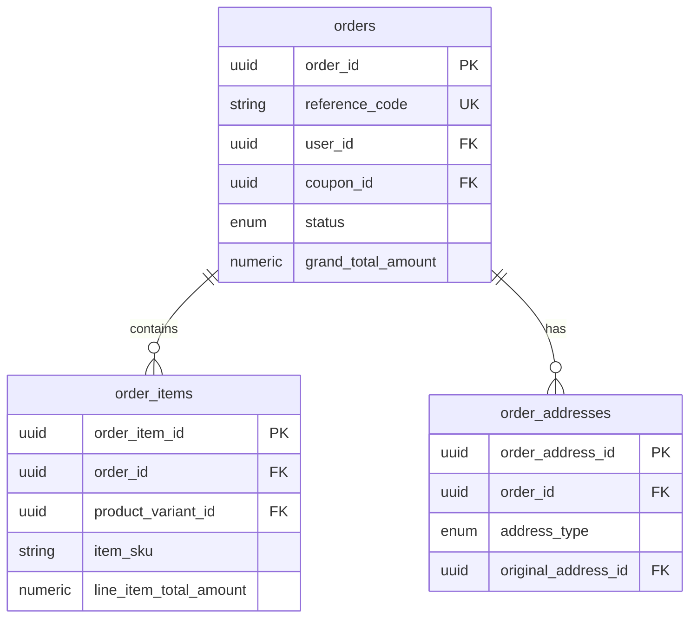
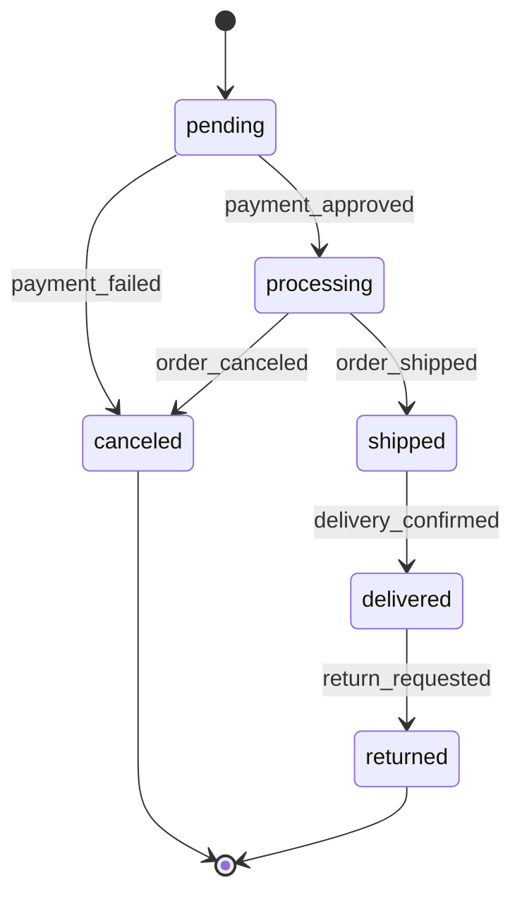

# Order Service - Documentação Técnica

## 1. Visão Geral do Microsserviço

O **Order Service** é responsável por toda a gestão de pedidos e processos de checkout. Este microsserviço centraliza as operações relacionadas à criação, processamento e acompanhamento de pedidos de compra.

### Responsabilidades Principais
- Criação e gestão de pedidos
- Processamento de checkout
- Controle de status de pedidos
- Gestão de itens de pedido
- Snapshot de endereços de entrega
- Cálculo de totais e descontos
- Integração com outros serviços
- Geração de códigos de referência
- Auditoria de alterações de pedidos

## 2. Estrutura de Tabelas

### 2.1 Tabela Principal: `orders`
**Descrição**: Pedidos principais do sistema

| Campo | Tipo | Descrição |
|-------|------|----------|
| order_id | UUID | Identificador único do pedido |
| reference_code | VARCHAR(20) | Código de referência único |
| user_id | UUID | Referência ao usuário |
| coupon_id | UUID | Referência ao cupom aplicado |
| status | order_status_enum | Status atual do pedido |
| items_total_amount | NUMERIC(10,2) | Total dos itens |
| discount_amount | NUMERIC(10,2) | Valor do desconto aplicado |
| shipping_amount | NUMERIC(10,2) | Valor do frete |
| grand_total_amount | NUMERIC(12,2) | Total geral (calculado) |
| created_at | TIMESTAMPTZ | Data de criação |
| updated_at | TIMESTAMPTZ | Última atualização |
| deleted_at | TIMESTAMPTZ | Data de exclusão (soft delete) |
| version | INTEGER | Controle de versão |

### 2.2 Tabela: `order_items`
**Descrição**: Itens individuais dos pedidos

| Campo | Tipo | Descrição |
|-------|------|----------|
| order_item_id | UUID | Identificador único do item |
| order_id | UUID | Referência ao pedido |
| product_variant_id | UUID | Referência à variação do produto |
| item_sku | VARCHAR(100) | SKU do item (snapshot) |
| item_name | VARCHAR(255) | Nome do item (snapshot) |
| quantity | INTEGER | Quantidade comprada |
| unit_price | NUMERIC(10,2) | Preço unitário |
| line_item_total_amount | NUMERIC(12,2) | Total da linha (calculado) |
| created_at | TIMESTAMPTZ | Data de criação |
| updated_at | TIMESTAMPTZ | Última atualização |
| version | INTEGER | Controle de versão |

### 2.3 Tabela: `order_addresses`
**Descrição**: Snapshot dos endereços no momento da compra

| Campo | Tipo | Descrição |
|-------|------|----------|
| order_address_id | UUID | Identificador único do endereço |
| order_id | UUID | Referência ao pedido |
| address_type | address_type_enum | Tipo (shipping, billing) |
| recipient_name | VARCHAR(255) | Nome do destinatário |
| postal_code | CHAR(8) | CEP |
| street | VARCHAR(150) | Logradouro |
| street_number | VARCHAR(20) | Número |
| complement | VARCHAR(100) | Complemento |
| neighborhood | VARCHAR(100) | Bairro |
| city | VARCHAR(100) | Cidade |
| state_code | CHAR(2) | Código do estado |
| country_code | CHAR(2) | Código do país |
| phone | VARCHAR(20) | Telefone de contato |
| original_address_id | UUID | Referência ao endereço original |
| created_at | TIMESTAMPTZ | Data de criação |

## 3. Tipos Enumerados

### 3.1 `order_status_enum`
**Descrição**: Status possíveis de um pedido

| Valor | Descrição |
|-------|----------|
| pending | Pedido criado, aguardando pagamento |
| processing | Pagamento aprovado, processando |
| shipped | Pedido enviado |
| delivered | Pedido entregue |
| canceled | Pedido cancelado |
| returned | Pedido devolvido |

### 3.2 `address_type_enum`
**Descrição**: Tipos de endereço

| Valor | Descrição |
|-------|----------|
| shipping | Endereço de entrega |
| billing | Endereço de cobrança |

## 4. Relacionamentos Entre Entidades



**Relacionamentos Externos:**
- `user_id` → User Management Service (users.user_id)
- `coupon_id` → Promotion Service (coupons.coupon_id)
- `product_variant_id` → Catalog Service (product_variants.product_variant_id)
- `original_address_id` → User Management Service (user_addresses.address_id)

## 5. Funções e Triggers Específicos

### 5.1 Função de Geração de Código
```sql
CREATE OR REPLACE FUNCTION generate_order_code()
RETURNS VARCHAR AS $$
BEGIN
  RETURN 'ORD-' || TO_CHAR(CURRENT_DATE, 'YYYY-') || 
         UPPER(SUBSTRING(REPLACE(gen_random_uuid()::text, '-', ''), 1, 8));
END;
$$ LANGUAGE plpgsql VOLATILE;
```
**Descrição**: Gera códigos únicos no formato "ORD-YYYY-XXXXXXXX"

### 5.2 Trigger de Eventos de Domínio
```sql
CREATE OR REPLACE FUNCTION trigger_order_events()
RETURNS TRIGGER
```
**Descrição**: Publica eventos quando pedidos são criados ou têm status alterado

### 5.3 Campos Calculados
```sql
grand_total_amount NUMERIC(12,2) GENERATED ALWAYS AS 
(items_total_amount - discount_amount + shipping_amount) STORED
```
**Descrição**: Total geral calculado automaticamente

```sql
line_item_total_amount NUMERIC(12,2) GENERATED ALWAYS AS 
(unit_price * quantity) STORED
```
**Descrição**: Total por linha de item calculado automaticamente

## 6. Considerações de Segurança

### 6.1 Integridade de Dados
- Snapshot de dados críticos (endereços, preços, nomes)
- Controle de versioning para auditoria
- Soft delete para preservar histórico
- Validação de valores não negativos

### 6.2 Controle de Acesso
- Isolamento de pedidos por usuário
- Validação de propriedade antes de operações
- Auditoria completa de alterações
- Controle de status transitions

### 6.3 Consistência Transacional
- Operações atômicas para criação de pedidos
- Rollback automático em caso de falha
- Validação de integridade referencial
- Sincronização com outros serviços

## 7. Considerações de Performance

### 7.1 Índices Estratégicos

#### Índices Principais
```sql
CREATE INDEX idx_orders_user_id ON orders (user_id);
CREATE INDEX idx_orders_status ON orders (status);
CREATE INDEX idx_orders_created_at ON orders (created_at DESC);
CREATE INDEX idx_order_items_order_id ON order_items (order_id);
```

#### Índices Compostos
```sql
CREATE INDEX idx_orders_user_status_date ON orders (user_id, status, created_at DESC);
```
**Descrição**: Otimiza consultas de pedidos por usuário e status

### 7.2 Otimizações
- Campos calculados para evitar JOINs
- Índices parciais para dados ativos
- Consultas otimizadas com paginação
- Cache de totais pré-calculados

## 8. Funcionalidades do Sistema

### 8.1 Processo de Checkout

#### Etapas do Checkout
1. **Validação do Carrinho**
   - Verificar disponibilidade de produtos
   - Validar preços atuais
   - Confirmar quantidades

2. **Aplicação de Promoções**
   - Validar cupons de desconto
   - Calcular descontos aplicáveis
   - Atualizar totais

3. **Criação do Pedido**
   - Gerar código de referência
   - Criar registro principal
   - Copiar itens do carrinho
   - Snapshot de endereços

4. **Processamento de Pagamento**
   - Integrar com Payment Service
   - Aguardar confirmação
   - Atualizar status do pedido

### 8.2 Gestão de Status

#### Fluxo de Status


#### Regras de Transição
- `pending` → `processing`: Pagamento aprovado
- `pending` → `canceled`: Pagamento falhou ou cancelamento
- `processing` → `shipped`: Pedido enviado
- `processing` → `canceled`: Cancelamento antes do envio
- `shipped` → `delivered`: Entrega confirmada
- `delivered` → `returned`: Solicitação de devolução

### 8.3 Cálculos de Totais

#### Estrutura de Cálculo
```
Total dos Itens (items_total_amount)
- Desconto (discount_amount)
+ Frete (shipping_amount)
= Total Geral (grand_total_amount)
```

#### Validações
- Valores não podem ser negativos
- Desconto não pode exceder total dos itens
- Frete deve ser calculado externamente

## 9. Integração com Outros Serviços

### 9.1 Cart Service
- Conversão de carrinho em pedido
- Transferência de itens
- Limpeza do carrinho pós-checkout

### 9.2 Payment Service
- Processamento de pagamentos
- Atualização de status baseada em pagamento
- Gestão de reembolsos

### 9.3 User Management Service
- Validação de usuários
- Snapshot de endereços
- Histórico de pedidos por usuário

### 9.4 Catalog Service
- Validação de produtos
- Snapshot de informações de produtos
- Verificação de disponibilidade

### 9.5 Promotion Service
- Aplicação de cupons
- Cálculo de descontos
- Validação de promoções

## 10. Procedure de Checkout Completo

### 10.1 Função `complete_order_checkout`
```sql
CREATE OR REPLACE FUNCTION complete_order_checkout(
    p_user_id UUID,
    p_cart_id UUID,
    p_shipping_address_data JSONB,
    p_billing_address_data JSONB,
    p_payment_method payment_method_enum,
    p_payment_details JSONB,
    p_coupon_code VARCHAR(50) DEFAULT NULL
)
RETURNS JSONB
```

**Descrição**: Coordena todo o processo de checkout em uma transação

#### Etapas da Função
1. Criar pedido principal
2. Copiar itens do carrinho
3. Criar endereços do pedido
4. Iniciar pagamento
5. Limpar carrinho
6. Retornar resultado

## 11. Monitoramento e Métricas

### 11.1 Métricas de Negócio
- Taxa de conversão checkout
- Valor médio do pedido
- Tempo médio de processamento
- Taxa de cancelamento por status
- Produtos mais vendidos

### 11.2 Métricas Técnicas
- Performance de criação de pedidos
- Uso de índices
- Taxa de falha em transações
- Tempo de resposta de consultas

### 11.3 Alertas
- Pedidos com status inconsistente
- Falhas no processo de checkout
- Pedidos pendentes há muito tempo
- Discrepâncias em totais calculados

## 12. Padrões de Nomenclatura

### 12.1 Convenções de Tabelas
- Prefixo `order_` para tabelas relacionadas
- Nomes descritivos e claros
- Relacionamentos explícitos via foreign keys

### 12.2 Convenções de Campos
- Snake_case consistente
- Sufixo `_amount` para valores monetários
- Sufixo `_id` para identificadores
- Prefixo `item_` para campos de snapshot
- Campos de auditoria padronizados

### 12.3 Convenções de Status
- Valores em inglês minúsculo
- Estados claros e não ambíguos
- Transições lógicas definidas
- Documentação completa de fluxos

## 13. Commands e Queries (CQRS)

### 13.1 Commands

#### 13.1.1 Order Management Commands

##### CreateOrderCommand
```csharp
public class CreateOrderCommand : IRequest<CreateOrderResult>
{
    public Guid UserId { get; set; }
    public Guid? CouponId { get; set; }
    public List<CreateOrderItemDto> Items { get; set; }
    public CreateOrderAddressDto ShippingAddress { get; set; }
    public CreateOrderAddressDto? BillingAddress { get; set; }
    public decimal ShippingAmount { get; set; }
}

public class CreateOrderItemDto
{
    public Guid ProductVariantId { get; set; }
    public int Quantity { get; set; }
    public decimal UnitPrice { get; set; }
}

public class CreateOrderAddressDto
{
    public string RecipientName { get; set; }
    public string PostalCode { get; set; }
    public string Street { get; set; }
    public string StreetNumber { get; set; }
    public string? Complement { get; set; }
    public string Neighborhood { get; set; }
    public string City { get; set; }
    public string StateCode { get; set; }
    public string CountryCode { get; set; }
    public string? Phone { get; set; }
    public Guid? OriginalAddressId { get; set; }
}
```

**Validações:**
- UserId deve existir no User Management Service
- Items não pode estar vazio
- Quantities devem ser positivas
- UnitPrice deve ser positivo
- Endereços devem ter campos obrigatórios preenchidos

**Handler:** `CreateOrderCommandHandler`
**Eventos:** `OrderCreatedEvent`, `OrderItemsAddedEvent`
**Integração:** Cart Service (limpeza), Catalog Service (validação), User Management (endereços)

##### UpdateOrderStatusCommand
```csharp
public class UpdateOrderStatusCommand : IRequest<UpdateOrderStatusResult>
{
    public Guid OrderId { get; set; }
    public OrderStatus NewStatus { get; set; }
    public string? Reason { get; set; }
    public Guid UpdatedBy { get; set; }
}
```

**Validações:**
- Transição de status deve ser válida
- Usuário deve ter permissão para alterar status
- Reason obrigatório para cancelamentos

**Handler:** `UpdateOrderStatusCommandHandler`
**Eventos:** `OrderStatusChangedEvent`
**Segurança:** Validação de propriedade do pedido

##### CancelOrderCommand
```csharp
public class CancelOrderCommand : IRequest<CancelOrderResult>
{
    public Guid OrderId { get; set; }
    public string CancellationReason { get; set; }
    public Guid CancelledBy { get; set; }
}
```

**Validações:**
- Pedido deve estar em status cancelável (pending, processing)
- CancellationReason obrigatório

**Handler:** `CancelOrderCommandHandler`
**Eventos:** `OrderCancelledEvent`
**Integração:** Payment Service (reembolso)

##### CompleteCheckoutCommand
```csharp
public class CompleteCheckoutCommand : IRequest<CompleteCheckoutResult>
{
    public Guid UserId { get; set; }
    public Guid CartId { get; set; }
    public CreateOrderAddressDto ShippingAddress { get; set; }
    public CreateOrderAddressDto? BillingAddress { get; set; }
    public PaymentMethodDto PaymentMethod { get; set; }
    public string? CouponCode { get; set; }
}
```

**Validações:**
- Carrinho deve existir e ter itens
- Produtos devem estar disponíveis
- Cupom deve ser válido (se fornecido)
- Método de pagamento deve ser válido

**Handler:** `CompleteCheckoutCommandHandler`
**Eventos:** `CheckoutCompletedEvent`, `OrderCreatedEvent`
**Integração:** Cart, Payment, Promotion Services
**Processamento:** Assíncrono com saga pattern

#### 13.1.2 Order Items Commands

##### AddOrderItemCommand
```csharp
public class AddOrderItemCommand : IRequest<AddOrderItemResult>
{
    public Guid OrderId { get; set; }
    public Guid ProductVariantId { get; set; }
    public int Quantity { get; set; }
    public decimal UnitPrice { get; set; }
}
```

**Validações:**
- Pedido deve estar em status modificável
- Produto deve existir e estar disponível
- Quantity deve ser positiva

**Handler:** `AddOrderItemCommandHandler`
**Eventos:** `OrderItemAddedEvent`, `OrderTotalsRecalculatedEvent`

##### UpdateOrderItemCommand
```csharp
public class UpdateOrderItemCommand : IRequest<UpdateOrderItemResult>
{
    public Guid OrderItemId { get; set; }
    public int NewQuantity { get; set; }
}
```

**Handler:** `UpdateOrderItemCommandHandler`
**Eventos:** `OrderItemUpdatedEvent`, `OrderTotalsRecalculatedEvent`

##### RemoveOrderItemCommand
```csharp
public class RemoveOrderItemCommand : IRequest<RemoveOrderItemResult>
{
    public Guid OrderItemId { get; set; }
}
```

**Handler:** `RemoveOrderItemCommandHandler`
**Eventos:** `OrderItemRemovedEvent`, `OrderTotalsRecalculatedEvent`

#### 13.1.3 Order Processing Commands

##### ProcessPaymentCommand
```csharp
public class ProcessPaymentCommand : IRequest<ProcessPaymentResult>
{
    public Guid OrderId { get; set; }
    public PaymentMethodDto PaymentMethod { get; set; }
    public decimal Amount { get; set; }
}
```

**Handler:** `ProcessPaymentCommandHandler`
**Eventos:** `PaymentProcessedEvent`, `OrderStatusChangedEvent`
**Integração:** Payment Service
**Processamento:** Assíncrono

##### ShipOrderCommand
```csharp
public class ShipOrderCommand : IRequest<ShipOrderResult>
{
    public Guid OrderId { get; set; }
    public string TrackingCode { get; set; }
    public string CarrierName { get; set; }
    public DateTime EstimatedDeliveryDate { get; set; }
}
```

**Handler:** `ShipOrderCommandHandler`
**Eventos:** `OrderShippedEvent`
**Integração:** Shipping Service, Notification Service

##### DeliverOrderCommand
```csharp
public class DeliverOrderCommand : IRequest<DeliverOrderResult>
{
    public Guid OrderId { get; set; }
    public DateTime DeliveredAt { get; set; }
    public string? DeliveryNotes { get; set; }
}
```

**Handler:** `DeliverOrderCommandHandler`
**Eventos:** `OrderDeliveredEvent`

##### ReturnOrderCommand
```csharp
public class ReturnOrderCommand : IRequest<ReturnOrderResult>
{
    public Guid OrderId { get; set; }
    public string ReturnReason { get; set; }
    public List<Guid> ItemsToReturn { get; set; }
}
```

**Handler:** `ReturnOrderCommandHandler`
**Eventos:** `OrderReturnRequestedEvent`
**Integração:** Payment Service (reembolso)

#### 13.1.4 Order Calculations Commands

##### RecalculateOrderTotalsCommand
```csharp
public class RecalculateOrderTotalsCommand : IRequest<RecalculateOrderTotalsResult>
{
    public Guid OrderId { get; set; }
}
```

**Handler:** `RecalculateOrderTotalsCommandHandler`
**Eventos:** `OrderTotalsRecalculatedEvent`

##### ApplyCouponCommand
```csharp
public class ApplyCouponCommand : IRequest<ApplyCouponResult>
{
    public Guid OrderId { get; set; }
    public string CouponCode { get; set; }
}
```

**Validações:**
- Cupom deve ser válido e ativo
- Pedido deve atender critérios do cupom

**Handler:** `ApplyCouponCommandHandler`
**Eventos:** `CouponAppliedEvent`, `OrderTotalsRecalculatedEvent`
**Integração:** Promotion Service

##### RemoveCouponCommand
```csharp
public class RemoveCouponCommand : IRequest<RemoveCouponResult>
{
    public Guid OrderId { get; set; }
}
```

**Handler:** `RemoveCouponCommandHandler`
**Eventos:** `CouponRemovedEvent`, `OrderTotalsRecalculatedEvent`

### 13.2 Queries

#### 13.2.1 Order Queries

##### GetOrderByIdQuery
```csharp
public class GetOrderByIdQuery : IRequest<OrderDetailDto>
{
    public Guid OrderId { get; set; }
    public Guid? RequestingUserId { get; set; }
}

public class OrderDetailDto
{
    public Guid OrderId { get; set; }
    public string ReferenceCode { get; set; }
    public Guid UserId { get; set; }
    public OrderStatus Status { get; set; }
    public decimal ItemsTotalAmount { get; set; }
    public decimal DiscountAmount { get; set; }
    public decimal ShippingAmount { get; set; }
    public decimal GrandTotalAmount { get; set; }
    public DateTime CreatedAt { get; set; }
    public List<OrderItemDto> Items { get; set; }
    public List<OrderAddressDto> Addresses { get; set; }
    public CouponDto? AppliedCoupon { get; set; }
}
```

**Handler:** `GetOrderByIdQueryHandler`
**Cache:** Redis, TTL 5 minutos
**Segurança:** Validação de propriedade do pedido

##### GetOrdersByUserIdQuery
```csharp
public class GetOrdersByUserIdQuery : IRequest<PagedResult<OrderSummaryDto>>
{
    public Guid UserId { get; set; }
    public OrderStatus? Status { get; set; }
    public DateTime? FromDate { get; set; }
    public DateTime? ToDate { get; set; }
    public int Page { get; set; } = 1;
    public int PageSize { get; set; } = 20;
}

public class OrderSummaryDto
{
    public Guid OrderId { get; set; }
    public string ReferenceCode { get; set; }
    public OrderStatus Status { get; set; }
    public decimal GrandTotalAmount { get; set; }
    public DateTime CreatedAt { get; set; }
    public int ItemsCount { get; set; }
}
```

**Handler:** `GetOrdersByUserIdQueryHandler`
**Cache:** Redis, TTL 2 minutos
**Paginação:** Cursor-based para performance

##### GetOrderByReferenceCodeQuery
```csharp
public class GetOrderByReferenceCodeQuery : IRequest<OrderDetailDto>
{
    public string ReferenceCode { get; set; }
    public Guid? RequestingUserId { get; set; }
}
```

**Handler:** `GetOrderByReferenceCodeQueryHandler`
**Cache:** Redis, TTL 10 minutos
**Índice:** Otimizado para busca por reference_code

##### GetOrdersWithFiltersQuery
```csharp
public class GetOrdersWithFiltersQuery : IRequest<PagedResult<OrderSummaryDto>>
{
    public List<OrderStatus>? Statuses { get; set; }
    public DateTime? FromDate { get; set; }
    public DateTime? ToDate { get; set; }
    public decimal? MinAmount { get; set; }
    public decimal? MaxAmount { get; set; }
    public string? CustomerEmail { get; set; }
    public int Page { get; set; } = 1;
    public int PageSize { get; set; } = 50;
}
```

**Handler:** `GetOrdersWithFiltersQueryHandler`
**Segurança:** Apenas administradores
**Performance:** Índices compostos otimizados

#### 13.2.2 Order Items Queries

##### GetOrderItemsQuery
```csharp
public class GetOrderItemsQuery : IRequest<List<OrderItemDto>>
{
    public Guid OrderId { get; set; }
}

public class OrderItemDto
{
    public Guid OrderItemId { get; set; }
    public Guid ProductVariantId { get; set; }
    public string ItemSku { get; set; }
    public string ItemName { get; set; }
    public int Quantity { get; set; }
    public decimal UnitPrice { get; set; }
    public decimal LineItemTotalAmount { get; set; }
}
```

**Handler:** `GetOrderItemsQueryHandler`
**Cache:** Incluído no cache do pedido principal

##### GetOrderItemByIdQuery
```csharp
public class GetOrderItemByIdQuery : IRequest<OrderItemDetailDto>
{
    public Guid OrderItemId { get; set; }
}
```

**Handler:** `GetOrderItemByIdQueryHandler`

#### 13.2.3 Order Address Queries

##### GetOrderAddressesQuery
```csharp
public class GetOrderAddressesQuery : IRequest<List<OrderAddressDto>>
{
    public Guid OrderId { get; set; }
}

public class OrderAddressDto
{
    public Guid OrderAddressId { get; set; }
    public AddressType AddressType { get; set; }
    public string RecipientName { get; set; }
    public string PostalCode { get; set; }
    public string Street { get; set; }
    public string StreetNumber { get; set; }
    public string? Complement { get; set; }
    public string Neighborhood { get; set; }
    public string City { get; set; }
    public string StateCode { get; set; }
    public string CountryCode { get; set; }
    public string? Phone { get; set; }
}
```

**Handler:** `GetOrderAddressesQueryHandler`

##### GetOrderAddressByTypeQuery
```csharp
public class GetOrderAddressByTypeQuery : IRequest<OrderAddressDto>
{
    public Guid OrderId { get; set; }
    public AddressType AddressType { get; set; }
}
```

**Handler:** `GetOrderAddressByTypeQueryHandler`

#### 13.2.4 Analytics Queries

##### GetOrderStatisticsQuery
```csharp
public class GetOrderStatisticsQuery : IRequest<OrderStatisticsDto>
{
    public DateTime FromDate { get; set; }
    public DateTime ToDate { get; set; }
    public Guid? UserId { get; set; }
}

public class OrderStatisticsDto
{
    public int TotalOrders { get; set; }
    public decimal TotalRevenue { get; set; }
    public decimal AverageOrderValue { get; set; }
    public Dictionary<OrderStatus, int> OrdersByStatus { get; set; }
    public decimal ConversionRate { get; set; }
}
```

**Handler:** `GetOrderStatisticsQueryHandler`
**Cache:** Redis, TTL 1 hora
**Performance:** Agregações pré-calculadas

##### GetOrdersByDateRangeQuery
```csharp
public class GetOrdersByDateRangeQuery : IRequest<PagedResult<OrderSummaryDto>>
{
    public DateTime FromDate { get; set; }
    public DateTime ToDate { get; set; }
    public int Page { get; set; } = 1;
    public int PageSize { get; set; } = 100;
}
```

**Handler:** `GetOrdersByDateRangeQueryHandler`
**Performance:** Índice otimizado por data

##### GetTopSellingProductsQuery
```csharp
public class GetTopSellingProductsQuery : IRequest<List<TopSellingProductDto>>
{
    public DateTime FromDate { get; set; }
    public DateTime ToDate { get; set; }
    public int Limit { get; set; } = 10;
}

public class TopSellingProductDto
{
    public Guid ProductVariantId { get; set; }
    public string ProductName { get; set; }
    public string Sku { get; set; }
    public int TotalQuantitySold { get; set; }
    public decimal TotalRevenue { get; set; }
}
```

**Handler:** `GetTopSellingProductsQueryHandler`
**Cache:** Redis, TTL 6 horas
**Performance:** View materializada

#### 13.2.5 Admin Queries

##### GetAllOrdersQuery
```csharp
public class GetAllOrdersQuery : IRequest<PagedResult<OrderSummaryDto>>
{
    public int Page { get; set; } = 1;
    public int PageSize { get; set; } = 50;
    public string? SortBy { get; set; } = "created_at";
    public string? SortDirection { get; set; } = "desc";
}
```

**Handler:** `GetAllOrdersQueryHandler`
**Segurança:** Apenas administradores
**Performance:** Paginação otimizada

##### GetOrdersRequiringAttentionQuery
```csharp
public class GetOrdersRequiringAttentionQuery : IRequest<List<OrderAlertDto>>
{
    public int HoursThreshold { get; set; } = 24;
}

public class OrderAlertDto
{
    public Guid OrderId { get; set; }
    public string ReferenceCode { get; set; }
    public OrderStatus Status { get; set; }
    public string AlertReason { get; set; }
    public DateTime CreatedAt { get; set; }
    public int HoursSinceCreated { get; set; }
}
```

**Handler:** `GetOrdersRequiringAttentionQueryHandler`
**Alertas:**
- Pedidos pending há mais de X horas
- Pedidos processing sem movimento
- Pedidos shipped sem confirmação de entrega

### 13.3 Características Técnicas

#### 13.3.1 Validações de Negócio
- Transições de status validadas por máquina de estados
- Integridade referencial com outros serviços
- Validação de valores monetários (não negativos)
- Controle de concorrência otimista

#### 13.3.2 Eventos de Domínio
```csharp
public class OrderCreatedEvent : IDomainEvent
{
    public Guid OrderId { get; set; }
    public Guid UserId { get; set; }
    public decimal GrandTotalAmount { get; set; }
    public DateTime CreatedAt { get; set; }
}

public class OrderStatusChangedEvent : IDomainEvent
{
    public Guid OrderId { get; set; }
    public OrderStatus PreviousStatus { get; set; }
    public OrderStatus NewStatus { get; set; }
    public string? Reason { get; set; }
    public DateTime ChangedAt { get; set; }
}
```

#### 13.3.3 Estratégias de Cache
- **Orders:** TTL 5-10 minutos, invalidação por eventos
- **Statistics:** TTL 1-6 horas, refresh assíncrono
- **User Orders:** TTL 2 minutos, cache por usuário
- **Reference Codes:** TTL 10 minutos, alta taxa de hit

#### 13.3.4 Segurança
- Isolamento de dados por usuário
- Validação de propriedade em todas as operações
- Auditoria completa de alterações
- Rate limiting para operações críticas

#### 13.3.5 Tratamento de Erros
```csharp
public class OrderNotFoundException : DomainException
public class InvalidOrderStatusTransitionException : DomainException
public class InsufficientInventoryException : DomainException
public class InvalidCouponException : DomainException
```

#### 13.3.6 Observabilidade
- Logging estruturado com correlation IDs
- Métricas de performance por operação
- Traces distribuídos para checkout
- Alertas para operações críticas

#### 13.3.7 Processamento Assíncrono
- Checkout process via saga pattern
- Payment processing com retry policies
- Email notifications via message queue
- Inventory updates via event sourcing

#### 13.3.8 Integração com Outros Serviços
- **Cart Service:** Conversão e limpeza de carrinho
- **Payment Service:** Processamento de pagamentos
- **User Management:** Validação de usuários e endereços
- **Catalog Service:** Validação de produtos e preços
- **Promotion Service:** Aplicação de cupons e descontos
- **Shipping Service:** Cálculo de frete e tracking
- **Notification Service:** Comunicação com clientes


# Order Service - Tasks

## Setup de Infraestrutura
[ ] Configurar banco de dados PostgreSQL para Orders
[ ] Configurar Redis para cache de pedidos
[ ] Configurar RabbitMQ para eventos de pedidos
[ ] Configurar variáveis de ambiente no .env
[ ] Criar .env.example com todas as variáveis necessárias

## Desenvolvimento de APIs
[ ] Implementar endpoint POST /orders (criar pedido)
[ ] Implementar endpoint GET /orders/{id} (buscar pedido)
[ ] Implementar endpoint GET /orders (listar pedidos do usuário)
[ ] Implementar endpoint PUT /orders/{id}/status (atualizar status)
[ ] Implementar endpoint POST /orders/{id}/cancel (cancelar pedido)
[ ] Implementar endpoint GET /orders/{id}/tracking (rastreamento)
[ ] Implementar endpoint POST /orders/{id}/refund (solicitar reembolso)
[ ] Implementar endpoint GET /orders/admin (listar todos - admin)
[ ] Implementar endpoint PUT /orders/{id}/shipping (atualizar envio)
[ ] Implementar endpoint GET /orders/{id}/invoice (gerar fatura)
[ ] Implementar validação de dados de entrada
[ ] Implementar middleware de autenticação
[ ] Implementar middleware de autorização

## Modelo de Dados
[ ] Criar tabela orders com campos obrigatórios
[ ] Criar tabela order_items para itens do pedido
[ ] Criar tabela order_status_history para histórico
[ ] Criar tabela order_payments para pagamentos
[ ] Criar tabela order_shipping para dados de envio
[ ] Criar tabela order_refunds para reembolsos
[ ] Implementar triggers para auditoria
[ ] Implementar índices para performance
[ ] Configurar constraints e relacionamentos

## Máquina de Estados
[ ] Implementar estados do pedido (pending, confirmed, processing, shipped, delivered, cancelled)
[ ] Configurar transições válidas entre estados
[ ] Implementar validações de mudança de estado
[ ] Configurar eventos automáticos de transição
[ ] Implementar rollback de estados inválidos
[ ] Configurar notificações por mudança de estado

## Processamento de Pedidos
[ ] Implementar validação de carrinho
[ ] Implementar reserva de produtos
[ ] Implementar cálculo de totais
[ ] Implementar aplicação de cupons
[ ] Implementar cálculo de frete
[ ] Implementar geração de número do pedido
[ ] Configurar timeout para confirmação
[ ] Implementar processamento assíncrono

## Integração com Outros Serviços
[ ] Integrar com Cart Service para dados do carrinho
[ ] Integrar com Payment Service para pagamentos
[ ] Integrar com Shipping Service para envio
[ ] Integrar com Catalog Service para validar produtos
[ ] Integrar com Promotion Service para cupons
[ ] Integrar com Notification Service para alertas
[ ] Configurar eventos para outros serviços
[ ] Implementar compensação de transações

## Gestão de Pagamentos
[ ] Implementar integração com gateway de pagamento
[ ] Configurar webhooks de pagamento
[ ] Implementar validação de pagamento
[ ] Configurar retry de pagamentos falhados
[ ] Implementar split de pagamentos
[ ] Configurar reembolsos automáticos
[ ] Implementar auditoria de pagamentos

## Gestão de Estoque
[ ] Implementar reserva de produtos no pedido
[ ] Configurar liberação automática de reservas
[ ] Implementar validação de estoque
[ ] Configurar notificações de indisponibilidade
[ ] Implementar ajuste de estoque pós-cancelamento
[ ] Configurar sincronização com Catalog Service

## Segurança
[ ] Implementar autenticação para todas as operações
[ ] Configurar autorização por usuário/admin
[ ] Implementar rate limiting para APIs
[ ] Configurar CORS adequadamente
[ ] Implementar logs de auditoria
[ ] Configurar sanitização de dados
[ ] Implementar proteção contra SQL injection
[ ] Configurar headers de segurança
[ ] Implementar validação de propriedade do pedido

## Testes
[ ] Criar testes unitários para controllers
[ ] Criar testes unitários para services
[ ] Criar testes de integração para APIs
[ ] Criar testes para máquina de estados
[ ] Criar testes de integração com outros serviços
[ ] Criar testes de performance
[ ] Configurar coverage de testes
[ ] Implementar testes de carga
[ ] Criar testes para cenários de falha

## Monitoramento e Logs
[ ] Configurar logs estruturados
[ ] Implementar métricas de pedidos
[ ] Configurar alertas para falhas de pagamento
[ ] Implementar health check endpoint
[ ] Configurar monitoramento de SLA
[ ] Implementar dashboards de pedidos
[ ] Configurar alertas de performance

## Deploy e DevOps
[ ] Configurar Dockerfile
[ ] Configurar docker-compose para desenvolvimento
[ ] Configurar pipeline CI/CD
[ ] Configurar ambiente de staging
[ ] Configurar ambiente de produção
[ ] Implementar rollback strategy
[ ] Configurar backup automático do banco
[ ] Configurar disaster recovery

## Documentação
[ ] Documentar APIs com Swagger/OpenAPI
[ ] Criar documentação de setup
[ ] Documentar fluxos de pedidos
[ ] Documentar máquina de estados
[ ] Documentar integrações
[ ] Criar guia de troubleshooting
[ ] Documentar variáveis de ambiente

## Relatórios e Analytics
[ ] Implementar relatórios de vendas
[ ] Configurar métricas de conversão
[ ] Implementar análise de abandono
[ ] Configurar dashboards executivos
[ ] Implementar relatórios financeiros
[ ] Configurar alertas de performance
[ ] Implementar análise de tendências

## Gestão de Cancelamentos
[ ] Implementar regras de cancelamento
[ ] Configurar prazos para cancelamento
[ ] Implementar reembolso automático
[ ] Configurar notificações de cancelamento
[ ] Implementar auditoria de cancelamentos
[ ] Configurar compensação de estoque

## Gestão de Devoluções
[ ] Implementar processo de devolução
[ ] Configurar regras de devolução
[ ] Implementar rastreamento de devoluções
[ ] Configurar reembolsos de devolução
[ ] Implementar auditoria de devoluções
[ ] Configurar notificações de devolução

## Performance e Escalabilidade
[ ] Implementar cache de pedidos frequentes
[ ] Configurar particionamento de tabelas
[ ] Implementar read replicas
[ ] Configurar load balancing
[ ] Implementar circuit breaker
[ ] Configurar timeout adequados
[ ] Implementar retry policies

## Backup e Recuperação
[ ] Configurar backup automático
[ ] Implementar point-in-time recovery
[ ] Configurar replicação de dados
[ ] Implementar disaster recovery
[ ] Configurar testes de recuperação

## Compliance
[ ] Implementar LGPD compliance
[ ] Configurar anonização de dados
[ ] Implementar auditoria fiscal
[ ] Configurar retenção de dados
[ ] Implementar controle de acesso
[ ] Configurar logs de auditoria

## Notificações
[ ] Configurar notificações de confirmação
[ ] Implementar alertas de mudança de status
[ ] Configurar lembretes de pagamento
[ ] Implementar notificações de entrega
[ ] Configurar alertas de problemas
[ ] Implementar notificações personalizadas