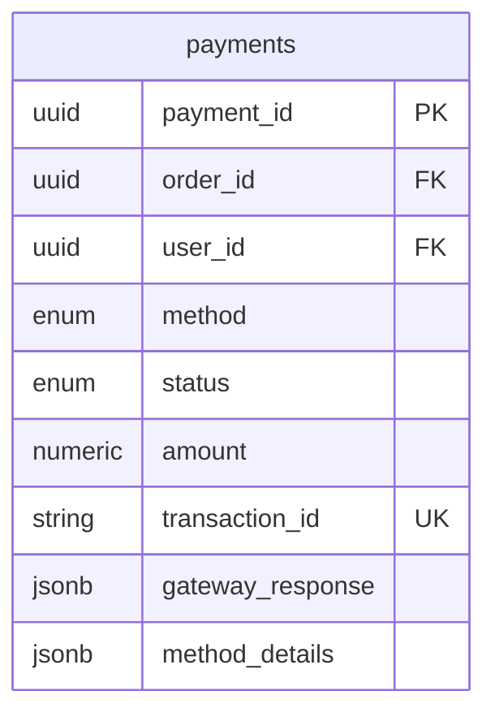
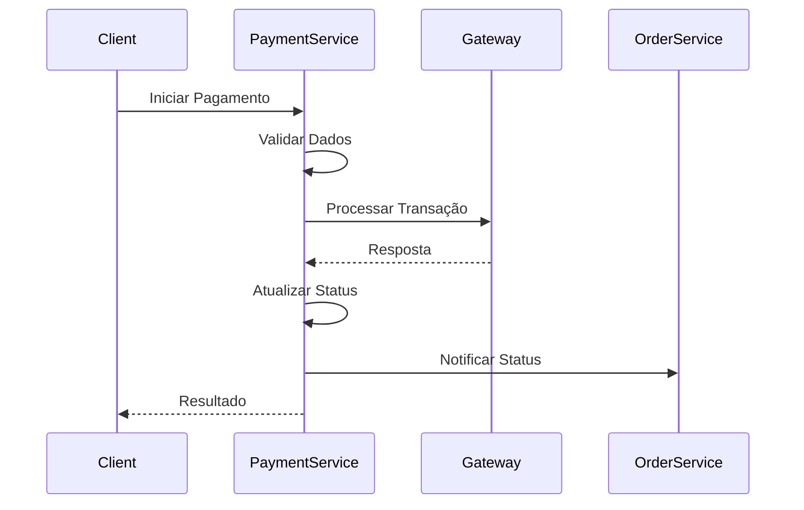
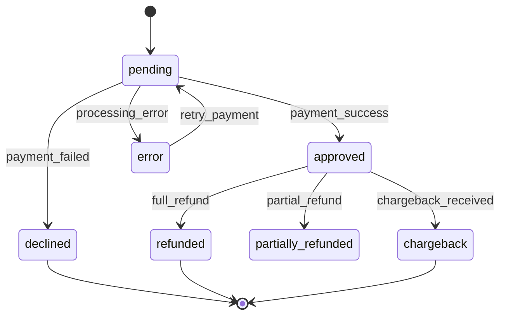

# Payment Service - Documentação Técnica

## 1. Visão Geral do Microsserviço

O **Payment Service** é responsável por todo o processamento de pagamentos e transações financeiras do e-commerce. Este microsserviço centraliza as operações relacionadas a métodos de pagamento, processamento de transações e integração com gateways de pagamento.

### Responsabilidades Principais
- Processamento de pagamentos
- Integração com gateways de pagamento
- Gestão de métodos de pagamento
- Controle de status de transações
- Processamento de reembolsos
- Gestão de chargebacks
- Auditoria de transações financeiras
- Retry automático para falhas temporárias
- Notificações de status de pagamento

## 2. Estrutura de Tabelas

### 2.1 Tabela Principal: `payments`
**Descrição**: Transações de pagamento do sistema

| Campo | Tipo | Descrição |
|-------|------|----------|
| payment_id | UUID | Identificador único do pagamento |
| order_id | UUID | Referência ao pedido |
| user_id | UUID | Referência ao usuário |
| method | payment_method_enum | Método de pagamento utilizado |
| status | payment_status_enum | Status atual da transação |
| amount | NUMERIC(10,2) | Valor da transação |
| transaction_id | VARCHAR(100) | ID da transação no gateway |
| gateway_response | JSONB | Resposta completa do gateway |
| method_details | JSONB | Detalhes específicos do método |
| processed_at | TIMESTAMPTZ | Data de processamento |
| created_at | TIMESTAMPTZ | Data de criação |
| updated_at | TIMESTAMPTZ | Última atualização |
| version | INTEGER | Controle de versão |

## 3. Tipos Enumerados

### 3.1 `payment_method_enum`
**Descrição**: Métodos de pagamento suportados

| Valor | Descrição |
|-------|----------|
| credit_card | Cartão de crédito |
| debit_card | Cartão de débito |
| pix | PIX (pagamento instantâneo) |
| bank_slip | Boleto bancário |

### 3.2 `payment_status_enum`
**Descrição**: Status possíveis de uma transação

| Valor | Descrição |
|-------|----------|
| pending | Transação criada, aguardando processamento |
| approved | Pagamento aprovado |
| declined | Pagamento recusado |
| refunded | Pagamento reembolsado totalmente |
| partially_refunded | Pagamento reembolsado parcialmente |
| chargeback | Chargeback solicitado |
| error | Erro no processamento |

## 4. Relacionamentos Entre Entidades



**Relacionamentos Externos:**
- `order_id` → Order Service (orders.order_id)
- `user_id` → User Management Service (users.user_id)

## 5. Estrutura de Dados JSONB

### 5.1 `gateway_response`
**Descrição**: Resposta completa do gateway de pagamento

```json
{
  "gateway_name": "stripe",
  "gateway_transaction_id": "pi_1234567890",
  "response_code": "approved",
  "response_message": "Payment successful",
  "authorization_code": "AUTH123",
  "risk_score": 32,
  "processing_fee": 2.50,
  "raw_response": {...}
}
```

### 5.2 `method_details` por Tipo

#### Cartão de Crédito/Débito
```json
{
  "card_brand": "visa",
  "last_four_digits": "1234",
  "expiry_month": 12,
  "expiry_year": 2025,
  "cardholder_name": "João Silva",
  "installments": 3,
  "gateway_token": "card_token_123"
}
```

#### PIX
```json
{
  "pix_key": "user@email.com",
  "qr_code": "base64_encoded_qr",
  "expiry_time": "2024-01-15T10:30:00Z",
  "end_to_end_id": "E12345678202401151030123456789"
}
```

#### Boleto Bancário
```json
{
  "barcode": "12345678901234567890123456789012345678901234",
  "due_date": "2024-01-20",
  "bank_code": "001",
  "agency": "1234",
  "account": "567890",
  "document_url": "https://gateway.com/boleto/123.pdf"
}
```

## 6. Considerações de Segurança

### 6.1 Proteção de Dados Sensíveis
- Nunca armazenar dados completos de cartão
- Utilizar tokens fornecidos pelos gateways
- Criptografia de dados sensíveis em trânsito
- Logs sanitizados (sem dados de cartão)

### 6.2 Conformidade PCI DSS
- Armazenamento seguro de tokens
- Auditoria completa de transações
- Controle de acesso restrito
- Monitoramento de atividades suspeitas

### 6.3 Prevenção de Fraudes
- Validação de dados de entrada
- Análise de risco por transação
- Limites de valor por usuário
- Detecção de padrões anômalos

### 6.4 Gestão de Chaves e Tokens
- Rotação automática de chaves API
- Armazenamento seguro de credenciais
- Separação por ambiente (dev/prod)
- Auditoria de uso de credenciais

## 7. Considerações de Performance

### 7.1 Índices Estratégicos

#### Índices Principais
```sql
CREATE INDEX idx_payments_order_id ON payments (order_id);
CREATE INDEX idx_payments_user_id ON payments (user_id);
CREATE INDEX idx_payments_status ON payments (status);
```

#### Índices JSONB
```sql
CREATE INDEX idx_payments_method_details_gin ON payments USING GIN (method_details);
```
**Descrição**: Permite consultas eficientes em campos JSONB

#### Índices Compostos
```sql
CREATE INDEX idx_payments_order_status ON payments (order_id, status);
```
**Descrição**: Otimiza consultas de pagamento por pedido e status

### 7.2 Otimizações
- Índices parciais para transações ativas
- Cache de resultados de validação
- Processamento assíncrono para operações lentas
- Pool de conexões otimizado

## 8. Funcionalidades do Sistema

### 8.1 Processamento de Pagamentos

#### Fluxo de Pagamento


#### Etapas do Processamento
1. **Validação de Entrada**
   - Verificar dados obrigatórios
   - Validar formato de valores
   - Confirmar método de pagamento

2. **Preparação da Transação**
   - Criar registro de pagamento
   - Preparar dados para gateway
   - Definir timeout e retry

3. **Comunicação com Gateway**
   - Enviar requisição de pagamento
   - Aguardar resposta
   - Tratar erros e timeouts

4. **Processamento da Resposta**
   - Atualizar status da transação
   - Armazenar resposta completa
   - Notificar outros serviços

### 8.2 Gestão de Status

#### Fluxo de Status


### 8.3 Sistema de Retry

#### Estratégia de Retry
- Retry automático para erros temporários
- Backoff exponencial entre tentativas
- Limite máximo de tentativas
- Log detalhado de tentativas

#### Condições para Retry
- Timeout de rede
- Erro temporário do gateway
- Indisponibilidade momentânea
- Erro de conectividade

### 8.4 Webhooks e Notificações

#### Processamento de Webhooks
1. Validar assinatura do webhook
2. Verificar duplicação de eventos
3. Atualizar status da transação
4. Notificar serviços dependentes
5. Confirmar recebimento

## 9. Integração com Gateways

### 9.1 Gateways Suportados
- **Stripe**: Cartões internacionais
- **PagSeguro**: Mercado brasileiro
- **Mercado Pago**: América Latina
- **PayPal**: Pagamentos globais

### 9.2 Padrão de Integração

#### Interface Comum
```typescript
interface PaymentGateway {
  processPayment(request: PaymentRequest): Promise<PaymentResponse>;
  refundPayment(transactionId: string, amount?: number): Promise<RefundResponse>;
  getTransactionStatus(transactionId: string): Promise<TransactionStatus>;
  validateWebhook(payload: string, signature: string): boolean;
}
```

### 9.3 Configuração por Gateway
- Credenciais específicas por ambiente
- Configuração de timeout e retry
- Mapeamento de códigos de erro
- Customização de campos obrigatórios

## 10. Triggers e Eventos

### 10.1 Trigger de Eventos de Pagamento
```sql
CREATE OR REPLACE FUNCTION trigger_payment_events()
RETURNS TRIGGER
```

#### Eventos Publicados
- `payment.initiated`: Pagamento iniciado
- `payment.approved`: Pagamento aprovado
- `payment.declined`: Pagamento recusado
- `payment.refunded`: Reembolso processado
- `payment.chargeback`: Chargeback recebido

### 10.2 Integração com Audit Service
- Log de todas as transações
- Rastreamento de alterações de status
- Auditoria de acessos a dados sensíveis
- Compliance com regulamentações

## 11. Monitoramento e Métricas

### 11.1 Métricas de Negócio
- Taxa de aprovação por método
- Valor médio de transação
- Taxa de chargeback
- Tempo médio de processamento
- Distribuição por gateway

### 11.2 Métricas Técnicas
- Latência de processamento
- Taxa de erro por gateway
- Uso de retry automático
- Performance de consultas JSONB

### 11.3 Alertas Críticos
- Taxa de erro acima do limite
- Transações pendentes há muito tempo
- Falhas de comunicação com gateway
- Tentativas de fraude detectadas

## 12. Tratamento de Erros

### 12.1 Categorização de Erros

#### Erros Temporários (Retry)
- Timeout de rede
- Indisponibilidade do gateway
- Limite de rate temporário
- Erro interno do gateway

#### Erros Permanentes (Não Retry)
- Cartão inválido
- Saldo insuficiente
- Cartão expirado
- Dados incorretos

### 12.2 Códigos de Erro Padronizados
```json
{
  "error_code": "CARD_DECLINED",
  "error_message": "Cartão recusado pelo banco emissor",
  "gateway_code": "51",
  "gateway_message": "Insufficient funds",
  "retry_allowed": false
}
```

## 13. Padrões de Nomenclatura

### 13.1 Convenções de Campos
- Snake_case consistente
- Sufixo `_id` para identificadores
- Sufixo `_at` para timestamps
- Prefixo `gateway_` para dados do gateway
- Campos JSONB com nomes descritivos

### 13.2 Convenções de Status
- Valores em inglês minúsculo
- Estados claros e não ambíguos
- Alinhamento com padrões da indústria
- Documentação completa de transições

### 13.3 Convenções de Logs
- Sanitização de dados sensíveis
- Estrutura JSON consistente
- Níveis de log apropriados
- Correlação por transaction_id

## 14. Commands e Queries (CQRS)

### 14.1 Commands

#### 14.1.1 Payment Processing Commands

##### ProcessPaymentCommand
**Descrição**: Processa um novo pagamento

```csharp
public class ProcessPaymentCommand : IRequest<ProcessPaymentResult>
{
    public Guid OrderId { get; set; }
    public Guid UserId { get; set; }
    public PaymentMethod Method { get; set; }
    public decimal Amount { get; set; }
    public PaymentMethodDetails MethodDetails { get; set; }
    public string Currency { get; set; } = "BRL";
    public string GatewayPreference { get; set; }
    public Dictionary<string, object> Metadata { get; set; }
}

public class ProcessPaymentResult
{
    public Guid PaymentId { get; set; }
    public PaymentStatus Status { get; set; }
    public string TransactionId { get; set; }
    public string GatewayResponse { get; set; }
    public bool RequiresAction { get; set; }
    public string ActionUrl { get; set; }
}
```

**Validações**:
- Compliance PCI DSS para dados de cartão
- Validação de valor mínimo/máximo
- Verificação de método de pagamento suportado
- Sanitização de dados sensíveis
- Validação de moeda e formato

**Handler**: `ProcessPaymentCommandHandler`
**Eventos**: `PaymentInitiated`, `PaymentProcessing`
**Cache**: Não aplicável (operação de escrita)
**Segurança**: Tokenização de dados sensíveis, logs sanitizados

##### RetryPaymentCommand
**Descrição**: Reprocessa um pagamento que falhou

```csharp
public class RetryPaymentCommand : IRequest<RetryPaymentResult>
{
    public Guid PaymentId { get; set; }
    public string Reason { get; set; }
    public bool ForceRetry { get; set; }
    public string AlternativeGateway { get; set; }
}

public class RetryPaymentResult
{
    public bool Success { get; set; }
    public PaymentStatus NewStatus { get; set; }
    public string ErrorMessage { get; set; }
    public int RetryAttempt { get; set; }
}
```

**Validações**:
- Verificar se pagamento existe
- Validar se retry é permitido
- Verificar limite de tentativas
- Validar status atual

**Handler**: `RetryPaymentCommandHandler`
**Eventos**: `PaymentRetryInitiated`, `PaymentRetryCompleted`
**Retry Policy**: Exponential backoff, máximo 5 tentativas

##### CancelPaymentCommand
**Descrição**: Cancela um pagamento pendente

```csharp
public class CancelPaymentCommand : IRequest<CancelPaymentResult>
{
    public Guid PaymentId { get; set; }
    public string CancellationReason { get; set; }
    public Guid RequestedBy { get; set; }
}

public class CancelPaymentResult
{
    public bool Success { get; set; }
    public PaymentStatus FinalStatus { get; set; }
    public string Message { get; set; }
}
```

**Validações**:
- Verificar se pagamento pode ser cancelado
- Validar permissões do usuário
- Verificar status atual

**Handler**: `CancelPaymentCommandHandler`
**Eventos**: `PaymentCancelled`

#### 14.1.2 Refund Management Commands

##### ProcessRefundCommand
**Descrição**: Processa um reembolso total

```csharp
public class ProcessRefundCommand : IRequest<ProcessRefundResult>
{
    public Guid PaymentId { get; set; }
    public decimal? Amount { get; set; } // null = reembolso total
    public string Reason { get; set; }
    public Guid RequestedBy { get; set; }
    public bool NotifyCustomer { get; set; } = true;
}

public class ProcessRefundResult
{
    public Guid RefundId { get; set; }
    public bool Success { get; set; }
    public decimal RefundedAmount { get; set; }
    public string GatewayRefundId { get; set; }
    public PaymentStatus NewPaymentStatus { get; set; }
}
```

**Validações**:
- Verificar se pagamento foi aprovado
- Validar valor do reembolso
- Verificar política de reembolso
- Validar permissões

**Handler**: `ProcessRefundCommandHandler`
**Eventos**: `RefundInitiated`, `RefundCompleted`
**Integração**: Gateway de pagamento para processamento

##### ProcessPartialRefundCommand
**Descrição**: Processa um reembolso parcial

```csharp
public class ProcessPartialRefundCommand : IRequest<ProcessPartialRefundResult>
{
    public Guid PaymentId { get; set; }
    public decimal RefundAmount { get; set; }
    public string Reason { get; set; }
    public Guid RequestedBy { get; set; }
    public List<RefundItem> Items { get; set; }
}

public class RefundItem
{
    public string ItemId { get; set; }
    public decimal Amount { get; set; }
    public string Reason { get; set; }
}
```

**Handler**: `ProcessPartialRefundCommandHandler`
**Eventos**: `PartialRefundCompleted`

#### 14.1.3 Payment Methods Commands

##### SavePaymentMethodCommand
**Descrição**: Salva um método de pagamento do usuário

```csharp
public class SavePaymentMethodCommand : IRequest<SavePaymentMethodResult>
{
    public Guid UserId { get; set; }
    public PaymentMethodType Type { get; set; }
    public string GatewayToken { get; set; }
    public PaymentMethodMetadata Metadata { get; set; }
    public bool SetAsDefault { get; set; }
}

public class PaymentMethodMetadata
{
    public string LastFourDigits { get; set; }
    public string Brand { get; set; }
    public int? ExpiryMonth { get; set; }
    public int? ExpiryYear { get; set; }
    public string CardholderName { get; set; }
}
```

**Validações**:
- Verificar token válido do gateway
- Validar dados do cartão (sem armazenar dados sensíveis)
- Verificar duplicação

**Handler**: `SavePaymentMethodCommandHandler`
**Eventos**: `PaymentMethodSaved`
**Segurança**: Apenas tokens, nunca dados completos do cartão

##### RemovePaymentMethodCommand
**Descrição**: Remove um método de pagamento

```csharp
public class RemovePaymentMethodCommand : IRequest<bool>
{
    public Guid PaymentMethodId { get; set; }
    public Guid UserId { get; set; }
}
```

**Handler**: `RemovePaymentMethodCommandHandler`
**Eventos**: `PaymentMethodRemoved`

##### UpdatePaymentMethodCommand
**Descrição**: Atualiza informações de um método de pagamento

```csharp
public class UpdatePaymentMethodCommand : IRequest<bool>
{
    public Guid PaymentMethodId { get; set; }
    public Guid UserId { get; set; }
    public PaymentMethodMetadata NewMetadata { get; set; }
    public bool? SetAsDefault { get; set; }
}
```

**Handler**: `UpdatePaymentMethodCommandHandler`
**Eventos**: `PaymentMethodUpdated`

#### 14.1.4 Chargeback Management Commands

##### ProcessChargebackCommand
**Descrição**: Processa um chargeback recebido

```csharp
public class ProcessChargebackCommand : IRequest<ProcessChargebackResult>
{
    public Guid PaymentId { get; set; }
    public string ChargebackId { get; set; }
    public decimal Amount { get; set; }
    public string Reason { get; set; }
    public DateTime ChargebackDate { get; set; }
    public string GatewayData { get; set; }
}

public class ProcessChargebackResult
{
    public bool Success { get; set; }
    public Guid ChargebackRecordId { get; set; }
    public PaymentStatus NewPaymentStatus { get; set; }
}
```

**Handler**: `ProcessChargebackCommandHandler`
**Eventos**: `ChargebackReceived`, `PaymentStatusChanged`

##### DisputeChargebackCommand
**Descrição**: Inicia disputa de chargeback

```csharp
public class DisputeChargebackCommand : IRequest<DisputeChargebackResult>
{
    public Guid ChargebackId { get; set; }
    public string DisputeReason { get; set; }
    public List<string> EvidenceDocuments { get; set; }
    public Guid RequestedBy { get; set; }
}
```

**Handler**: `DisputeChargebackCommandHandler`
**Eventos**: `ChargebackDisputed`

#### 14.1.5 Gateway Management Commands

##### SyncGatewayStatusCommand
**Descrição**: Sincroniza status com o gateway

```csharp
public class SyncGatewayStatusCommand : IRequest<SyncGatewayStatusResult>
{
    public Guid PaymentId { get; set; }
    public string GatewayName { get; set; }
    public bool ForceSync { get; set; }
}
```

**Handler**: `SyncGatewayStatusCommandHandler`
**Eventos**: `GatewayStatusSynced`

##### UpdateGatewayConfigCommand
**Descrição**: Atualiza configuração de gateway

```csharp
public class UpdateGatewayConfigCommand : IRequest<bool>
{
    public string GatewayName { get; set; }
    public GatewayConfiguration Configuration { get; set; }
    public Guid UpdatedBy { get; set; }
}
```

**Handler**: `UpdateGatewayConfigCommandHandler`
**Eventos**: `GatewayConfigUpdated`
**Segurança**: Criptografia de credenciais, auditoria completa

#### 14.1.6 Webhook Processing Commands

##### ProcessWebhookCommand
**Descrição**: Processa webhook recebido de gateway

```csharp
public class ProcessWebhookCommand : IRequest<ProcessWebhookResult>
{
    public string GatewayName { get; set; }
    public string EventType { get; set; }
    public string Payload { get; set; }
    public string Signature { get; set; }
    public Dictionary<string, string> Headers { get; set; }
}

public class ProcessWebhookResult
{
    public bool Success { get; set; }
    public bool SignatureValid { get; set; }
    public bool EventProcessed { get; set; }
    public string Message { get; set; }
}
```

**Validações**:
- Verificar assinatura do webhook
- Validar origem
- Verificar duplicação de eventos
- Validar estrutura do payload

**Handler**: `ProcessWebhookCommandHandler`
**Eventos**: `WebhookReceived`, `WebhookProcessed`
**Processamento**: Assíncrono com retry automático

### 14.2 Queries

#### 14.2.1 Payment Queries

##### GetPaymentByIdQuery
**Descrição**: Busca pagamento por ID

```csharp
public class GetPaymentByIdQuery : IRequest<PaymentDto>
{
    public Guid PaymentId { get; set; }
    public bool IncludeSensitiveData { get; set; } = false;
}

public class PaymentDto
{
    public Guid PaymentId { get; set; }
    public Guid OrderId { get; set; }
    public Guid UserId { get; set; }
    public PaymentMethod Method { get; set; }
    public PaymentStatus Status { get; set; }
    public decimal Amount { get; set; }
    public string Currency { get; set; }
    public string TransactionId { get; set; }
    public DateTime CreatedAt { get; set; }
    public DateTime? ProcessedAt { get; set; }
    public PaymentMethodSummary MethodSummary { get; set; }
    public List<PaymentEventDto> Events { get; set; }
}
```

**Handler**: `GetPaymentByIdQueryHandler`
**Cache**: Redis, TTL 5 minutos
**Segurança**: Dados sensíveis apenas para usuários autorizados

##### GetPaymentsByOrderIdQuery
**Descrição**: Busca pagamentos por pedido

```csharp
public class GetPaymentsByOrderIdQuery : IRequest<List<PaymentDto>>
{
    public Guid OrderId { get; set; }
    public bool IncludeRefunds { get; set; } = true;
}
```

**Handler**: `GetPaymentsByOrderIdQueryHandler`
**Cache**: Redis, TTL 3 minutos

##### GetPaymentsByUserIdQuery
**Descrição**: Busca pagamentos por usuário com paginação

```csharp
public class GetPaymentsByUserIdQuery : IRequest<PagedResult<PaymentDto>>
{
    public Guid UserId { get; set; }
    public int Page { get; set; } = 1;
    public int PageSize { get; set; } = 20;
    public PaymentStatus? StatusFilter { get; set; }
    public DateTime? StartDate { get; set; }
    public DateTime? EndDate { get; set; }
}
```

**Handler**: `GetPaymentsByUserIdQueryHandler`
**Cache**: Redis, TTL 2 minutos
**Paginação**: Máximo 100 itens por página

##### GetPaymentsWithFiltersQuery
**Descrição**: Busca pagamentos com filtros avançados

```csharp
public class GetPaymentsWithFiltersQuery : IRequest<PagedResult<PaymentDto>>
{
    public PaymentFilters Filters { get; set; }
    public PaginationOptions Pagination { get; set; }
    public SortingOptions Sorting { get; set; }
}

public class PaymentFilters
{
    public List<PaymentStatus> Statuses { get; set; }
    public List<PaymentMethod> Methods { get; set; }
    public decimal? MinAmount { get; set; }
    public decimal? MaxAmount { get; set; }
    public DateTime? StartDate { get; set; }
    public DateTime? EndDate { get; set; }
    public string GatewayName { get; set; }
    public Guid? UserId { get; set; }
}
```

**Handler**: `GetPaymentsWithFiltersQueryHandler`
**Cache**: Não aplicável (consulta dinâmica)
**Performance**: Índices otimizados para filtros comuns

#### 14.2.2 Payment Method Queries

##### GetUserPaymentMethodsQuery
**Descrição**: Busca métodos de pagamento do usuário

```csharp
public class GetUserPaymentMethodsQuery : IRequest<List<PaymentMethodDto>>
{
    public Guid UserId { get; set; }
    public bool IncludeExpired { get; set; } = false;
}

public class PaymentMethodDto
{
    public Guid PaymentMethodId { get; set; }
    public PaymentMethodType Type { get; set; }
    public string LastFourDigits { get; set; }
    public string Brand { get; set; }
    public int? ExpiryMonth { get; set; }
    public int? ExpiryYear { get; set; }
    public bool IsDefault { get; set; }
    public bool IsExpired { get; set; }
    public DateTime CreatedAt { get; set; }
}
```

**Handler**: `GetUserPaymentMethodsQueryHandler`
**Cache**: Redis, TTL 10 minutos
**Segurança**: Apenas dados não sensíveis

##### GetPaymentMethodByIdQuery
**Descrição**: Busca método de pagamento por ID

```csharp
public class GetPaymentMethodByIdQuery : IRequest<PaymentMethodDto>
{
    public Guid PaymentMethodId { get; set; }
    public Guid UserId { get; set; }
}
```

**Handler**: `GetPaymentMethodByIdQueryHandler`
**Cache**: Redis, TTL 10 minutos

#### 14.2.3 Transaction Queries

##### GetTransactionHistoryQuery
**Descrição**: Busca histórico de transações

```csharp
public class GetTransactionHistoryQuery : IRequest<PagedResult<TransactionHistoryDto>>
{
    public Guid PaymentId { get; set; }
    public int Page { get; set; } = 1;
    public int PageSize { get; set; } = 50;
}

public class TransactionHistoryDto
{
    public Guid EventId { get; set; }
    public string EventType { get; set; }
    public PaymentStatus PreviousStatus { get; set; }
    public PaymentStatus NewStatus { get; set; }
    public string Description { get; set; }
    public DateTime Timestamp { get; set; }
    public string GatewayResponse { get; set; }
}
```

**Handler**: `GetTransactionHistoryQueryHandler`
**Cache**: Redis, TTL 15 minutos

##### GetPaymentStatusQuery
**Descrição**: Busca status atual do pagamento

```csharp
public class GetPaymentStatusQuery : IRequest<PaymentStatusDto>
{
    public Guid PaymentId { get; set; }
    public bool IncludeGatewaySync { get; set; } = false;
}

public class PaymentStatusDto
{
    public Guid PaymentId { get; set; }
    public PaymentStatus Status { get; set; }
    public DateTime LastUpdated { get; set; }
    public string StatusDescription { get; set; }
    public bool CanRetry { get; set; }
    public bool CanCancel { get; set; }
    public bool CanRefund { get; set; }
}
```

**Handler**: `GetPaymentStatusQueryHandler`
**Cache**: Redis, TTL 1 minuto

#### 14.2.4 Analytics Queries

##### GetPaymentStatisticsQuery
**Descrição**: Busca estatísticas de pagamentos

```csharp
public class GetPaymentStatisticsQuery : IRequest<PaymentStatisticsDto>
{
    public DateTime StartDate { get; set; }
    public DateTime EndDate { get; set; }
    public List<PaymentMethod> Methods { get; set; }
    public string GroupBy { get; set; } // day, week, month
}

public class PaymentStatisticsDto
{
    public decimal TotalAmount { get; set; }
    public int TotalTransactions { get; set; }
    public decimal ApprovalRate { get; set; }
    public decimal AverageAmount { get; set; }
    public Dictionary<PaymentMethod, int> TransactionsByMethod { get; set; }
    public Dictionary<PaymentStatus, int> TransactionsByStatus { get; set; }
    public List<DailyStatistics> DailyBreakdown { get; set; }
}
```

**Handler**: `GetPaymentStatisticsQueryHandler`
**Cache**: Redis, TTL 30 minutos
**Performance**: Dados pré-agregados para consultas rápidas

##### GetGatewayPerformanceQuery
**Descrição**: Busca performance dos gateways

```csharp
public class GetGatewayPerformanceQuery : IRequest<List<GatewayPerformanceDto>>
{
    public DateTime StartDate { get; set; }
    public DateTime EndDate { get; set; }
}

public class GatewayPerformanceDto
{
    public string GatewayName { get; set; }
    public int TotalTransactions { get; set; }
    public decimal ApprovalRate { get; set; }
    public decimal AverageResponseTime { get; set; }
    public int ErrorCount { get; set; }
    public decimal TotalVolume { get; set; }
}
```

**Handler**: `GetGatewayPerformanceQueryHandler`
**Cache**: Redis, TTL 1 hora

#### 14.2.5 Admin Queries

##### GetFailedPaymentsQuery
**Descrição**: Busca pagamentos com falha para análise

```csharp
public class GetFailedPaymentsQuery : IRequest<PagedResult<FailedPaymentDto>>
{
    public DateTime StartDate { get; set; }
    public DateTime EndDate { get; set; }
    public string ErrorType { get; set; }
    public int Page { get; set; } = 1;
    public int PageSize { get; set; } = 50;
}

public class FailedPaymentDto
{
    public Guid PaymentId { get; set; }
    public Guid OrderId { get; set; }
    public decimal Amount { get; set; }
    public PaymentMethod Method { get; set; }
    public string ErrorCode { get; set; }
    public string ErrorMessage { get; set; }
    public int RetryCount { get; set; }
    public DateTime FailedAt { get; set; }
    public bool CanRetry { get; set; }
}
```

**Handler**: `GetFailedPaymentsQueryHandler`
**Cache**: Não aplicável (dados críticos)

##### GetChargebacksQuery
**Descrição**: Busca chargebacks para gestão

```csharp
public class GetChargebacksQuery : IRequest<PagedResult<ChargebackDto>>
{
    public DateTime? StartDate { get; set; }
    public DateTime? EndDate { get; set; }
    public ChargebackStatus? Status { get; set; }
    public int Page { get; set; } = 1;
    public int PageSize { get; set; } = 20;
}

public class ChargebackDto
{
    public Guid ChargebackId { get; set; }
    public Guid PaymentId { get; set; }
    public string ChargebackReason { get; set; }
    public decimal Amount { get; set; }
    public ChargebackStatus Status { get; set; }
    public DateTime ReceivedAt { get; set; }
    public DateTime? DisputedAt { get; set; }
    public bool CanDispute { get; set; }
}
```

**Handler**: `GetChargebacksQueryHandler`
**Cache**: Redis, TTL 5 minutos

### 14.3 Características Técnicas

#### 14.3.1 Validações de Segurança
- **PCI DSS Compliance**: Nunca armazenar dados completos de cartão
- **Tokenização**: Uso obrigatório de tokens de gateway
- **Sanitização**: Logs sem dados sensíveis
- **Criptografia**: Dados em trânsito sempre criptografados
- **Auditoria**: Log completo de todas as operações

#### 14.3.2 Tratamento de Erros
- **Categorização**: Erros temporários vs permanentes
- **Retry Policy**: Backoff exponencial para erros temporários
- **Circuit Breaker**: Proteção contra falhas em cascata
- **Fallback**: Gateways alternativos em caso de falha

#### 14.3.3 Observabilidade
- **Métricas**: Taxa de aprovação, latência, volume
- **Logs Estruturados**: Correlação por transaction_id
- **Alertas**: Falhas críticas, fraudes, performance
- **Dashboards**: Monitoramento em tempo real

#### 14.3.4 Integração com Gateways
- **Múltiplos Gateways**: Stripe, PagSeguro, Mercado Pago, PayPal
- **Roteamento Inteligente**: Seleção automática do melhor gateway
- **Webhook Handling**: Processamento assíncrono de eventos
- **Rate Limiting**: Controle de requisições por gateway

#### 14.3.5 Processamento Assíncrono
- **Message Queue**: Processamento de webhooks
- **Background Jobs**: Retry automático, sincronização
- **Event Sourcing**: Histórico completo de eventos
- **Saga Pattern**: Coordenação de transações distribuídas

#### 14.3.6 Cache e Performance
- **Redis Cache**: Consultas frequentes
- **TTL Estratégico**: Baseado na criticidade dos dados
- **Índices Otimizados**: Consultas por status, usuário, data
- **Paginação**: Limite máximo para proteção de performance

#### 14.3.7 Compliance e Auditoria
- **Audit Trail**: Rastreamento completo de alterações
- **Data Retention**: Políticas de retenção de dados
- **LGPD Compliance**: Direito ao esquecimento
- **Relatórios Regulatórios**: Geração automática de relatórios


# Payment Service - Tasks

## Setup de Infraestrutura
[ ] Configurar banco de dados PostgreSQL para Payments
[ ] Configurar Redis para cache de transações
[ ] Configurar RabbitMQ para eventos de pagamento
[ ] Configurar variáveis de ambiente no .env
[ ] Criar .env.example com todas as variáveis necessárias
[ ] Configurar certificados SSL para PCI compliance

## Desenvolvimento de APIs
[ ] Implementar endpoint POST /payments (processar pagamento)
[ ] Implementar endpoint GET /payments/{id} (buscar pagamento)
[ ] Implementar endpoint GET /payments/order/{order_id} (pagamentos do pedido)
[ ] Implementar endpoint POST /payments/{id}/refund (processar reembolso)
[ ] Implementar endpoint GET /payments/{id}/status (status do pagamento)
[ ] Implementar endpoint POST /payments/webhook (webhook do gateway)
[ ] Implementar endpoint GET /payments/methods (métodos disponíveis)
[ ] Implementar endpoint POST /payments/validate (validar dados)
[ ] Implementar endpoint GET /payments/admin (listar todos - admin)
[ ] Implementar endpoint POST /payments/{id}/capture (capturar pagamento)
[ ] Implementar validação de dados de entrada
[ ] Implementar middleware de autenticação
[ ] Implementar middleware de criptografia

## Modelo de Dados
[ ] Criar tabela payments com campos obrigatórios
[ ] Criar tabela payment_methods para métodos de pagamento
[ ] Criar tabela payment_transactions para transações
[ ] Criar tabela payment_refunds para reembolsos
[ ] Criar tabela payment_webhooks para logs de webhook
[ ] Criar tabela payment_fraud_checks para antifraude
[ ] Implementar triggers para auditoria
[ ] Implementar índices para performance
[ ] Configurar constraints e relacionamentos
[ ] Implementar criptografia de dados sensíveis

## Integração com Gateways
[ ] Integrar com Stripe para cartões de crédito
[ ] Integrar com PayPal para pagamentos online
[ ] Integrar com PagSeguro para mercado brasileiro
[ ] Integrar com Mercado Pago para América Latina
[ ] Implementar PIX para pagamentos instantâneos
[ ] Configurar boleto bancário
[ ] Implementar carteira digital
[ ] Configurar débito automático
[ ] Implementar fallback entre gateways

## Processamento de Pagamentos
[ ] Implementar validação de cartão de crédito
[ ] Configurar tokenização de dados sensíveis
[ ] Implementar autorização de pagamento
[ ] Configurar captura de pagamento
[ ] Implementar processamento assíncrono
[ ] Configurar retry automático para falhas
[ ] Implementar split de pagamentos
[ ] Configurar parcelamento
[ ] Implementar validação de CVV
[ ] Configurar 3D Secure

## Sistema Antifraude
[ ] Implementar análise de risco básica
[ ] Configurar blacklist de cartões
[ ] Implementar geolocalização de transações
[ ] Configurar limites de transação
[ ] Implementar análise de comportamento
[ ] Configurar machine learning para detecção
[ ] Implementar scoring de risco
[ ] Configurar alertas de fraude
[ ] Implementar quarentena de transações

## Gestão de Reembolsos
[ ] Implementar processo de reembolso
[ ] Configurar reembolso parcial
[ ] Implementar reembolso total
[ ] Configurar prazos de reembolso
[ ] Implementar auditoria de reembolsos
[ ] Configurar notificações de reembolso
[ ] Implementar aprovação manual
[ ] Configurar limites de reembolso

## Webhooks e Notificações
[ ] Implementar processamento de webhooks
[ ] Configurar validação de assinatura
[ ] Implementar retry de webhooks falhados
[ ] Configurar logs de webhooks
[ ] Implementar idempotência
[ ] Configurar timeout adequados
[ ] Implementar fila de processamento
[ ] Configurar dead letter queue

## Segurança e Compliance
[ ] Implementar PCI DSS compliance
[ ] Configurar criptografia end-to-end
[ ] Implementar tokenização de dados
[ ] Configurar logs de auditoria
[ ] Implementar controle de acesso
[ ] Configurar rate limiting
[ ] Implementar proteção contra ataques
[ ] Configurar headers de segurança
[ ] Implementar validação de origem
[ ] Configurar certificados SSL/TLS

## Testes
[ ] Criar testes unitários para controllers
[ ] Criar testes unitários para services
[ ] Criar testes de integração para APIs
[ ] Criar testes para gateways de pagamento
[ ] Criar testes de segurança
[ ] Criar testes de performance
[ ] Configurar coverage de testes
[ ] Implementar testes de carga
[ ] Criar testes para cenários de fraude
[ ] Implementar testes de webhook

## Monitoramento e Logs
[ ] Configurar logs estruturados
[ ] Implementar métricas de transações
[ ] Configurar alertas para falhas
[ ] Implementar health check endpoint
[ ] Configurar monitoramento de SLA
[ ] Implementar dashboards de pagamentos
[ ] Configurar alertas de fraude
[ ] Implementar métricas de conversão
[ ] Configurar alertas de performance

## Deploy e DevOps
[ ] Configurar Dockerfile
[ ] Configurar docker-compose para desenvolvimento
[ ] Configurar pipeline CI/CD
[ ] Configurar ambiente de staging
[ ] Configurar ambiente de produção
[ ] Implementar rollback strategy
[ ] Configurar backup automático do banco
[ ] Configurar disaster recovery
[ ] Implementar blue-green deployment

## Documentação
[ ] Documentar APIs com Swagger/OpenAPI
[ ] Criar documentação de setup
[ ] Documentar fluxos de pagamento
[ ] Documentar integrações com gateways
[ ] Documentar compliance PCI DSS
[ ] Criar guia de troubleshooting
[ ] Documentar variáveis de ambiente
[ ] Documentar procedimentos de segurança

## Relatórios e Analytics
[ ] Implementar relatórios financeiros
[ ] Configurar métricas de conversão
[ ] Implementar análise de chargebacks
[ ] Configurar dashboards executivos
[ ] Implementar relatórios de fraude
[ ] Configurar alertas de performance
[ ] Implementar análise de tendências
[ ] Configurar reconciliação bancária

## Gestão de Chargebacks
[ ] Implementar detecção de chargebacks
[ ] Configurar processo de disputa
[ ] Implementar coleta de evidências
[ ] Configurar notificações de chargeback
[ ] Implementar prevenção de chargebacks
[ ] Configurar análise de causas
[ ] Implementar alertas preventivos

## Reconciliação Financeira
[ ] Implementar reconciliação automática
[ ] Configurar matching de transações
[ ] Implementar relatórios de conciliação
[ ] Configurar alertas de divergências
[ ] Implementar ajustes manuais
[ ] Configurar auditoria financeira
[ ] Implementar controle de caixa

## Performance e Escalabilidade
[ ] Implementar cache de métodos de pagamento
[ ] Configurar particionamento de tabelas
[ ] Implementar read replicas
[ ] Configurar load balancing
[ ] Implementar circuit breaker
[ ] Configurar timeout adequados
[ ] Implementar retry policies
[ ] Configurar connection pooling

## Backup e Recuperação
[ ] Configurar backup automático
[ ] Implementar point-in-time recovery
[ ] Configurar replicação de dados
[ ] Implementar disaster recovery
[ ] Configurar testes de recuperação
[ ] Implementar backup criptografado

## Integração com Outros Serviços
[ ] Integrar com Order Service para status
[ ] Integrar com Notification Service para alertas
[ ] Integrar com User Management para dados
[ ] Configurar eventos para outros serviços
[ ] Implementar compensação de transações
[ ] Configurar sincronização de dados

## Métodos de Pagamento Alternativos
[ ] Implementar pagamento via PIX
[ ] Configurar boleto bancário
[ ] Implementar carteira digital
[ ] Configurar débito em conta
[ ] Implementar pagamento por aproximação
[ ] Configurar QR Code para pagamento
[ ] Implementar pagamento recorrente

## Compliance e Auditoria
[ ] Implementar LGPD compliance
[ ] Configurar auditoria de transações
[ ] Implementar controle de acesso
[ ] Configurar logs de auditoria
[ ] Implementar retenção de dados
[ ] Configurar anonização de dados
[ ] Implementar relatórios regulatórios