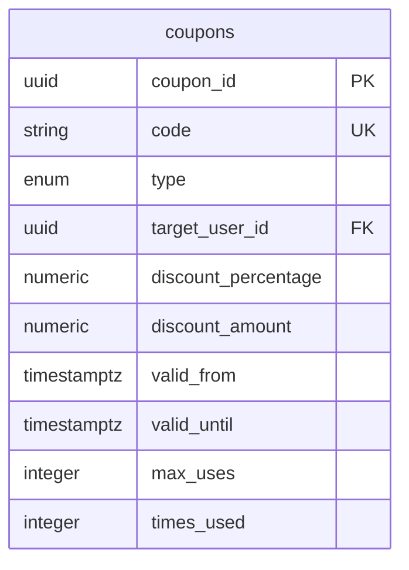

# Promotion Service - Documentação Técnica

## 1. Visão Geral do Microsserviço

O **Promotion Service** é responsável por toda a gestão de cupons, promoções e descontos aplicáveis no e-commerce. Este microsserviço centraliza as regras de negócio relacionadas a campanhas promocionais e sistemas de desconto.

### Responsabilidades Principais
- Gestão de cupons de desconto
- Controle de campanhas promocionais
- Validação de elegibilidade de descontos
- Aplicação de regras de negócio promocionais
- Controle de uso e limites de cupons
- Segmentação de promoções por usuário
- Auditoria de uso de promoções

## 2. Estrutura de Tabelas

### 2.1 Tabela Principal: `coupons`
**Descrição**: Cupons de desconto e promoções do sistema

| Campo | Tipo | Descrição |
|-------|------|----------|
| coupon_id | UUID | Identificador único do cupom |
| code | VARCHAR(50) | Código único do cupom |
| description | TEXT | Descrição da promoção |
| discount_percentage | NUMERIC(5,2) | Percentual de desconto (0-100) |
| discount_amount | NUMERIC(10,2) | Valor fixo de desconto |
| valid_from | TIMESTAMPTZ | Data de início da validade |
| valid_until | TIMESTAMPTZ | Data de fim da validade |
| max_uses | INTEGER | Máximo de usos permitidos |
| times_used | INTEGER | Quantidade de vezes usado |
| min_purchase_amount | NUMERIC(10,2) | Valor mínimo de compra |
| is_active | BOOLEAN | Status ativo do cupom |
| type | coupon_type | Tipo (general, user_specific) |
| target_user_id | UUID | ID do usuário específico (se aplicável) |

## 3. Tipos Enumerados

### 3.1 `coupon_type`
**Descrição**: Define o tipo de cupom e sua aplicabilidade

| Valor | Descrição |
|-------|----------|
| general | Cupom de uso geral, disponível para todos |
| user_specific | Cupom específico para um usuário |

## 4. Relacionamentos Entre Entidades



**Relacionamentos Externos:**
- `target_user_id` → User Management Service (users.user_id)
- Referenciado por Order Service (orders.coupon_id)

## 5. Regras de Negócio e Constraints

### 5.1 Constraints de Integridade

#### Tipo de Desconto Exclusivo
```sql
CONSTRAINT chk_discount_type CHECK (
    (discount_percentage IS NOT NULL AND discount_amount IS NULL) OR 
    (discount_percentage IS NULL AND discount_amount IS NOT NULL)
)
```
**Descrição**: Garante que apenas um tipo de desconto seja definido (percentual OU valor fixo)

#### Validação de Período
```sql
CONSTRAINT chk_valid_until CHECK (valid_until > valid_from)
```
**Descrição**: Garante que a data de fim seja posterior à data de início

### 5.2 Regras de Aplicação

#### Cupons Gerais
- Disponíveis para qualquer usuário
- Sujeitos a limite de uso global
- Podem ter valor mínimo de compra

#### Cupons Específicos
- Vinculados a um usuário específico
- Não contam para limite global
- Ideais para campanhas personalizadas

## 6. Considerações de Segurança

### 6.1 Prevenção de Fraudes
- Códigos únicos para evitar duplicação
- Controle rigoroso de uso e limites
- Validação de período de validade
- Auditoria completa de aplicações

### 6.2 Controle de Acesso
- Separação entre cupons gerais e específicos
- Validação de elegibilidade por usuário
- Controle de versioning para auditoria
- Soft delete para preservar histórico

### 6.3 Validações de Integridade
- Verificação de período de validade
- Controle de limite de uso
- Validação de valor mínimo de compra
- Prevenção de uso múltiplo simultâneo

## 7. Considerações de Performance

### 7.1 Índices Estratégicos

#### Índice de Usuário Específico
```sql
CREATE INDEX idx_coupons_target_user_id ON coupons (target_user_id) 
WHERE type = 'user_specific';
```
**Descrição**: Otimiza busca de cupons específicos por usuário

#### Índice de Cupons Ativos
```sql
CREATE INDEX idx_coupons_is_active_and_valid ON coupons (is_active, valid_until) 
WHERE deleted_at IS NULL;
```
**Descrição**: Otimiza busca de cupons válidos e ativos

### 7.2 Otimizações de Consulta
- Índices parciais para dados ativos
- Filtros por período de validade
- Consultas otimizadas por tipo de cupom
- Cache de cupons frequentemente usados

## 8. Funcionalidades do Sistema

### 8.1 Validação de Cupons

#### Critérios de Validação
1. **Status Ativo**: `is_active = true`
2. **Período Válido**: Data atual entre `valid_from` e `valid_until`
3. **Limite de Uso**: `times_used < max_uses` (se definido)
4. **Valor Mínimo**: Valor do pedido ≥ `min_purchase_amount` (se definido)
5. **Usuário Específico**: Validação de `target_user_id` (se aplicável)

#### Processo de Aplicação
1. Validar código do cupom
2. Verificar critérios de elegibilidade
3. Calcular desconto aplicável
4. Incrementar contador de uso
5. Registrar aplicação para auditoria

### 8.2 Tipos de Desconto

#### Desconto Percentual
- Valor entre 0% e 100%
- Aplicado sobre o valor total do pedido
- Pode ter valor máximo de desconto

#### Desconto Fixo
- Valor monetário fixo
- Deduzido do total do pedido
- Não pode exceder o valor do pedido

### 8.3 Gestão de Campanhas

#### Campanhas Gerais
- Códigos promocionais públicos
- Divulgação em marketing
- Controle de uso global

#### Campanhas Segmentadas
- Cupons personalizados por usuário
- Campanhas de retenção
- Promoções exclusivas

## 9. Integração com Outros Serviços

### 9.1 User Management Service
- Validação de usuários específicos
- Verificação de elegibilidade
- Histórico de uso por usuário

### 9.2 Order Service
- Aplicação de descontos em pedidos
- Validação durante checkout
- Registro de uso em pedidos

### 9.3 Audit Service
- Log de aplicações de cupons
- Rastreamento de fraudes
- Relatórios de uso

## 10. Padrões de Nomenclatura

### 10.1 Convenções de Tabela
- Nome no plural: `coupons`
- Campos descritivos e claros
- Prefixos consistentes para tipos relacionados

### 10.2 Convenções de Campos
- Snake_case para nomes
- Sufixo `_id` para identificadores
- Sufixo `_amount` para valores monetários
- Sufixo `_percentage` para percentuais
- Prefixo `is_` para booleanos
- Sufixo `_at` para timestamps

### 10.3 Convenções de Códigos
- Códigos alfanuméricos únicos
- Formato legível e memorável
- Evitar caracteres ambíguos (0, O, I, l)
- Comprimento adequado para digitação

## 11. Commands e Queries (CQRS)

### 11.1 Commands

#### 11.1.1 Coupon Management

##### CreateCouponCommand
**Estrutura de Dados:**
```csharp
public class CreateCouponCommand : IRequest<Guid>
{
    public string Code { get; set; }
    public string Description { get; set; }
    public decimal? DiscountPercentage { get; set; }
    public decimal? DiscountAmount { get; set; }
    public DateTime ValidFrom { get; set; }
    public DateTime ValidUntil { get; set; }
    public int? MaxUses { get; set; }
    public decimal? MinPurchaseAmount { get; set; }
    public CouponType Type { get; set; }
    public Guid? TargetUserId { get; set; }
}
```

**Validações:**
- Código único no sistema
- Apenas um tipo de desconto (percentual OU valor fixo)
- Data de fim posterior à data de início
- Percentual entre 0% e 100%
- Valor mínimo de compra não negativo

**Handler:**
```csharp
public class CreateCouponCommandHandler : IRequestHandler<CreateCouponCommand, Guid>
{
    public async Task<Guid> Handle(CreateCouponCommand request, CancellationToken cancellationToken)
    {
        // Validar unicidade do código
        // Aplicar regras de negócio
        // Criar cupom
        // Publicar evento CouponCreatedEvent
    }
}
```

**Eventos de Domínio:**
- `CouponCreatedEvent`
- `CouponValidationFailedEvent`

**Exemplo de Uso:**
```csharp
var command = new CreateCouponCommand
{
    Code = "WELCOME10",
    Description = "Desconto de boas-vindas",
    DiscountPercentage = 10,
    ValidFrom = DateTime.UtcNow,
    ValidUntil = DateTime.UtcNow.AddDays(30),
    Type = CouponType.General
};
```

##### UpdateCouponCommand
**Estrutura de Dados:**
```csharp
public class UpdateCouponCommand : IRequest<bool>
{
    public Guid CouponId { get; set; }
    public string Description { get; set; }
    public DateTime? ValidUntil { get; set; }
    public int? MaxUses { get; set; }
    public decimal? MinPurchaseAmount { get; set; }
    public bool? IsActive { get; set; }
}
```

**Validações:**
- Cupom deve existir
- Não permitir alteração de código ou tipo de desconto
- Validar integridade de datas

##### DeactivateCouponCommand
**Estrutura de Dados:**
```csharp
public class DeactivateCouponCommand : IRequest<bool>
{
    public Guid CouponId { get; set; }
    public string Reason { get; set; }
}
```

##### DeleteCouponCommand
**Estrutura de Dados:**
```csharp
public class DeleteCouponCommand : IRequest<bool>
{
    public Guid CouponId { get; set; }
    public bool SoftDelete { get; set; } = true;
}
```

#### 11.1.2 Campaign Management

##### CreateCampaignCommand
**Estrutura de Dados:**
```csharp
public class CreateCampaignCommand : IRequest<Guid>
{
    public string Name { get; set; }
    public string Description { get; set; }
    public DateTime StartDate { get; set; }
    public DateTime EndDate { get; set; }
    public List<Guid> CouponIds { get; set; }
    public CampaignType Type { get; set; }
    public Dictionary<string, object> TargetingRules { get; set; }
}
```

##### UpdateCampaignCommand
**Estrutura de Dados:**
```csharp
public class UpdateCampaignCommand : IRequest<bool>
{
    public Guid CampaignId { get; set; }
    public string Name { get; set; }
    public string Description { get; set; }
    public DateTime? EndDate { get; set; }
    public Dictionary<string, object> TargetingRules { get; set; }
}
```

##### ActivateCampaignCommand
**Estrutura de Dados:**
```csharp
public class ActivateCampaignCommand : IRequest<bool>
{
    public Guid CampaignId { get; set; }
}
```

##### DeactivateCampaignCommand
**Estrutura de Dados:**
```csharp
public class DeactivateCampaignCommand : IRequest<bool>
{
    public Guid CampaignId { get; set; }
    public string Reason { get; set; }
}
```

#### 11.1.3 Coupon Usage

##### ValidateCouponCommand
**Estrutura de Dados:**
```csharp
public class ValidateCouponCommand : IRequest<CouponValidationResult>
{
    public string CouponCode { get; set; }
    public Guid UserId { get; set; }
    public decimal OrderAmount { get; set; }
    public List<Guid> ProductIds { get; set; }
}
```

**Validações:**
- Rate limiting por usuário (máximo 10 validações por minuto)
- Verificar status ativo
- Validar período de validade
- Verificar limite de uso
- Validar valor mínimo de compra
- Verificar elegibilidade do usuário

**Handler:**
```csharp
public class ValidateCouponCommandHandler : IRequestHandler<ValidateCouponCommand, CouponValidationResult>
{
    public async Task<CouponValidationResult> Handle(ValidateCouponCommand request, CancellationToken cancellationToken)
    {
        // Aplicar rate limiting
        // Buscar cupom por código
        // Executar validações de negócio
        // Calcular desconto aplicável
        // Registrar tentativa de validação
        // Retornar resultado
    }
}
```

##### ApplyCouponCommand
**Estrutura de Dados:**
```csharp
public class ApplyCouponCommand : IRequest<CouponApplicationResult>
{
    public string CouponCode { get; set; }
    public Guid UserId { get; set; }
    public Guid OrderId { get; set; }
    public decimal OrderAmount { get; set; }
}
```

##### ReleaseCouponCommand
**Estrutura de Dados:**
```csharp
public class ReleaseCouponCommand : IRequest<bool>
{
    public Guid CouponId { get; set; }
    public Guid OrderId { get; set; }
    public string Reason { get; set; }
}
```

##### IncrementUsageCommand
**Estrutura de Dados:**
```csharp
public class IncrementUsageCommand : IRequest<bool>
{
    public Guid CouponId { get; set; }
    public Guid UserId { get; set; }
    public Guid OrderId { get; set; }
}
```

#### 11.1.4 User-Specific Promotions

##### AssignUserCouponCommand
**Estrutura de Dados:**
```csharp
public class AssignUserCouponCommand : IRequest<Guid>
{
    public Guid UserId { get; set; }
    public string CouponTemplate { get; set; }
    public decimal? DiscountPercentage { get; set; }
    public decimal? DiscountAmount { get; set; }
    public DateTime ValidUntil { get; set; }
    public string Reason { get; set; }
}
```

##### RevokeUserCouponCommand
**Estrutura de Dados:**
```csharp
public class RevokeUserCouponCommand : IRequest<bool>
{
    public Guid CouponId { get; set; }
    public Guid UserId { get; set; }
    public string Reason { get; set; }
}
```

##### CreatePersonalizedOfferCommand
**Estrutura de Dados:**
```csharp
public class CreatePersonalizedOfferCommand : IRequest<Guid>
{
    public Guid UserId { get; set; }
    public List<Guid> ProductIds { get; set; }
    public decimal DiscountPercentage { get; set; }
    public DateTime ValidUntil { get; set; }
    public string OfferReason { get; set; }
}
```

### 11.2 Queries

#### 11.2.1 Coupon Queries

##### GetCouponByCodeQuery
**Estrutura de Dados:**
```csharp
public class GetCouponByCodeQuery : IRequest<CouponDto>
{
    public string Code { get; set; }
    public bool IncludeInactive { get; set; } = false;
}
```

**Cache Strategy:**
- Cache Redis com TTL de 5 minutos
- Invalidação automática em updates
- Cache warming para cupons populares

##### GetCouponByIdQuery
**Estrutura de Dados:**
```csharp
public class GetCouponByIdQuery : IRequest<CouponDto>
{
    public Guid CouponId { get; set; }
}
```

##### GetActiveCouponsQuery
**Estrutura de Dados:**
```csharp
public class GetActiveCouponsQuery : IRequest<PagedResult<CouponDto>>
{
    public int Page { get; set; } = 1;
    public int PageSize { get; set; } = 20;
    public CouponType? Type { get; set; }
    public DateTime? ValidFrom { get; set; }
    public DateTime? ValidUntil { get; set; }
}
```

##### GetCouponUsageStatsQuery
**Estrutura de Dados:**
```csharp
public class GetCouponUsageStatsQuery : IRequest<CouponUsageStatsDto>
{
    public Guid CouponId { get; set; }
    public DateTime? FromDate { get; set; }
    public DateTime? ToDate { get; set; }
}
```

#### 11.2.2 Campaign Queries

##### GetActiveCampaignsQuery
**Estrutura de Dados:**
```csharp
public class GetActiveCampaignsQuery : IRequest<List<CampaignDto>>
{
    public CampaignType? Type { get; set; }
    public Guid? UserId { get; set; }
}
```

##### GetCampaignDetailsQuery
**Estrutura de Dados:**
```csharp
public class GetCampaignDetailsQuery : IRequest<CampaignDetailsDto>
{
    public Guid CampaignId { get; set; }
}
```

##### GetCampaignPerformanceQuery
**Estrutura de Dados:**
```csharp
public class GetCampaignPerformanceQuery : IRequest<CampaignPerformanceDto>
{
    public Guid CampaignId { get; set; }
    public DateTime FromDate { get; set; }
    public DateTime ToDate { get; set; }
}
```

#### 11.2.3 User Promotion Queries

##### GetUserSpecificCouponsQuery
**Estrutura de Dados:**
```csharp
public class GetUserSpecificCouponsQuery : IRequest<List<CouponDto>>
{
    public Guid UserId { get; set; }
    public bool OnlyActive { get; set; } = true;
}
```

##### GetUserCouponHistoryQuery
**Estrutura de Dados:**
```csharp
public class GetUserCouponHistoryQuery : IRequest<PagedResult<CouponUsageHistoryDto>>
{
    public Guid UserId { get; set; }
    public int Page { get; set; } = 1;
    public int PageSize { get; set; } = 20;
    public DateTime? FromDate { get; set; }
    public DateTime? ToDate { get; set; }
}
```

##### GetEligiblePromotionsQuery
**Estrutura de Dados:**
```csharp
public class GetEligiblePromotionsQuery : IRequest<List<PromotionDto>>
{
    public Guid UserId { get; set; }
    public decimal OrderAmount { get; set; }
    public List<Guid> ProductIds { get; set; }
}
```

#### 11.2.4 Analytics Queries

##### GetPromotionAnalyticsQuery
**Estrutura de Dados:**
```csharp
public class GetPromotionAnalyticsQuery : IRequest<PromotionAnalyticsDto>
{
    public DateTime FromDate { get; set; }
    public DateTime ToDate { get; set; }
    public List<Guid> CouponIds { get; set; }
    public AnalyticsGroupBy GroupBy { get; set; }
}
```

##### GetCouponUsageReportQuery
**Estrutura de Dados:**
```csharp
public class GetCouponUsageReportQuery : IRequest<CouponUsageReportDto>
{
    public DateTime FromDate { get; set; }
    public DateTime ToDate { get; set; }
    public ReportFormat Format { get; set; }
}
```

##### GetCampaignROIQuery
**Estrutura de Dados:**
```csharp
public class GetCampaignROIQuery : IRequest<CampaignROIDto>
{
    public Guid CampaignId { get; set; }
    public DateTime FromDate { get; set; }
    public DateTime ToDate { get; set; }
}
```

#### 11.2.5 Admin Queries

##### GetAllCouponsQuery
**Estrutura de Dados:**
```csharp
public class GetAllCouponsQuery : IRequest<PagedResult<CouponDto>>
{
    public int Page { get; set; } = 1;
    public int PageSize { get; set; } = 50;
    public string SearchTerm { get; set; }
    public CouponStatus? Status { get; set; }
    public CouponType? Type { get; set; }
    public DateTime? CreatedFrom { get; set; }
    public DateTime? CreatedTo { get; set; }
}
```

##### GetExpiredCouponsQuery
**Estrutura de Dados:**
```csharp
public class GetExpiredCouponsQuery : IRequest<List<CouponDto>>
{
    public DateTime? ExpiredBefore { get; set; }
    public bool IncludeUsed { get; set; } = false;
}
```

##### GetCouponAuditLogQuery
**Estrutura de Dados:**
```csharp
public class GetCouponAuditLogQuery : IRequest<PagedResult<CouponAuditLogDto>>
{
    public Guid? CouponId { get; set; }
    public Guid? UserId { get; set; }
    public DateTime? FromDate { get; set; }
    public DateTime? ToDate { get; set; }
    public AuditAction? Action { get; set; }
    public int Page { get; set; } = 1;
    public int PageSize { get; set; } = 50;
}
```

### 11.3 Características Técnicas

#### 11.3.1 Segurança
- **Rate Limiting**: Validação de cupons limitada a 10 tentativas por minuto por usuário
- **Prevenção de Fraudes**: Detecção de padrões suspeitos de uso
- **Auditoria Completa**: Log de todas as operações com cupons
- **Validação de Integridade**: Verificação de consistência de dados

#### 11.3.2 Cache e Performance
- **Cache Distribuído**: Redis para cupons frequentemente acessados
- **Cache Warming**: Pré-carregamento de cupons populares
- **Invalidação Inteligente**: Limpeza automática em atualizações
- **Índices Otimizados**: Consultas rápidas por código e usuário

#### 11.3.3 Observabilidade
- **Logging Estruturado**: Serilog com contexto de correlação
- **Métricas de Negócio**: Taxa de conversão, uso de cupons
- **Health Checks**: Monitoramento de dependências
- **Distributed Tracing**: Rastreamento de operações

#### 11.3.4 Integração com Outros Serviços
- **User Management Service**: Validação de usuários
- **Order Service**: Aplicação de descontos
- **Notification Service**: Alertas de campanhas
- **Analytics Service**: Métricas de performance
- **Audit Service**: Logs de auditoria

#### 11.3.5 Processamento Assíncrono
- **Event Sourcing**: Histórico completo de eventos
- **Message Queue**: RabbitMQ para processamento em background
- **Retry Policies**: Reprocessamento automático de falhas
- **Dead Letter Queue**: Tratamento de mensagens com falha

#### 11.3.6 Compliance e Auditoria
- **LGPD Compliance**: Anonimização de dados pessoais
- **Retention Policies**: Políticas de retenção de dados
- **Audit Trail**: Rastro completo de auditoria
- **Data Encryption**: Criptografia de dados sensíveis

#### 11.3.7 Validações de Negócio
- **Regras de Elegibilidade**: Validação complexa de critérios
- **Limite de Uso**: Controle rigoroso de aplicações
- **Período de Validade**: Verificação temporal precisa
- **Valor Mínimo**: Validação de threshold de compra

#### 11.3.8 Tratamento de Erros
- **Circuit Breaker**: Proteção contra falhas em cascata
- **Fallback Strategies**: Estratégias de recuperação
- **Error Handling**: Tratamento gracioso de exceções
- **Monitoring**: Alertas proativos de problemas

## 12. Monitoramento e Métricas

### 12.1 Métricas de Negócio
- Taxa de uso de cupons
- Valor médio de desconto
- Cupons mais utilizados
- Efetividade de campanhas

### 12.2 Métricas Técnicas
- Performance de validação
- Taxa de erro em aplicações
- Uso de índices
- Tempo de resposta de consultas

### 12.3 Alertas
- Cupons próximos ao limite de uso
- Campanhas próximas ao vencimento
- Uso anômalo de cupons
- Falhas de validação# Promotion Service - Tasks

## Setup de Infraestrutura
[ ] Configurar banco de dados PostgreSQL para Promotions
[ ] Configurar Redis para cache de cupons
[ ] Configurar RabbitMQ para eventos de promoções
[ ] Configurar variáveis de ambiente no .env
[ ] Criar .env.example com todas as variáveis necessárias

## Desenvolvimento de APIs
[ ] Implementar endpoint POST /coupons (criar cupom)
[ ] Implementar endpoint GET /coupons/{code} (buscar cupom por código)
[ ] Implementar endpoint PUT /coupons/{id} (atualizar cupom)
[ ] Implementar endpoint DELETE /coupons/{id} (deletar cupom)
[ ] Implementar endpoint GET /coupons (listar cupons - admin)
[ ] Implementar endpoint POST /coupons/{code}/validate (validar cupom)
[ ] Implementar endpoint POST /coupons/{code}/apply (aplicar cupom)
[ ] Implementar endpoint POST /campaigns (criar campanha)
[ ] Implementar endpoint GET /campaigns (listar campanhas)
[ ] Implementar endpoint PUT /campaigns/{id} (atualizar campanha)
[ ] Implementar endpoint DELETE /campaigns/{id} (deletar campanha)
[ ] Implementar endpoint GET /promotions/user/{user_id} (promoções do usuário)
[ ] Implementar validação de dados de entrada
[ ] Implementar middleware de autenticação

## Modelo de Dados
[ ] Criar tabela coupons com campos obrigatórios
[ ] Criar tabela campaigns para campanhas promocionais
[ ] Criar tabela coupon_usage para histórico de uso
[ ] Criar tabela promotion_rules para regras de negócio
[ ] Criar tabela user_promotions para promoções personalizadas
[ ] Criar tabela promotion_analytics para métricas
[ ] Implementar triggers para auditoria
[ ] Implementar índices para performance
[ ] Configurar constraints e relacionamentos

## Tipos de Promoções
[ ] Implementar cupons de desconto percentual
[ ] Implementar cupons de desconto fixo
[ ] Implementar cupons de frete grátis
[ ] Implementar cupons de produto grátis
[ ] Implementar promoções por categoria
[ ] Implementar promoções por quantidade
[ ] Implementar promoções progressivas
[ ] Implementar promoções sazonais
[ ] Implementar promoções de primeiro pedido
[ ] Implementar promoções de fidelidade

## Regras de Negócio
[ ] Implementar validação de data de validade
[ ] Implementar limite de uso por cupom
[ ] Implementar limite de uso por usuário
[ ] Implementar valor mínimo do pedido
[ ] Implementar produtos elegíveis/excluídos
[ ] Implementar categorias elegíveis/excluídas
[ ] Implementar combinação de cupons
[ ] Implementar prioridade de aplicação
[ ] Implementar validação de estoque
[ ] Implementar regras de usuário (novo/existente)

## Sistema de Validação
[ ] Implementar validação de código único
[ ] Implementar validação de período ativo
[ ] Implementar validação de limite de uso
[ ] Implementar validação de valor mínimo
[ ] Implementar validação de produtos aplicáveis
[ ] Implementar validação de usuário elegível
[ ] Implementar validação de combinação
[ ] Implementar validação de geolocalização
[ ] Implementar validação de canal de venda

## Cache e Performance
[ ] Implementar cache de cupons ativos
[ ] Implementar cache de regras de promoção
[ ] Configurar TTL para cache de cupons
[ ] Implementar invalidação inteligente de cache
[ ] Otimizar queries de validação
[ ] Implementar pré-cálculo de descontos
[ ] Configurar connection pooling

## Segurança
[ ] Implementar autenticação para operações admin
[ ] Configurar rate limiting para validação
[ ] Implementar proteção contra força bruta
[ ] Configurar CORS adequadamente
[ ] Implementar logs de auditoria
[ ] Configurar sanitização de dados
[ ] Implementar proteção contra SQL injection
[ ] Configurar headers de segurança
[ ] Implementar validação de origem

## Testes
[ ] Criar testes unitários para controllers
[ ] Criar testes unitários para services
[ ] Criar testes de integração para APIs
[ ] Criar testes para regras de negócio
[ ] Criar testes de validação de cupons
[ ] Criar testes de performance
[ ] Configurar coverage de testes
[ ] Implementar testes de carga
[ ] Criar testes para cenários de fraude

## Monitoramento e Logs
[ ] Configurar logs estruturados
[ ] Implementar métricas de uso de cupons
[ ] Configurar alertas para fraudes
[ ] Implementar health check endpoint
[ ] Configurar monitoramento de performance
[ ] Implementar dashboards de promoções
[ ] Configurar alertas de limite de uso
[ ] Implementar métricas de conversão

## Deploy e DevOps
[ ] Configurar Dockerfile
[ ] Configurar docker-compose para desenvolvimento
[ ] Configurar pipeline CI/CD
[ ] Configurar ambiente de staging
[ ] Configurar ambiente de produção
[ ] Implementar rollback strategy
[ ] Configurar backup automático do banco
[ ] Configurar disaster recovery

## Documentação
[ ] Documentar APIs com Swagger/OpenAPI
[ ] Criar documentação de setup
[ ] Documentar tipos de promoções
[ ] Documentar regras de negócio
[ ] Documentar fluxos de validação
[ ] Criar guia de troubleshooting
[ ] Documentar variáveis de ambiente

## Analytics e Relatórios
[ ] Implementar tracking de uso de cupons
[ ] Configurar métricas de conversão
[ ] Implementar análise de ROI
[ ] Configurar dashboards de performance
[ ] Implementar relatórios de campanhas
[ ] Configurar alertas de performance
[ ] Implementar análise de tendências
[ ] Configurar segmentação de usuários

## Gestão de Campanhas
[ ] Implementar criação de campanhas
[ ] Configurar agendamento de campanhas
[ ] Implementar ativação/desativação automática
[ ] Configurar segmentação de público
[ ] Implementar A/B testing
[ ] Configurar distribuição de cupons
[ ] Implementar campanhas recorrentes
[ ] Configurar limites de orçamento

## Integração com Outros Serviços
[ ] Integrar com Cart Service para aplicação
[ ] Integrar com Order Service para validação
[ ] Integrar com User Management para segmentação
[ ] Integrar com Catalog Service para produtos
[ ] Integrar com Notification Service para alertas
[ ] Configurar eventos para outros serviços
[ ] Implementar sincronização de dados

## Prevenção de Fraudes
[ ] Implementar detecção de uso abusivo
[ ] Configurar limites por IP
[ ] Implementar blacklist de usuários
[ ] Configurar análise de padrões
[ ] Implementar captcha para validação
[ ] Configurar alertas de suspeita
[ ] Implementar quarentena de cupons
[ ] Configurar validação manual

## Personalização
[ ] Implementar cupons personalizados
[ ] Configurar promoções por segmento
[ ] Implementar recomendações de cupons
[ ] Configurar promoções baseadas em comportamento
[ ] Implementar cupons dinâmicos
[ ] Configurar promoções geográficas
[ ] Implementar promoções sazonais

## Automação
[ ] Implementar geração automática de cupons
[ ] Configurar distribuição automática
[ ] Implementar expiração automática
[ ] Configurar limpeza de cupons expirados
[ ] Implementar renovação automática
[ ] Configurar alertas automáticos
[ ] Implementar backup automático

## Performance e Escalabilidade
[ ] Implementar particionamento de tabelas
[ ] Configurar read replicas
[ ] Implementar load balancing
[ ] Configurar circuit breaker
[ ] Implementar retry policies
[ ] Configurar timeout adequados
[ ] Implementar connection pooling

## Backup e Recuperação
[ ] Configurar backup automático
[ ] Implementar point-in-time recovery
[ ] Configurar replicação de dados
[ ] Implementar disaster recovery
[ ] Configurar testes de recuperação

## Compliance
[ ] Implementar LGPD compliance
[ ] Configurar auditoria de uso
[ ] Implementar controle de acesso
[ ] Configurar logs de auditoria
[ ] Implementar retenção de dados
[ ] Configurar anonização de dados

## Notificações
[ ] Configurar notificações de cupons
[ ] Implementar alertas de expiração
[ ] Configurar lembretes de uso
[ ] Implementar notificações de campanhas
[ ] Configurar alertas de limite
[ ] Implementar notificações personalizadas