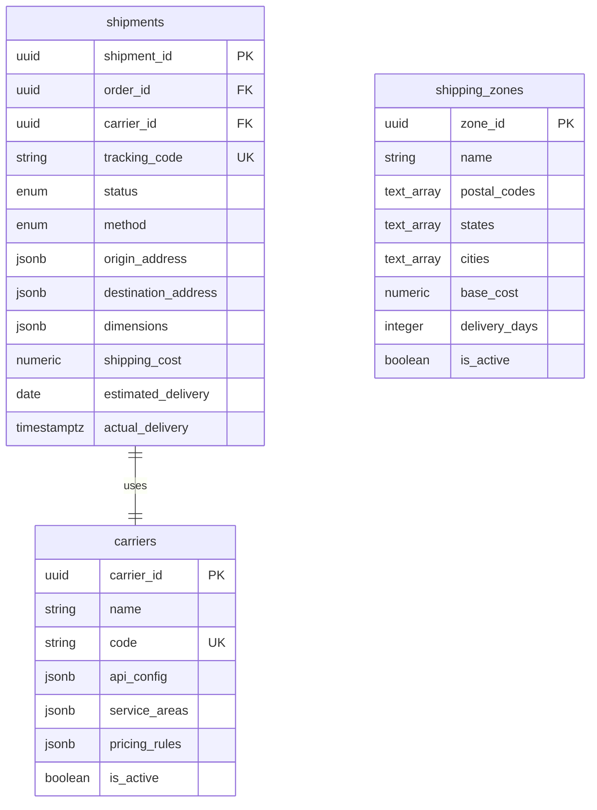
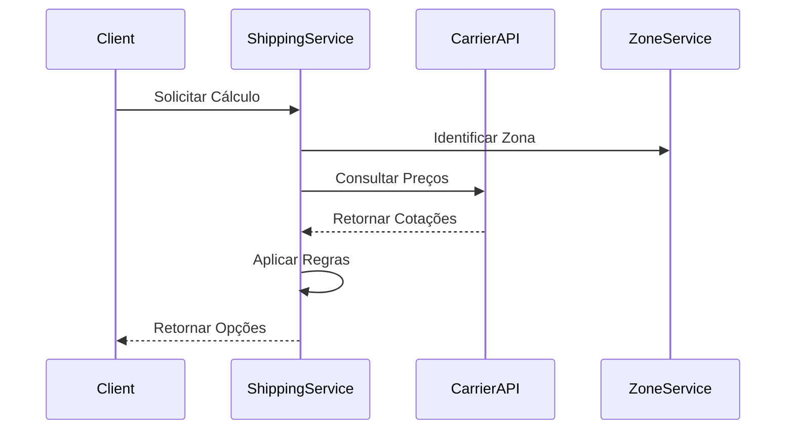
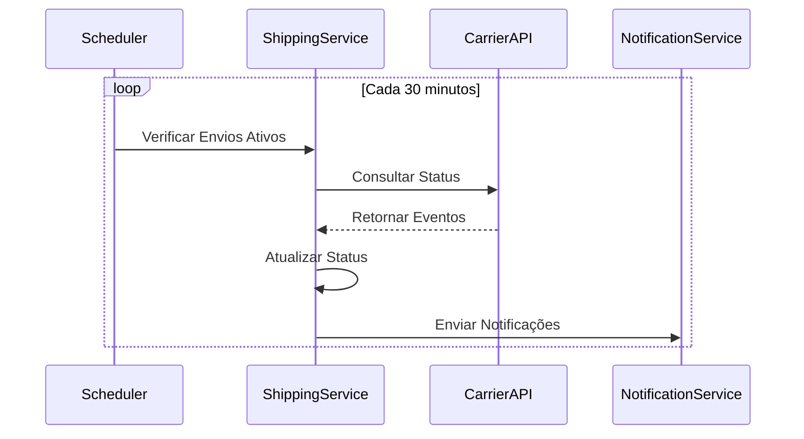

# Shipping Service - Documentação Técnica

## 1. Visão Geral do Microsserviço

O **Shipping Service** é responsável por toda a logística e gestão de entregas do e-commerce. Este microsserviço centraliza as operações relacionadas ao cálculo de frete, rastreamento de entregas, gestão de transportadoras e otimização de rotas.

### Responsabilidades Principais
- Cálculo de frete e prazos de entrega
- Gestão de transportadoras e métodos de envio
- Rastreamento de entregas em tempo real
- Otimização de rotas e consolidação de envios
- Gestão de endereços de entrega
- Controle de status de envio
- Integração com APIs de transportadoras
- Gestão de devoluções e trocas
- Cálculo de custos logísticos
- Notificações de status de entrega

## 2. Estrutura de Tabelas

### 2.1 Tabela Principal: `shipments`
**Descrição**: Envios e entregas do sistema

| Campo | Tipo | Descrição |
|-------|------|----------|
| shipment_id | UUID | Identificador único do envio |
| order_id | UUID | Referência ao pedido |
| carrier_id | UUID | Referência à transportadora |
| tracking_code | VARCHAR(100) | Código de rastreamento |
| status | shipment_status_enum | Status atual do envio |
| method | shipping_method_enum | Método de envio |
| origin_address | JSONB | Endereço de origem |
| destination_address | JSONB | Endereço de destino |
| dimensions | JSONB | Dimensões e peso |
| shipping_cost | NUMERIC(10,2) | Custo do frete |
| estimated_delivery | DATE | Data estimada de entrega |
| actual_delivery | TIMESTAMPTZ | Data real de entrega |
| carrier_response | JSONB | Resposta da transportadora |
| tracking_events | JSONB[] | Histórico de rastreamento |
| created_at | TIMESTAMPTZ | Data de criação |
| updated_at | TIMESTAMPTZ | Última atualização |
| version | INTEGER | Controle de versão |

### 2.2 Tabela: `carriers`
**Descrição**: Transportadoras disponíveis

| Campo | Tipo | Descrição |
|-------|------|----------|
| carrier_id | UUID | Identificador único da transportadora |
| name | VARCHAR(100) | Nome da transportadora |
| code | VARCHAR(20) | Código identificador |
| api_config | JSONB | Configurações da API |
| service_areas | JSONB | Áreas de atendimento |
| pricing_rules | JSONB | Regras de precificação |
| is_active | BOOLEAN | Status ativo/inativo |
| created_at | TIMESTAMPTZ | Data de criação |
| updated_at | TIMESTAMPTZ | Última atualização |

### 2.3 Tabela: `shipping_zones`
**Descrição**: Zonas de entrega e precificação

| Campo | Tipo | Descrição |
|-------|------|----------|
| zone_id | UUID | Identificador único da zona |
| name | VARCHAR(100) | Nome da zona |
| postal_codes | TEXT[] | Códigos postais incluídos |
| states | TEXT[] | Estados incluídos |
| cities | TEXT[] | Cidades incluídas |
| base_cost | NUMERIC(10,2) | Custo base da zona |
| delivery_days | INTEGER | Dias para entrega |
| is_active | BOOLEAN | Status ativo/inativo |
| created_at | TIMESTAMPTZ | Data de criação |
| updated_at | TIMESTAMPTZ | Última atualização |

## 3. Tipos Enumerados

### 3.1 `shipment_status_enum`
**Descrição**: Status possíveis de um envio

| Valor | Descrição |
|-------|----------|
| pending | Envio criado, aguardando processamento |
| confirmed | Envio confirmado pela transportadora |
| picked_up | Produto coletado no remetente |
| in_transit | Em trânsito para destino |
| out_for_delivery | Saiu para entrega |
| delivered | Entregue com sucesso |
| failed_delivery | Tentativa de entrega falhada |
| returned | Devolvido ao remetente |
| cancelled | Envio cancelado |

### 3.2 `shipping_method_enum`
**Descrição**: Métodos de envio disponíveis

| Valor | Descrição |
|-------|----------|
| standard | Entrega padrão |
| express | Entrega expressa |
| overnight | Entrega no dia seguinte |
| same_day | Entrega no mesmo dia |
| pickup | Retirada no local |

## 4. Relacionamentos Entre Entidades



**Relacionamentos Externos:**
- `order_id` → Order Service (orders.order_id)

## 5. Estrutura de Dados JSONB

### 5.1 `origin_address` / `destination_address`
**Descrição**: Estrutura padronizada de endereços

```json
{
  "street": "Rua das Flores, 123",
  "complement": "Apto 45",
  "neighborhood": "Centro",
  "city": "São Paulo",
  "state": "SP",
  "postal_code": "01234-567",
  "country": "BR",
  "latitude": -23.5505,
  "longitude": -46.6333,
  "contact_name": "João Silva",
  "contact_phone": "+5511999999999"
}
```

### 5.2 `dimensions`
**Descrição**: Dimensões e peso do envio

```json
{
  "weight": 2.5,
  "weight_unit": "kg",
  "length": 30.0,
  "width": 20.0,
  "height": 15.0,
  "dimension_unit": "cm",
  "volume": 9000.0,
  "volume_unit": "cm3",
  "package_type": "box",
  "fragile": false,
  "declared_value": 150.00
}
```

### 5.3 `carrier_response`
**Descrição**: Resposta da API da transportadora

```json
{
  "carrier_name": "Correios",
  "service_code": "04014",
  "service_name": "SEDEX",
  "tracking_url": "https://correios.com.br/track/ABC123456BR",
  "estimated_delivery_date": "2024-01-20",
  "shipping_cost": 25.50,
  "delivery_days": 3,
  "raw_response": {...}
}
```

### 5.4 `tracking_events`
**Descrição**: Array de eventos de rastreamento

```json
[
  {
    "timestamp": "2024-01-15T10:30:00Z",
    "status": "picked_up",
    "location": "São Paulo - SP",
    "description": "Objeto postado",
    "carrier_code": "PO",
    "next_location": "Centro de Distribuição SP"
  },
  {
    "timestamp": "2024-01-16T14:20:00Z",
    "status": "in_transit",
    "location": "Rio de Janeiro - RJ",
    "description": "Objeto em trânsito",
    "carrier_code": "DO",
    "next_location": "Centro de Entrega RJ"
  }
]
```

### 5.5 `api_config` (Carriers)
**Descrição**: Configurações da API da transportadora

```json
{
  "base_url": "https://api.correios.com.br",
  "auth_type": "bearer_token",
  "credentials": {
    "username": "${CORREIOS_USERNAME}",
    "password": "${CORREIOS_PASSWORD}"
  },
  "endpoints": {
    "calculate": "/v1/calculate",
    "track": "/v1/track",
    "create_shipment": "/v1/shipments"
  },
  "rate_limit": {
    "requests_per_minute": 60,
    "burst_limit": 10
  },
  "timeout": 30,
  "retry_attempts": 3
}
```

### 5.6 `pricing_rules` (Carriers)
**Descrição**: Regras de precificação da transportadora

```json
{
  "base_rate": 10.00,
  "weight_rules": [
    {"max_weight": 1.0, "rate_per_kg": 5.00},
    {"max_weight": 5.0, "rate_per_kg": 4.00},
    {"max_weight": 10.0, "rate_per_kg": 3.50}
  ],
  "distance_rules": [
    {"max_distance": 100, "multiplier": 1.0},
    {"max_distance": 500, "multiplier": 1.2},
    {"max_distance": 1000, "multiplier": 1.5}
  ],
  "zone_multipliers": {
    "urban": 1.0,
    "suburban": 1.2,
    "rural": 1.5
  },
  "service_fees": {
    "express": 15.00,
    "same_day": 50.00,
    "insurance": 0.02
  }
}
```

## 6. Considerações de Segurança

### 6.1 Proteção de Dados Pessoais
- Criptografia de endereços sensíveis
- Anonimização de dados de contato
- Controle de acesso a informações de entrega
- Logs sanitizados sem dados pessoais

### 6.2 Integração Segura com APIs
- Autenticação segura com transportadoras
- Validação de certificados SSL/TLS
- Rate limiting para evitar abuso
- Monitoramento de tentativas de acesso

### 6.3 Validação de Dados
- Validação de códigos postais
- Verificação de endereços válidos
- Sanitização de dados de entrada
- Prevenção de injection attacks

### 6.4 Auditoria e Compliance
- Log de todas as operações
- Rastreamento de alterações
- Conformidade com LGPD
- Retenção controlada de dados

## 7. Considerações de Performance

### 7.1 Índices Estratégicos

#### Índices Principais
```sql
CREATE INDEX idx_shipments_order_id ON shipments (order_id);
CREATE INDEX idx_shipments_tracking_code ON shipments (tracking_code);
CREATE INDEX idx_shipments_status ON shipments (status);
CREATE INDEX idx_shipments_carrier_id ON shipments (carrier_id);
```

#### Índices JSONB
```sql
CREATE INDEX idx_shipments_destination_gin ON shipments USING GIN (destination_address);
CREATE INDEX idx_shipments_tracking_events_gin ON shipments USING GIN (tracking_events);
```
**Descrição**: Permite consultas eficientes em campos JSONB

#### Índices Compostos
```sql
CREATE INDEX idx_shipments_status_date ON shipments (status, estimated_delivery);
CREATE INDEX idx_shipments_carrier_status ON shipments (carrier_id, status);
```

#### Índices Parciais
```sql
CREATE INDEX idx_shipments_active ON shipments (order_id) 
WHERE status NOT IN ('delivered', 'cancelled', 'returned');
```
**Descrição**: Otimiza consultas de envios ativos

### 7.2 Otimizações
- Cache de cálculos de frete frequentes
- Pré-processamento de zonas de entrega
- Batch processing para atualizações de rastreamento
- Compressão de dados históricos

## 8. Funcionalidades do Sistema

### 8.1 Cálculo de Frete

#### Fluxo de Cálculo


#### Fatores de Cálculo
1. **Distância e Localização**
   - Origem e destino
   - Zona de entrega
   - Área urbana/rural

2. **Características do Produto**
   - Peso e dimensões
   - Valor declarado
   - Fragilidade

3. **Método de Envio**
   - Velocidade de entrega
   - Serviços adicionais
   - Horário de coleta

4. **Regras de Negócio**
   - Promoções ativas
   - Frete grátis
   - Descontos por volume

### 8.2 Rastreamento de Entregas

#### Sistema de Polling


#### Webhook Processing
1. **Recebimento de Webhook**
   - Validar assinatura
   - Verificar duplicação
   - Parsear dados

2. **Processamento de Eventos**
   - Atualizar status do envio
   - Adicionar evento ao histórico
   - Calcular estimativas

3. **Notificações**
   - Notificar cliente
   - Atualizar Order Service
   - Registrar métricas

### 8.3 Otimização de Rotas

#### Consolidação de Envios
- Agrupar envios por região
- Otimizar rotas de coleta
- Reduzir custos de transporte
- Melhorar eficiência logística

#### Algoritmos de Otimização
- Problema do caixeiro viajante (TSP)
- Algoritmos genéticos
- Heurísticas de proximidade
- Machine learning para previsões

## 9. Integração com Transportadoras

### 9.1 Transportadoras Suportadas
- **Correios**: Cobertura nacional
- **Jadlog**: Entregas expressas
- **Total Express**: Logística integrada
- **Mercado Envios**: E-commerce
- **Loggi**: Last mile delivery

### 9.2 Padrão de Integração

#### Interface Comum
```typescript
interface CarrierAdapter {
  calculateShipping(request: ShippingRequest): Promise<ShippingQuote[]>;
  createShipment(shipment: ShipmentData): Promise<ShipmentResponse>;
  trackShipment(trackingCode: string): Promise<TrackingInfo>;
  cancelShipment(shipmentId: string): Promise<CancellationResponse>;
  validateAddress(address: Address): Promise<AddressValidation>;
}
```

### 9.3 Tratamento de Erros por Transportadora
- Mapeamento de códigos de erro
- Retry automático para falhas temporárias
- Fallback para transportadoras alternativas
- Notificação de falhas críticas

## 10. Triggers e Eventos

### 10.1 Trigger de Eventos de Envio
```sql
CREATE OR REPLACE FUNCTION trigger_shipment_events()
RETURNS TRIGGER
```

#### Eventos Publicados
- `shipment.created`: Envio criado
- `shipment.confirmed`: Envio confirmado
- `shipment.picked_up`: Produto coletado
- `shipment.in_transit`: Em trânsito
- `shipment.delivered`: Entregue
- `shipment.failed`: Falha na entrega

### 10.2 Integração com Outros Serviços
- **Order Service**: Atualização de status
- **Notification Service**: Alertas de entrega
- **Audit Service**: Log de operações
- **Analytics Service**: Métricas de performance

## 11. Monitoramento e Métricas

### 11.1 Métricas de Negócio
- Taxa de entrega no prazo
- Custo médio de frete
- Tempo médio de entrega
- Taxa de falhas de entrega
- Satisfação do cliente

### 11.2 Métricas Técnicas
- Latência de APIs de transportadoras
- Taxa de erro por carrier
- Performance de cálculos de frete
- Uso de cache
- Throughput de rastreamento

### 11.3 Alertas Críticos
- Falhas de integração com carriers
- Envios atrasados além do limite
- Taxa de erro acima do threshold
- Problemas de performance

## 12. Gestão de Devoluções

### 12.1 Processo de Devolução
1. **Solicitação de Devolução**
   - Validar elegibilidade
   - Gerar código de devolução
   - Criar envio reverso

2. **Coleta do Produto**
   - Agendar coleta
   - Gerar etiqueta de devolução
   - Rastrear envio reverso

3. **Processamento**
   - Receber produto
   - Validar condições
   - Atualizar status

### 12.2 Tipos de Devolução
- **Troca**: Produto defeituoso
- **Arrependimento**: Desistência da compra
- **Erro de Envio**: Produto incorreto
- **Dano no Transporte**: Produto danificado

## 13. Padrões de Nomenclatura

### 13.1 Convenções de Campos
- Snake_case consistente
- Sufixo `_id` para identificadores
- Sufixo `_at` para timestamps
- Sufixo `_code` para códigos
- Campos JSONB com nomes descritivos

### 13.2 Convenções de Status
- Estados em inglês minúsculo
- Transições claras e lógicas
- Alinhamento com padrões de carriers
- Documentação de cada estado

### 13.3 Convenções de Logs
- Estrutura JSON padronizada
- Correlação por tracking_code
- Níveis de log apropriados
- Sanitização de dados sensíveis

## 14. Commands e Queries (CQRS)

### 14.1 Commands - Shipment Management

#### 14.1.1 CreateShipmentCommand
**Descrição**: Cria um novo envio no sistema

```csharp
public class CreateShipmentCommand : IRequest<CreateShipmentResponse>
{
    public Guid OrderId { get; set; }
    public Guid CarrierId { get; set; }
    public ShippingMethod Method { get; set; }
    public AddressDto OriginAddress { get; set; }
    public AddressDto DestinationAddress { get; set; }
    public DimensionsDto Dimensions { get; set; }
    public decimal DeclaredValue { get; set; }
    public bool RequireSignature { get; set; }
    public bool IsFragile { get; set; }
    public Dictionary<string, object> Metadata { get; set; }
}

public class CreateShipmentResponse
{
    public Guid ShipmentId { get; set; }
    public string TrackingCode { get; set; }
    public decimal ShippingCost { get; set; }
    public DateTime EstimatedDelivery { get; set; }
    public string CarrierResponse { get; set; }
}
```

**Validações**:
- OrderId deve existir e estar válido
- CarrierId deve estar ativo
- Endereços devem ser válidos
- Dimensões e peso dentro dos limites
- Valor declarado deve ser positivo

**Handler**: `CreateShipmentCommandHandler`
**Eventos**: `ShipmentCreatedEvent`, `ShippingCostCalculatedEvent`
**Segurança**: Validação de permissões, sanitização de endereços
**Cache**: Invalidar cache de envios ativos
**Integração**: APIs de transportadoras para criação
**Rate Limiting**: 100 requests/minuto por usuário

#### 14.1.2 UpdateShipmentCommand
**Descrição**: Atualiza informações de um envio existente

```csharp
public class UpdateShipmentCommand : IRequest<UpdateShipmentResponse>
{
    public Guid ShipmentId { get; set; }
    public ShipmentStatus? Status { get; set; }
    public AddressDto DestinationAddress { get; set; }
    public DateTime? EstimatedDelivery { get; set; }
    public decimal? ShippingCost { get; set; }
    public string Notes { get; set; }
    public int Version { get; set; } // Controle de concorrência
}
```

**Validações**:
- Shipment deve existir
- Status deve seguir fluxo válido
- Controle de versão para concorrência
- Apenas campos permitidos podem ser alterados

**Handler**: `UpdateShipmentCommandHandler`
**Eventos**: `ShipmentUpdatedEvent`, `ShipmentStatusChangedEvent`
**Circuit Breaker**: Para APIs de transportadoras
**Observabilidade**: Log de todas as alterações

#### 14.1.3 CancelShipmentCommand
**Descrição**: Cancela um envio

```csharp
public class CancelShipmentCommand : IRequest<CancelShipmentResponse>
{
    public Guid ShipmentId { get; set; }
    public string CancellationReason { get; set; }
    public bool RefundShipping { get; set; }
    public string RequestedBy { get; set; }
}
```

**Validações**:
- Envio deve estar em status cancelável
- Razão de cancelamento obrigatória
- Verificar políticas de reembolso

**Handler**: `CancelShipmentCommandHandler`
**Eventos**: `ShipmentCancelledEvent`, `RefundRequestedEvent`
**Integração**: Cancelamento na transportadora

### 14.2 Commands - Shipping Calculation

#### 14.2.1 CalculateShippingCommand
**Descrição**: Calcula opções e custos de frete

```csharp
public class CalculateShippingCommand : IRequest<CalculateShippingResponse>
{
    public AddressDto OriginAddress { get; set; }
    public AddressDto DestinationAddress { get; set; }
    public DimensionsDto Dimensions { get; set; }
    public decimal DeclaredValue { get; set; }
    public List<ShippingMethod> RequestedMethods { get; set; }
    public List<Guid> PreferredCarriers { get; set; }
    public bool IncludeInsurance { get; set; }
}

public class CalculateShippingResponse
{
    public List<ShippingOptionDto> Options { get; set; }
    public string CalculationId { get; set; }
    public DateTime CalculatedAt { get; set; }
    public TimeSpan CalculationTime { get; set; }
}
```

**Cache**: Redis com TTL de 30 minutos
**Rate Limiting**: 200 requests/minuto
**Fallback**: Cálculo offline se APIs falharem
**Otimização**: Paralelização de consultas

#### 14.2.2 ValidateAddressCommand
**Descrição**: Valida e normaliza endereços

```csharp
public class ValidateAddressCommand : IRequest<ValidateAddressResponse>
{
    public AddressDto Address { get; set; }
    public bool NormalizeAddress { get; set; }
    public bool ValidateDeliveryArea { get; set; }
}
```

**Integração**: APIs de validação de endereço
**Cache**: Endereços validados por 24 horas
**LGPD**: Não armazenar dados pessoais

### 14.3 Commands - Tracking Management

#### 14.3.1 UpdateTrackingCommand
**Descrição**: Atualiza informações de rastreamento

```csharp
public class UpdateTrackingCommand : IRequest<UpdateTrackingResponse>
{
    public string TrackingCode { get; set; }
    public List<TrackingEventDto> Events { get; set; }
    public ShipmentStatus NewStatus { get; set; }
    public DateTime? ActualDelivery { get; set; }
    public string CarrierReference { get; set; }
}
```

**Processamento**: Assíncrono via RabbitMQ
**Deduplicação**: Evitar eventos duplicados
**Webhook**: Notificar serviços interessados

#### 14.3.2 ProcessWebhookCommand
**Descrição**: Processa webhooks de transportadoras

```csharp
public class ProcessWebhookCommand : IRequest<ProcessWebhookResponse>
{
    public string CarrierCode { get; set; }
    public string Signature { get; set; }
    public string Payload { get; set; }
    public Dictionary<string, string> Headers { get; set; }
    public DateTime ReceivedAt { get; set; }
}
```

**Segurança**: Validação de assinatura
**Idempotência**: Evitar processamento duplicado
**Retry**: Política de retry para falhas

### 14.4 Commands - Carrier Management

#### 14.4.1 CreateCarrierCommand
**Descrição**: Cadastra nova transportadora

```csharp
public class CreateCarrierCommand : IRequest<CreateCarrierResponse>
{
    public string Name { get; set; }
    public string Code { get; set; }
    public CarrierApiConfigDto ApiConfig { get; set; }
    public List<string> ServiceAreas { get; set; }
    public PricingRulesDto PricingRules { get; set; }
    public bool IsActive { get; set; }
}
```

**Validações**:
- Nome e código únicos
- Configuração de API válida
- Teste de conectividade

**Handler**: `CreateCarrierCommandHandler`
**Eventos**: `CarrierCreatedEvent`
**Segurança**: Criptografia de credenciais

### 14.5 Commands - Zone Management

#### 14.5.1 CreateShippingZoneCommand
**Descrição**: Cria zona de entrega

```csharp
public class CreateShippingZoneCommand : IRequest<CreateShippingZoneResponse>
{
    public string Name { get; set; }
    public List<string> PostalCodes { get; set; }
    public List<string> States { get; set; }
    public List<string> Cities { get; set; }
    public decimal BaseCost { get; set; }
    public int DeliveryDays { get; set; }
}
```

**Validações**:
- Códigos postais válidos
- Não sobreposição de zonas
- Custos positivos

### 14.6 Queries - Shipment Queries

#### 14.6.1 GetShipmentByIdQuery
**Descrição**: Busca envio por ID

```csharp
public class GetShipmentByIdQuery : IRequest<ShipmentDto>
{
    public Guid ShipmentId { get; set; }
    public bool IncludeTrackingHistory { get; set; }
    public bool IncludeCarrierDetails { get; set; }
}
```

**Cache**: Redis por 5 minutos
**Índice**: idx_shipments_id (PK)
**Segurança**: Verificar permissões de acesso

#### 14.6.2 GetShipmentByTrackingCodeQuery
**Descrição**: Busca envio por código de rastreamento

```csharp
public class GetShipmentByTrackingCodeQuery : IRequest<ShipmentDto>
{
    public string TrackingCode { get; set; }
    public bool PublicAccess { get; set; }
}
```

**Cache**: Redis por 10 minutos
**Índice**: idx_shipments_tracking_code
**Rate Limiting**: 50 requests/minuto para acesso público

#### 14.6.3 GetActiveShipmentsQuery
**Descrição**: Lista envios ativos

```csharp
public class GetActiveShipmentsQuery : IRequest<PagedResult<ShipmentDto>>
{
    public int Page { get; set; } = 1;
    public int PageSize { get; set; } = 20;
    public List<ShipmentStatus> StatusFilter { get; set; }
    public Guid? CarrierId { get; set; }
    public DateTime? FromDate { get; set; }
    public DateTime? ToDate { get; set; }
}
```

**Paginação**: Máximo 100 itens por página
**Índice**: idx_shipments_active (parcial)
**Cache**: Redis por 2 minutos

### 14.7 Queries - Shipping Calculation Queries

#### 14.7.1 GetShippingOptionsQuery
**Descrição**: Obtém opções de frete disponíveis

```csharp
public class GetShippingOptionsQuery : IRequest<List<ShippingOptionDto>>
{
    public string OriginPostalCode { get; set; }
    public string DestinationPostalCode { get; set; }
    public DimensionsDto Dimensions { get; set; }
    public decimal DeclaredValue { get; set; }
}
```

**Cache**: Redis por 1 hora
**Otimização**: Consulta paralela a múltiplas transportadoras
**Fallback**: Opções pré-calculadas

#### 14.7.2 GetDeliveryEstimateQuery
**Descrição**: Calcula estimativa de entrega

```csharp
public class GetDeliveryEstimateQuery : IRequest<DeliveryEstimateDto>
{
    public string OriginPostalCode { get; set; }
    public string DestinationPostalCode { get; set; }
    public ShippingMethod Method { get; set; }
    public Guid CarrierId { get; set; }
}
```

**Cache**: Redis por 4 horas
**ML**: Modelo de previsão baseado em histórico

### 14.8 Queries - Tracking Queries

#### 14.8.1 GetTrackingInfoQuery
**Descrição**: Obtém informações de rastreamento

```csharp
public class GetTrackingInfoQuery : IRequest<TrackingInfoDto>
{
    public string TrackingCode { get; set; }
    public bool RefreshFromCarrier { get; set; }
    public bool IncludeEstimatedDelivery { get; set; }
}
```

**Cache**: Redis por 15 minutos
**Real-time**: Opção de consulta em tempo real
**Rate Limiting**: 30 requests/minuto por tracking

#### 14.8.2 GetTrackingHistoryQuery
**Descrição**: Histórico completo de rastreamento

```csharp
public class GetTrackingHistoryQuery : IRequest<List<TrackingEventDto>>
{
    public string TrackingCode { get; set; }
    public DateTime? FromDate { get; set; }
    public DateTime? ToDate { get; set; }
    public bool IncludeCarrierRawData { get; set; }
}
```

**Índice**: idx_shipments_tracking_events_gin
**Compressão**: Dados antigos comprimidos

### 14.9 Queries - Carrier Queries

#### 14.9.1 GetActiveCarriersQuery
**Descrição**: Lista transportadoras ativas

```csharp
public class GetActiveCarriersQuery : IRequest<List<CarrierDto>>
{
    public string ServiceArea { get; set; }
    public List<ShippingMethod> SupportedMethods { get; set; }
    public bool IncludePerformanceMetrics { get; set; }
}
```

**Cache**: Redis por 30 minutos
**Filtros**: Por área de atendimento e métodos

#### 14.9.2 GetCarrierPerformanceQuery
**Descrição**: Métricas de performance da transportadora

```csharp
public class GetCarrierPerformanceQuery : IRequest<CarrierPerformanceDto>
{
    public Guid CarrierId { get; set; }
    public DateTime FromDate { get; set; }
    public DateTime ToDate { get; set; }
    public List<string> Metrics { get; set; }
}
```

**Analytics**: Integração com serviço de analytics
**Cache**: Redis por 1 hora

### 14.10 Queries - Analytics Queries

#### 14.10.1 GetShippingAnalyticsQuery
**Descrição**: Analytics de envios

```csharp
public class GetShippingAnalyticsQuery : IRequest<ShippingAnalyticsDto>
{
    public DateTime FromDate { get; set; }
    public DateTime ToDate { get; set; }
    public List<Guid> CarrierIds { get; set; }
    public List<string> Regions { get; set; }
    public AnalyticsGranularity Granularity { get; set; }
}
```

**Agregação**: Dados pré-agregados para performance
**Cache**: Redis por 2 horas
**Permissões**: Apenas usuários autorizados

#### 14.10.2 GetDeliveryPerformanceQuery
**Descrição**: Performance de entregas

```csharp
public class GetDeliveryPerformanceQuery : IRequest<DeliveryPerformanceDto>
{
    public DateTime FromDate { get; set; }
    public DateTime ToDate { get; set; }
    public List<ShippingMethod> Methods { get; set; }
    public bool IncludeBenchmarks { get; set; }
}
```

**KPIs**: Taxa de entrega no prazo, tempo médio, custos
**Benchmarks**: Comparação com metas

### 14.11 Queries - Admin Queries

#### 14.11.1 GetAllShipmentsQuery
**Descrição**: Lista todos os envios (admin)

```csharp
public class GetAllShipmentsQuery : IRequest<PagedResult<ShipmentDto>>
{
    public int Page { get; set; } = 1;
    public int PageSize { get; set; } = 50;
    public ShipmentFilterDto Filters { get; set; }
    public ShipmentSortDto Sort { get; set; }
}
```

**Paginação**: Obrigatória para performance
**Filtros**: Status, data, transportadora, região
**Auditoria**: Log de acessos administrativos

#### 14.11.2 GetFailedShipmentsQuery
**Descrição**: Envios com falhas

```csharp
public class GetFailedShipmentsQuery : IRequest<List<FailedShipmentDto>>
{
    public DateTime FromDate { get; set; }
    public DateTime ToDate { get; set; }
    public List<string> ErrorTypes { get; set; }
    public bool IncludeRetryAttempts { get; set; }
}
```

**Alertas**: Notificação automática para falhas críticas
**Retry**: Informações sobre tentativas de reprocessamento

### 14.12 Características Técnicas

#### 14.12.1 Observabilidade
- **Logging**: Structured logging com correlação
- **Métricas**: Prometheus para monitoramento
- **Tracing**: Jaeger para rastreamento distribuído
- **Health Checks**: Endpoints de saúde para cada carrier

#### 14.12.2 Segurança e Compliance
- **LGPD**: Anonimização de dados pessoais
- **Criptografia**: Dados sensíveis em repouso e trânsito
- **Rate Limiting**: Proteção contra abuso
- **Auditoria**: Log completo de operações

#### 14.12.3 Performance e Escalabilidade
- **Cache Distribuído**: Redis para queries frequentes
- **Processamento Assíncrono**: RabbitMQ para operações pesadas
- **Circuit Breaker**: Proteção contra falhas de carriers
- **Connection Pooling**: Otimização de conexões DB

#### 14.12.4 Integração e Resiliência
- **Multi-Carrier**: Suporte a múltiplas transportadoras
- **Fallback**: Carriers alternativos em caso de falha
- **Retry Policies**: Políticas inteligentes de retry
- **Webhook Processing**: Processamento robusto de webhooks

#### 14.12.5 Otimização de Rotas
- **Algoritmos**: TSP, algoritmos genéticos
- **Machine Learning**: Previsões baseadas em histórico
- **Consolidação**: Agrupamento inteligente de envios
- **Real-time**: Ajustes dinâmicos de rotas


# Shipping Service - Tasks

## Setup de Infraestrutura
[ ] Configurar banco de dados PostgreSQL para Shipping
[ ] Configurar Redis para cache de cálculos
[ ] Configurar RabbitMQ para eventos de envio
[ ] Configurar variáveis de ambiente no .env
[ ] Criar .env.example com todas as variáveis necessárias

## Desenvolvimento de APIs
[ ] Implementar endpoint POST /shipments (criar envio)
[ ] Implementar endpoint GET /shipments/{id} (buscar envio)
[ ] Implementar endpoint PUT /shipments/{id} (atualizar envio)
[ ] Implementar endpoint GET /shipments (listar envios)
[ ] Implementar endpoint POST /shipments/{id}/track (rastrear envio)
[ ] Implementar endpoint PUT /shipments/{id}/status (atualizar status)
[ ] Implementar endpoint POST /shipping/calculate (calcular frete)
[ ] Implementar endpoint GET /carriers (listar transportadoras)
[ ] Implementar endpoint POST /carriers (criar transportadora)
[ ] Implementar endpoint PUT /carriers/{id} (atualizar transportadora)
[ ] Implementar endpoint GET /shipping-zones (listar zonas)
[ ] Implementar endpoint POST /shipping-zones (criar zona)
[ ] Implementar endpoint PUT /shipping-zones/{id} (atualizar zona)
[ ] Implementar validação de dados de entrada
[ ] Implementar middleware de autenticação

## Modelo de Dados
[ ] Criar tabela shipments com campos obrigatórios
[ ] Criar tabela carriers para transportadoras
[ ] Criar tabela shipping_zones para zonas de entrega
[ ] Criar tabela shipping_rates para tarifas
[ ] Criar tabela tracking_events para rastreamento
[ ] Criar tabela delivery_attempts para tentativas
[ ] Criar tabela shipping_labels para etiquetas
[ ] Criar tabela shipping_methods para métodos
[ ] Implementar triggers para auditoria
[ ] Implementar índices para performance
[ ] Configurar constraints e relacionamentos

## Cálculo de Frete
[ ] Implementar cálculo por peso
[ ] Implementar cálculo por dimensões
[ ] Implementar cálculo por distância
[ ] Implementar cálculo por zona
[ ] Implementar cálculo por valor
[ ] Implementar regras de frete grátis
[ ] Implementar descontos progressivos
[ ] Implementar sobretaxas especiais
[ ] Implementar cálculo para múltiplos produtos
[ ] Implementar validação de limites

## Gestão de Transportadoras
[ ] Integrar com Correios API
[ ] Integrar com transportadoras privadas
[ ] Configurar credenciais de APIs
[ ] Implementar fallback entre transportadoras
[ ] Configurar SLA por transportadora
[ ] Implementar avaliação de performance
[ ] Configurar custos por transportadora
[ ] Implementar seleção automática
[ ] Configurar limites de peso/dimensão

## Sistema de Rastreamento
[ ] Implementar coleta de eventos de rastreamento
[ ] Configurar webhooks de transportadoras
[ ] Implementar parsing de status
[ ] Configurar notificações de status
[ ] Implementar histórico de rastreamento
[ ] Configurar alertas de atraso
[ ] Implementar previsão de entrega
[ ] Configurar exceções de entrega

## Gestão de Endereços
[ ] Implementar validação de CEP
[ ] Configurar normalização de endereços
[ ] Implementar geocodificação
[ ] Configurar validação de existência
[ ] Implementar sugestões de correção
[ ] Configurar cache de endereços
[ ] Implementar validação de área de entrega

## Zonas de Entrega
[ ] Configurar zonas por CEP
[ ] Implementar zonas por região
[ ] Configurar zonas especiais
[ ] Implementar zonas de restrição
[ ] Configurar prazos por zona
[ ] Implementar custos por zona
[ ] Configurar disponibilidade por zona

## Métodos de Entrega
[ ] Configurar entrega padrão
[ ] Implementar entrega expressa
[ ] Configurar entrega agendada
[ ] Implementar retirada em loja
[ ] Configurar entrega same-day
[ ] Implementar entrega em pontos
[ ] Configurar entrega noturna
[ ] Implementar entrega weekend

## Gestão de Etiquetas
[ ] Implementar geração de etiquetas
[ ] Configurar templates de etiquetas
[ ] Implementar códigos de barras
[ ] Configurar impressão em lote
[ ] Implementar QR codes
[ ] Configurar formatos personalizados
[ ] Implementar validação de etiquetas

## Cache e Performance
[ ] Implementar cache de cálculos de frete
[ ] Configurar cache de zonas
[ ] Implementar cache de transportadoras
[ ] Configurar TTL para caches
[ ] Implementar invalidação inteligente
[ ] Otimizar queries de cálculo
[ ] Configurar connection pooling

## Segurança
[ ] Implementar autenticação para APIs
[ ] Configurar rate limiting
[ ] Implementar validação de origem
[ ] Configurar CORS adequadamente
[ ] Implementar logs de auditoria
[ ] Configurar sanitização de dados
[ ] Implementar proteção contra SQL injection
[ ] Configurar headers de segurança

## Testes
[ ] Criar testes unitários para controllers
[ ] Criar testes unitários para services
[ ] Criar testes de integração para APIs
[ ] Criar testes para cálculos de frete
[ ] Criar testes de integração com transportadoras
[ ] Criar testes de rastreamento
[ ] Configurar coverage de testes
[ ] Implementar testes de carga

## Monitoramento e Logs
[ ] Configurar logs estruturados
[ ] Implementar métricas de entrega
[ ] Configurar alertas de falhas
[ ] Implementar health check endpoint
[ ] Configurar monitoramento de SLA
[ ] Implementar dashboards de shipping
[ ] Configurar alertas de atraso
[ ] Implementar métricas de custo

## Deploy e DevOps
[ ] Configurar Dockerfile
[ ] Configurar docker-compose para desenvolvimento
[ ] Configurar pipeline CI/CD
[ ] Configurar ambiente de staging
[ ] Configurar ambiente de produção
[ ] Implementar rollback strategy
[ ] Configurar backup automático do banco
[ ] Configurar disaster recovery

## Documentação
[ ] Documentar APIs com Swagger/OpenAPI
[ ] Criar documentação de setup
[ ] Documentar cálculos de frete
[ ] Documentar integrações
[ ] Documentar fluxos de rastreamento
[ ] Criar guia de troubleshooting
[ ] Documentar variáveis de ambiente

## Integração com Outros Serviços
[ ] Integrar com Order Service para criação
[ ] Integrar com Cart Service para cálculos
[ ] Integrar com User Management para endereços
[ ] Integrar com Catalog Service para dimensões
[ ] Integrar com Notification Service para alertas
[ ] Configurar eventos para outros serviços
[ ] Implementar sincronização de dados

## Analytics e Relatórios
[ ] Implementar métricas de performance
[ ] Configurar análise de custos
[ ] Implementar relatórios de SLA
[ ] Configurar dashboards de entrega
[ ] Implementar análise de rotas
[ ] Configurar métricas de satisfação
[ ] Implementar análise de tendências

## Gestão de Exceções
[ ] Implementar tratamento de falhas de entrega
[ ] Configurar reagendamento automático
[ ] Implementar gestão de devoluções
[ ] Configurar alertas de problemas
[ ] Implementar escalação de issues
[ ] Configurar compensações automáticas

## Otimização de Rotas
[ ] Implementar algoritmos de otimização
[ ] Configurar agrupamento de entregas
[ ] Implementar análise de densidade
[ ] Configurar rotas dinâmicas
[ ] Implementar previsão de demanda
[ ] Configurar balanceamento de carga

## Gestão de Inventário
[ ] Implementar controle de estoque por localização
[ ] Configurar reserva de produtos
[ ] Implementar alocação inteligente
[ ] Configurar transferências entre estoques
[ ] Implementar previsão de demanda

## Sustentabilidade
[ ] Implementar cálculo de pegada de carbono
[ ] Configurar opções de entrega verde
[ ] Implementar consolidação de entregas
[ ] Configurar rotas otimizadas
[ ] Implementar embalagens sustentáveis

## Gestão de Custos
[ ] Implementar controle de custos por transportadora
[ ] Configurar análise de ROI
[ ] Implementar negociação automática
[ ] Configurar alertas de custo
[ ] Implementar otimização de gastos

## Compliance e Regulamentações
[ ] Implementar compliance com regulamentações
[ ] Configurar documentação fiscal
[ ] Implementar controles de exportação
[ ] Configurar validações regulatórias
[ ] Implementar auditoria de compliance

## Automação
[ ] Implementar criação automática de envios
[ ] Configurar seleção automática de transportadora
[ ] Implementar geração automática de etiquetas
[ ] Configurar notificações automáticas
[ ] Implementar reagendamento automático
[ ] Configurar escalação automática

## Performance e Escalabilidade
[ ] Implementar particionamento de tabelas
[ ] Configurar read replicas
[ ] Implementar load balancing
[ ] Configurar circuit breaker
[ ] Implementar retry policies
[ ] Configurar timeout adequados
[ ] Implementar connection pooling

## Backup e Recuperação
[ ] Configurar backup automático
[ ] Implementar point-in-time recovery
[ ] Configurar replicação de dados
[ ] Implementar disaster recovery
[ ] Configurar testes de recuperação

## Gestão de SLA
[ ] Configurar SLA por tipo de entrega
[ ] Implementar monitoramento de SLA
[ ] Configurar alertas de violação
[ ] Implementar compensações automáticas
[ ] Configurar relatórios de SLA

## Integrações Externas
[ ] Integrar com APIs de CEP
[ ] Configurar webhooks de status
[ ] Implementar sincronização de dados
[ ] Configurar fallback de APIs
[ ] Implementar cache de respostas externas