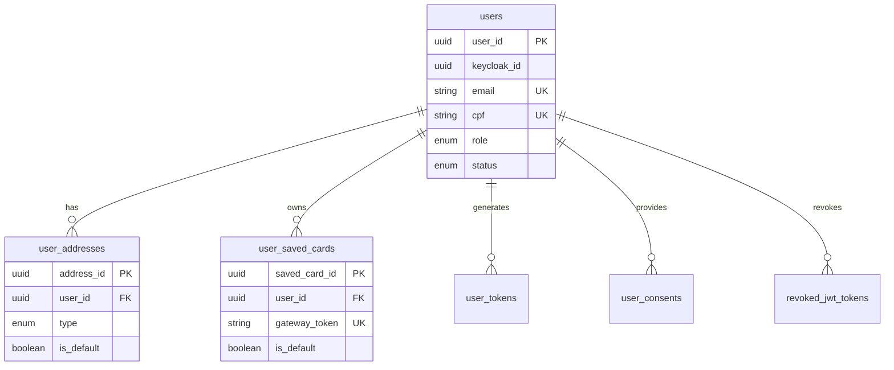

# User Management Service - Documentação Técnica

## 1. Visão Geral do Microsserviço

O **User Management Service** é responsável por toda a gestão de usuários, autenticação, autorização e conformidade com LGPD. Este microsserviço centraliza as operações relacionadas a perfis de usuário, endereços, cartões salvos, tokens de autenticação e consentimentos.

### Responsabilidades Principais
- Autenticação e autorização de usuários
- Gestão de perfis e dados pessoais
- Integração com Keycloak para SSO
- Gerenciamento de endereços de usuários
- Armazenamento seguro de cartões de pagamento
- Controle de tokens e sessões
- Conformidade LGPD e gestão de consentimentos
- Blacklist de tokens JWT revogados

## 2. Estrutura de Tabelas

### 2.1 Tabela Principal: `users`
**Descrição**: Tabela central que armazena informações básicas dos usuários

| Campo | Tipo | Descrição |
|-------|------|----------|
| user_id | UUID | Identificador único do usuário |
| keycloak_id | UUID | ID do usuário no Keycloak para SSO |
| first_name | VARCHAR(100) | Primeiro nome |
| last_name | VARCHAR(155) | Sobrenome |
| email | VARCHAR(255) | Email único do usuário |
| email_verified_at | TIMESTAMPTZ | Data de verificação do email |
| phone | VARCHAR(20) | Telefone de contato |
| password_hash | VARCHAR(255) | Hash da senha (nullable para SSO) |
| cpf | CHAR(11) | CPF único validado |
| date_of_birth | DATE | Data de nascimento |
| newsletter_opt_in | BOOLEAN | Consentimento para newsletter |
| status | VARCHAR(20) | Status da conta (ativo, inativo, banido) |
| role | user_role_enum | Papel do usuário (customer, admin) |
| failed_login_attempts | SMALLINT | Tentativas de login falhadas |
| account_locked_until | TIMESTAMPTZ | Data até quando a conta está bloqueada |

### 2.2 Tabela: `user_addresses`
**Descrição**: Endereços de entrega e cobrança dos usuários

| Campo | Tipo | Descrição |
|-------|------|----------|
| address_id | UUID | Identificador único do endereço |
| user_id | UUID | Referência ao usuário |
| type | address_type_enum | Tipo do endereço (shipping, billing) |
| postal_code | CHAR(8) | CEP |
| street | VARCHAR(150) | Logradouro |
| street_number | VARCHAR(20) | Número |
| complement | VARCHAR(100) | Complemento |
| neighborhood | VARCHAR(100) | Bairro |
| city | VARCHAR(100) | Cidade |
| state_code | CHAR(2) | Código do estado |
| country_code | CHAR(2) | Código do país |
| is_default | BOOLEAN | Endereço padrão por tipo |

### 2.3 Tabela: `user_saved_cards`
**Descrição**: Cartões de pagamento salvos pelos usuários

| Campo | Tipo | Descrição |
|-------|------|----------|
| saved_card_id | UUID | Identificador único do cartão |
| user_id | UUID | Referência ao usuário |
| nickname | VARCHAR(50) | Apelido do cartão |
| last_four_digits | CHAR(4) | Últimos 4 dígitos |
| brand | card_brand_enum | Bandeira do cartão |
| gateway_token | VARCHAR(255) | Token seguro do gateway |
| expiry_date | DATE | Data de expiração |
| is_default | BOOLEAN | Cartão padrão |

### 2.4 Tabela: `user_tokens`
**Descrição**: Tokens de autenticação e verificação

| Campo | Tipo | Descrição |
|-------|------|----------|
| token_id | UUID | Identificador único do token |
| user_id | UUID | Referência ao usuário |
| token_type | VARCHAR(50) | Tipo (refresh, email_verification, password_reset) |
| token_value | VARCHAR(256) | Valor único do token |
| expires_at | TIMESTAMPTZ | Data de expiração |
| revoked_at | TIMESTAMPTZ | Data de revogação |

### 2.5 Tabela: `user_consents`
**Descrição**: Consentimentos LGPD dos usuários

| Campo | Tipo | Descrição |
|-------|------|----------|
| consent_id | UUID | Identificador único do consentimento |
| user_id | UUID | Referência ao usuário |
| type | consent_type_enum | Tipo de consentimento |
| terms_version | VARCHAR(30) | Versão dos termos |
| is_granted | BOOLEAN | Consentimento concedido |

### 2.6 Tabela: `revoked_jwt_tokens`
**Descrição**: Blacklist de tokens JWT revogados

| Campo | Tipo | Descrição |
|-------|------|----------|
| jti | UUID | JWT ID (chave primária) |
| user_id | UUID | Referência ao usuário |
| expires_at | TIMESTAMPTZ | Data de expiração do token |

## 3. Relacionamentos Entre Entidades



## 4. Funções e Triggers Específicos

### 4.1 Função de Validação CPF
```sql
CREATE OR REPLACE FUNCTION is_cpf_valid(cpf TEXT)
RETURNS BOOLEAN
```
**Descrição**: Valida CPF brasileiro com algoritmo de dígitos verificadores

### 4.2 Trigger de Timestamp
```sql
CREATE OR REPLACE FUNCTION trigger_set_timestamp()
RETURNS TRIGGER
```
**Descrição**: Atualiza automaticamente o campo `updated_at`

### 4.3 Trigger de Eventos de Domínio
```sql
CREATE OR REPLACE FUNCTION trigger_user_events()
RETURNS TRIGGER
```
**Descrição**: Publica eventos quando usuários são criados ou atualizados

## 5. Considerações de Segurança

### 5.1 Autenticação
- Integração com Keycloak para SSO
- Suporte a autenticação híbrida (local + SSO)
- Controle de tentativas de login falhadas
- Bloqueio automático de contas

### 5.2 Proteção de Dados
- Senhas armazenadas com hash seguro
- Tokens de cartão armazenados via gateway
- Validação rigorosa de CPF
- Soft delete para preservar integridade referencial

### 5.3 Conformidade LGPD
- Gestão granular de consentimentos
- Versionamento de termos
- Auditoria completa de alterações
- Controle de retenção de dados

## 6. Considerações de Performance

### 6.1 Índices Estratégicos
- `idx_users_active_email`: Email único para usuários ativos
- `idx_users_status`: Filtros por status
- `uq_user_addresses_default_per_user_type`: Endereço padrão único por tipo
- `idx_user_tokens_expires_at`: Limpeza de tokens expirados

### 6.2 Otimizações
- Índices parciais para dados ativos
- Constraints para garantir integridade
- Triggers otimizados para eventos
- Limpeza automática de tokens expirados

## 7. Padrões de Nomenclatura

### 7.1 Convenções de Tabelas
- Prefixo `user_` para tabelas relacionadas
- Sufixo `_id` para chaves primárias UUID
- Sufixo `_at` para timestamps
- Sufixo `_enum` para tipos enumerados

### 7.2 Convenções de Campos
- Snake_case para nomes de campos
- Campos booleanos com prefixo `is_` ou `has_`
- Campos de auditoria padronizados (`created_at`, `updated_at`, `deleted_at`, `version`)
- Referências externas claramente identificadas

### 7.3 Convenções de Índices
- Prefixo `idx_` para índices regulares
- Prefixo `uq_` para índices únicos
- Nomes descritivos incluindo tabela e campos

## 8. Commands e Queries (CQRS)

### 8.1 Commands (Operações de Escrita)

#### 8.1.1 User Management Commands

**CreateUserCommand**
```csharp
public record CreateUserCommand(
    string FirstName,
    string LastName,
    string Email,
    string? Phone,
    string? Password,
    string Cpf,
    DateTime DateOfBirth,
    bool NewsletterOptIn,
    Guid? KeycloakId = null
) : ICommand<CreateUserResult>;

public record CreateUserResult(Guid UserId, string Email);
```
**Validações**: Email único, CPF válido, idade mínima, senha forte (se fornecida)
**Eventos**: UserCreatedEvent, UserRegisteredEvent
**Handler**: CreateUserCommandHandler

**UpdateUserProfileCommand**
```csharp
public record UpdateUserProfileCommand(
    Guid UserId,
    string? FirstName,
    string? LastName,
    string? Phone,
    DateTime? DateOfBirth,
    bool? NewsletterOptIn
) : ICommand;
```
**Validações**: Usuário existe, dados válidos
**Eventos**: UserProfileUpdatedEvent
**Handler**: UpdateUserProfileCommandHandler

**VerifyEmailCommand**
```csharp
public record VerifyEmailCommand(
    Guid UserId,
    string VerificationToken
) : ICommand;
```
**Validações**: Token válido e não expirado
**Eventos**: EmailVerifiedEvent
**Handler**: VerifyEmailCommandHandler

**ChangePasswordCommand**
```csharp
public record ChangePasswordCommand(
    Guid UserId,
    string CurrentPassword,
    string NewPassword
) : ICommand;
```
**Validações**: Senha atual correta, nova senha forte
**Eventos**: PasswordChangedEvent
**Handler**: ChangePasswordCommandHandler

**LockUserAccountCommand**
```csharp
public record LockUserAccountCommand(
    Guid UserId,
    DateTime? LockUntil,
    string Reason
) : ICommand;
```
**Validações**: Usuário existe e não é admin
**Eventos**: UserAccountLockedEvent
**Handler**: LockUserAccountCommandHandler

**UnlockUserAccountCommand**
```csharp
public record UnlockUserAccountCommand(
    Guid UserId,
    string Reason
) : ICommand;
```
**Validações**: Usuário existe e está bloqueado
**Eventos**: UserAccountUnlockedEvent
**Handler**: UnlockUserAccountCommandHandler

**DeactivateUserCommand**
```csharp
public record DeactivateUserCommand(
    Guid UserId,
    string Reason
) : ICommand;
```
**Validações**: Usuário existe e está ativo
**Eventos**: UserDeactivatedEvent
**Handler**: DeactivateUserCommandHandler

**DeleteUserCommand**
```csharp
public record DeleteUserCommand(
    Guid UserId,
    string LgpdReason,
    bool HardDelete = false
) : ICommand;
```
**Validações**: Conformidade LGPD, autorização adequada
**Eventos**: UserDeletedEvent, LgpdDataDeletionEvent
**Handler**: DeleteUserCommandHandler

#### 8.1.2 Authentication Commands

**LoginCommand**
```csharp
public record LoginCommand(
    string Email,
    string Password,
    string? IpAddress,
    string? UserAgent
) : ICommand<LoginResult>;

public record LoginResult(
    string AccessToken,
    string RefreshToken,
    DateTime ExpiresAt,
    UserDto User
);
```
**Validações**: Credenciais válidas, conta não bloqueada
**Eventos**: UserLoggedInEvent, LoginAttemptEvent
**Handler**: LoginCommandHandler

**LogoutCommand**
```csharp
public record LogoutCommand(
    Guid UserId,
    string? RefreshToken
) : ICommand;
```
**Validações**: Token válido
**Eventos**: UserLoggedOutEvent
**Handler**: LogoutCommandHandler

**RefreshTokenCommand**
```csharp
public record RefreshTokenCommand(
    string RefreshToken
) : ICommand<RefreshTokenResult>;

public record RefreshTokenResult(
    string AccessToken,
    string RefreshToken,
    DateTime ExpiresAt
);
```
**Validações**: Token válido e não expirado
**Eventos**: TokenRefreshedEvent
**Handler**: RefreshTokenCommandHandler

**RevokeTokenCommand**
```csharp
public record RevokeTokenCommand(
    Guid UserId,
    string TokenJti
) : ICommand;
```
**Validações**: Token existe e pertence ao usuário
**Eventos**: TokenRevokedEvent
**Handler**: RevokeTokenCommandHandler

**ResetPasswordCommand**
```csharp
public record ResetPasswordCommand(
    string Email
) : ICommand;
```
**Validações**: Email existe no sistema
**Eventos**: PasswordResetRequestedEvent
**Handler**: ResetPasswordCommandHandler

**ConfirmPasswordResetCommand**
```csharp
public record ConfirmPasswordResetCommand(
    string ResetToken,
    string NewPassword
) : ICommand;
```
**Validações**: Token válido, senha forte
**Eventos**: PasswordResetConfirmedEvent
**Handler**: ConfirmPasswordResetCommandHandler

#### 8.1.3 Address Management Commands

**AddUserAddressCommand**
```csharp
public record AddUserAddressCommand(
    Guid UserId,
    AddressType Type,
    string PostalCode,
    string Street,
    string StreetNumber,
    string? Complement,
    string Neighborhood,
    string City,
    string StateCode,
    string CountryCode,
    bool IsDefault
) : ICommand<Guid>;
```
**Validações**: CEP válido, usuário existe
**Eventos**: UserAddressAddedEvent
**Handler**: AddUserAddressCommandHandler

**UpdateUserAddressCommand**
```csharp
public record UpdateUserAddressCommand(
    Guid AddressId,
    Guid UserId,
    string? PostalCode,
    string? Street,
    string? StreetNumber,
    string? Complement,
    string? Neighborhood,
    string? City,
    string? StateCode,
    bool? IsDefault
) : ICommand;
```
**Validações**: Endereço pertence ao usuário, dados válidos
**Eventos**: UserAddressUpdatedEvent
**Handler**: UpdateUserAddressCommandHandler

**DeleteUserAddressCommand**
```csharp
public record DeleteUserAddressCommand(
    Guid AddressId,
    Guid UserId
) : ICommand;
```
**Validações**: Endereço pertence ao usuário
**Eventos**: UserAddressDeletedEvent
**Handler**: DeleteUserAddressCommandHandler

**SetDefaultAddressCommand**
```csharp
public record SetDefaultAddressCommand(
    Guid AddressId,
    Guid UserId,
    AddressType Type
) : ICommand;
```
**Validações**: Endereço pertence ao usuário, tipo correto
**Eventos**: DefaultAddressChangedEvent
**Handler**: SetDefaultAddressCommandHandler

#### 8.1.4 Saved Cards Commands

**AddSavedCardCommand**
```csharp
public record AddSavedCardCommand(
    Guid UserId,
    string Nickname,
    string CardToken,
    string LastFourDigits,
    CardBrand Brand,
    DateTime ExpiryDate,
    bool IsDefault
) : ICommand<Guid>;
```
**Validações**: Token válido do gateway, usuário existe
**Eventos**: SavedCardAddedEvent
**Handler**: AddSavedCardCommandHandler

**UpdateSavedCardCommand**
```csharp
public record UpdateSavedCardCommand(
    Guid SavedCardId,
    Guid UserId,
    string? Nickname,
    DateTime? ExpiryDate,
    bool? IsDefault
) : ICommand;
```
**Validações**: Cartão pertence ao usuário
**Eventos**: SavedCardUpdatedEvent
**Handler**: UpdateSavedCardCommandHandler

**DeleteSavedCardCommand**
```csharp
public record DeleteSavedCardCommand(
    Guid SavedCardId,
    Guid UserId
) : ICommand;
```
**Validações**: Cartão pertence ao usuário
**Eventos**: SavedCardDeletedEvent
**Handler**: DeleteSavedCardCommandHandler

**SetDefaultCardCommand**
```csharp
public record SetDefaultCardCommand(
    Guid SavedCardId,
    Guid UserId
) : ICommand;
```
**Validações**: Cartão pertence ao usuário
**Eventos**: DefaultCardChangedEvent
**Handler**: SetDefaultCardCommandHandler

#### 8.1.5 Consent Management Commands

**GrantConsentCommand**
```csharp
public record GrantConsentCommand(
    Guid UserId,
    ConsentType Type,
    string TermsVersion,
    string? IpAddress,
    string? UserAgent
) : ICommand;
```
**Validações**: Usuário existe, versão de termos válida
**Eventos**: ConsentGrantedEvent
**Handler**: GrantConsentCommandHandler

**RevokeConsentCommand**
```csharp
public record RevokeConsentCommand(
    Guid UserId,
    ConsentType Type,
    string Reason
) : ICommand;
```
**Validações**: Consentimento existe
**Eventos**: ConsentRevokedEvent
**Handler**: RevokeConsentCommandHandler

**UpdateConsentCommand**
```csharp
public record UpdateConsentCommand(
    Guid ConsentId,
    Guid UserId,
    string NewTermsVersion,
    bool IsGranted
) : ICommand;
```
**Validações**: Consentimento pertence ao usuário
**Eventos**: ConsentUpdatedEvent
**Handler**: UpdateConsentCommandHandler

### 8.2 Queries (Operações de Leitura)

#### 8.2.1 User Queries

**GetUserByIdQuery**
```csharp
public record GetUserByIdQuery(
    Guid UserId,
    bool IncludeDeleted = false
) : IQuery<UserDto?>;
```
**Handler**: GetUserByIdQueryHandler
**Cache**: 5 minutos
**Segurança**: Dados próprios ou admin

**GetUserByEmailQuery**
```csharp
public record GetUserByEmailQuery(
    string Email,
    bool IncludeInactive = false
) : IQuery<UserDto?>;
```
**Handler**: GetUserByEmailQueryHandler
**Cache**: 2 minutos
**Segurança**: Admin apenas

**GetUserByCpfQuery**
```csharp
public record GetUserByCpfQuery(
    string Cpf
) : IQuery<UserDto?>;
```
**Handler**: GetUserByCpfQueryHandler
**Cache**: 2 minutos
**Segurança**: Admin apenas

**GetUsersByStatusQuery**
```csharp
public record GetUsersByStatusQuery(
    UserStatus Status,
    int Page = 1,
    int PageSize = 20
) : IQuery<PagedResult<UserDto>>;
```
**Handler**: GetUsersByStatusQueryHandler
**Cache**: 1 minuto
**Segurança**: Admin apenas

**SearchUsersQuery**
```csharp
public record SearchUsersQuery(
    string? SearchTerm,
    UserStatus? Status,
    UserRole? Role,
    DateTime? CreatedAfter,
    DateTime? CreatedBefore,
    int Page = 1,
    int PageSize = 20
) : IQuery<PagedResult<UserDto>>;
```
**Handler**: SearchUsersQueryHandler
**Cache**: 30 segundos
**Segurança**: Admin apenas

#### 8.2.2 Authentication Queries

**ValidateTokenQuery**
```csharp
public record ValidateTokenQuery(
    string Token,
    string TokenType
) : IQuery<TokenValidationResult>;

public record TokenValidationResult(
    bool IsValid,
    Guid? UserId,
    DateTime? ExpiresAt,
    string? ErrorMessage
);
```
**Handler**: ValidateTokenQueryHandler
**Cache**: 1 minuto
**Segurança**: Sistema interno

**GetUserSessionsQuery**
```csharp
public record GetUserSessionsQuery(
    Guid UserId
) : IQuery<List<UserSessionDto>>;
```
**Handler**: GetUserSessionsQueryHandler
**Cache**: 30 segundos
**Segurança**: Dados próprios ou admin

**CheckAccountLockStatusQuery**
```csharp
public record CheckAccountLockStatusQuery(
    Guid UserId
) : IQuery<AccountLockStatusDto>;

public record AccountLockStatusDto(
    bool IsLocked,
    DateTime? LockedUntil,
    int FailedAttempts,
    string? Reason
);
```
**Handler**: CheckAccountLockStatusQueryHandler
**Cache**: 30 segundos
**Segurança**: Dados próprios ou admin

#### 8.2.3 Address Queries

**GetUserAddressesQuery**
```csharp
public record GetUserAddressesQuery(
    Guid UserId,
    AddressType? Type = null
) : IQuery<List<UserAddressDto>>;
```
**Handler**: GetUserAddressesQueryHandler
**Cache**: 5 minutos
**Segurança**: Dados próprios ou admin

**GetAddressByIdQuery**
```csharp
public record GetAddressByIdQuery(
    Guid AddressId,
    Guid UserId
) : IQuery<UserAddressDto?>;
```
**Handler**: GetAddressByIdQueryHandler
**Cache**: 5 minutos
**Segurança**: Dados próprios ou admin

**GetDefaultAddressQuery**
```csharp
public record GetDefaultAddressQuery(
    Guid UserId,
    AddressType Type
) : IQuery<UserAddressDto?>;
```
**Handler**: GetDefaultAddressQueryHandler
**Cache**: 10 minutos
**Segurança**: Dados próprios ou admin

#### 8.2.4 Saved Cards Queries

**GetUserSavedCardsQuery**
```csharp
public record GetUserSavedCardsQuery(
    Guid UserId
) : IQuery<List<SavedCardDto>>;
```
**Handler**: GetUserSavedCardsQueryHandler
**Cache**: 5 minutos
**Segurança**: Dados próprios ou admin

**GetSavedCardByIdQuery**
```csharp
public record GetSavedCardByIdQuery(
    Guid SavedCardId,
    Guid UserId
) : IQuery<SavedCardDto?>;
```
**Handler**: GetSavedCardByIdQueryHandler
**Cache**: 5 minutos
**Segurança**: Dados próprios ou admin

**GetDefaultCardQuery**
```csharp
public record GetDefaultCardQuery(
    Guid UserId
) : IQuery<SavedCardDto?>;
```
**Handler**: GetDefaultCardQueryHandler
**Cache**: 10 minutos
**Segurança**: Dados próprios ou admin

#### 8.2.5 Consent Queries

**GetUserConsentsQuery**
```csharp
public record GetUserConsentsQuery(
    Guid UserId
) : IQuery<List<UserConsentDto>>;
```
**Handler**: GetUserConsentsQueryHandler
**Cache**: 10 minutos
**Segurança**: Dados próprios ou admin

**GetConsentByTypeQuery**
```csharp
public record GetConsentByTypeQuery(
    Guid UserId,
    ConsentType Type
) : IQuery<UserConsentDto?>;
```
**Handler**: GetConsentByTypeQueryHandler
**Cache**: 10 minutos
**Segurança**: Dados próprios ou admin

**CheckConsentStatusQuery**
```csharp
public record CheckConsentStatusQuery(
    Guid UserId,
    ConsentType Type
) : IQuery<ConsentStatusDto>;

public record ConsentStatusDto(
    bool IsGranted,
    string? TermsVersion,
    DateTime? GrantedAt,
    DateTime? RevokedAt
);
```
**Handler**: CheckConsentStatusQueryHandler
**Cache**: 5 minutos
**Segurança**: Sistema interno

#### 8.2.6 Admin Queries

**GetUsersReportQuery**
```csharp
public record GetUsersReportQuery(
    DateTime? StartDate,
    DateTime? EndDate,
    UserStatus? Status,
    UserRole? Role
) : IQuery<UsersReportDto>;

public record UsersReportDto(
    int TotalUsers,
    int ActiveUsers,
    int InactiveUsers,
    int NewUsersInPeriod,
    Dictionary<UserStatus, int> UsersByStatus,
    Dictionary<UserRole, int> UsersByRole
);
```
**Handler**: GetUsersReportQueryHandler
**Cache**: 15 minutos
**Segurança**: Admin apenas

**GetLoginAttemptsQuery**
```csharp
public record GetLoginAttemptsQuery(
    Guid? UserId,
    DateTime? StartDate,
    DateTime? EndDate,
    bool? SuccessfulOnly,
    int Page = 1,
    int PageSize = 50
) : IQuery<PagedResult<LoginAttemptDto>>;
```
**Handler**: GetLoginAttemptsQueryHandler
**Cache**: 2 minutos
**Segurança**: Admin apenas

**GetConsentComplianceQuery**
```csharp
public record GetConsentComplianceQuery(
    ConsentType? Type,
    DateTime? StartDate,
    DateTime? EndDate
) : IQuery<ConsentComplianceDto>;

public record ConsentComplianceDto(
    int TotalUsers,
    int UsersWithConsent,
    int UsersWithoutConsent,
    double CompliancePercentage,
    Dictionary<ConsentType, int> ConsentsByType
);
```
**Handler**: GetConsentComplianceQueryHandler
**Cache**: 30 minutos
**Segurança**: Admin apenas

### 8.3 Considerações de Implementação

#### 8.3.1 Tratamento de Erros
- **ValidationException**: Dados inválidos
- **UnauthorizedException**: Acesso negado
- **NotFoundException**: Recurso não encontrado
- **ConflictException**: Conflito de dados (email duplicado)
- **BusinessRuleException**: Regras de negócio violadas

#### 8.3.2 Segurança
- Autorização baseada em claims JWT
- Validação de propriedade de recursos
- Rate limiting para operações sensíveis
- Auditoria de todas as operações
- Sanitização de dados de entrada

#### 8.3.3 Performance
- Cache distribuído para queries frequentes
- Paginação obrigatória para listas
- Índices otimizados para queries
- Projeções específicas para DTOs
- Lazy loading quando apropriado

#### 8.3.4 Observabilidade
- Logs estruturados para todas as operações
- Métricas de performance e uso
- Tracing distribuído
- Health checks específicos
- Alertas para operações críticas


# User Management Service - Tasks

## Setup de Infraestrutura
[ ] Configurar banco de dados PostgreSQL para User Management
[ ] Configurar conexão com Keycloak para autenticação
[ ] Configurar Redis para cache de sessões
[ ] Configurar RabbitMQ para eventos de usuário
[ ] Configurar variáveis de ambiente no .env
[ ] Criar .env.example com todas as variáveis necessárias

## Desenvolvimento de APIs
[ ] Implementar endpoint POST /users (criação de usuário)
[ ] Implementar endpoint GET /users/{id} (buscar usuário)
[ ] Implementar endpoint PUT /users/{id} (atualizar usuário)
[ ] Implementar endpoint DELETE /users/{id} (deletar usuário)
[ ] Implementar endpoint GET /users (listar usuários com paginação)
[ ] Implementar endpoint POST /users/login (autenticação)
[ ] Implementar endpoint POST /users/logout (logout)
[ ] Implementar endpoint POST /users/refresh-token (renovar token)
[ ] Implementar endpoint PUT /users/{id}/password (alterar senha)
[ ] Implementar endpoint POST /users/forgot-password (recuperar senha)
[ ] Implementar validação de dados de entrada
[ ] Implementar middleware de autenticação JWT
[ ] Implementar middleware de autorização por roles

## Modelo de Dados
[ ] Criar tabela users com campos obrigatórios
[ ] Criar tabela user_profiles para dados estendidos
[ ] Criar tabela user_roles para controle de acesso
[ ] Criar tabela user_sessions para controle de sessões
[ ] Implementar triggers para auditoria
[ ] Implementar índices para performance
[ ] Configurar constraints e relacionamentos

## Segurança
[ ] Implementar hash de senhas com bcrypt
[ ] Configurar rate limiting para endpoints críticos
[ ] Implementar validação de força de senha
[ ] Configurar CORS adequadamente
[ ] Implementar logs de auditoria
[ ] Configurar sanitização de dados
[ ] Implementar proteção contra SQL injection
[ ] Configurar headers de segurança

## Testes
[ ] Criar testes unitários para controllers
[ ] Criar testes unitários para services
[ ] Criar testes de integração para APIs
[ ] Criar testes de segurança
[ ] Configurar coverage de testes
[ ] Criar testes de performance
[ ] Implementar testes de carga

## Monitoramento e Logs
[ ] Configurar logs estruturados
[ ] Implementar métricas de performance
[ ] Configurar alertas para falhas
[ ] Implementar health check endpoint
[ ] Configurar monitoramento de recursos

## Deploy e DevOps
[ ] Configurar Dockerfile
[ ] Configurar docker-compose para desenvolvimento
[ ] Configurar pipeline CI/CD
[ ] Configurar ambiente de staging
[ ] Configurar ambiente de produção
[ ] Implementar rollback strategy
[ ] Configurar backup automático do banco

## Documentação
[ ] Documentar APIs com Swagger/OpenAPI
[ ] Criar documentação de setup
[ ] Documentar fluxos de autenticação
[ ] Criar guia de troubleshooting
[ ] Documentar variáveis de ambiente

## Integração
[ ] Integrar com Keycloak para SSO
[ ] Configurar eventos para outros microsserviços
[ ] Implementar sincronização de dados
[ ] Configurar webhooks para notificações

## Performance
[ ] Implementar cache de consultas frequentes
[ ] Otimizar queries do banco de dados
[ ] Configurar connection pooling
[ ] Implementar paginação eficiente
[ ] Configurar compressão de responses

## Compliance
[ ] Implementar LGPD/GDPR compliance
[ ] Configurar anonização de dados
[ ] Implementar direito ao esquecimento
[ ] Configurar consentimento de dados
[ ] Implementar auditoria de acesso a dados